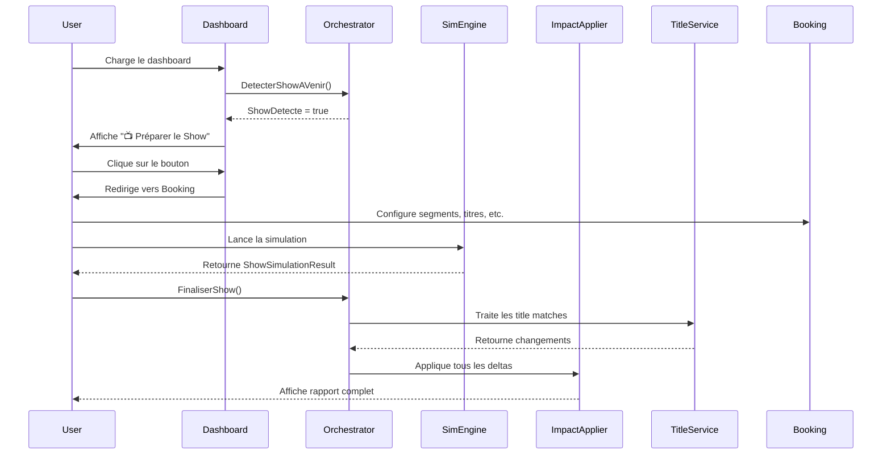

# Implémentation de la Feature "Show Day" (Match Day)

## Vue d'ensemble

Cette feature implémente le flux complet "Show Day" dans Ring General, permettant aux joueurs de détecter automatiquement les shows planifiés, de préparer leur booking, et de voir les résultats avec tous les impacts (finances, moral, titres).

## Architecture

### 1. ShowDayOrchestrator (`src/RingGeneral.Core/Services/ShowDayOrchestrator.cs`)

**Responsabilités :**
- Détection automatique des shows planifiés à la semaine actuelle
- Orchestration de la simulation complète via `ShowSimulationEngine`
- Finalisation avec application de tous les impacts (finances, moral, titres, blessures)

**Méthodes principales :**

```csharp
// Détecte si un show est prévu cette semaine
public ShowDayDetectionResult DetecterShowAVenir(string companyId, int currentWeek)

// Lance la simulation d'un show complet
public ShowSimulationResult SimulerShow(ShowContext context)

// Finalise le show en appliquant tous les impacts
public ShowDayFinalizationResult FinaliserShow(ShowSimulationResult resultat, ShowContext context)
```

**Points clés :**
- Intégration avec `TitleService` pour gérer les changements de champions
- Génère des rapports détaillés avec tous les changements
- Gère les cas de title changes avec calcul de prestige

### 2. DashboardViewModel (`src/RingGeneral.UI/ViewModels/Dashboard/DashboardViewModel.cs`)

**Nouvelles fonctionnalités :**

#### Propriétés ajoutées :
```csharp
public bool HasUpcomingShow { get; set; }
public string UpcomingShowName { get; set; }
public string MainButtonLabel => HasUpcomingShow ? "📺 Préparer le Show" : "▶️ Continuer";
```

#### Commandes ajoutées :
```csharp
public ReactiveCommand<Unit, Unit> ContinueCommand { get; }  // Avancer d'une semaine
public ReactiveCommand<Unit, Unit> PrepareShowCommand { get; }  // Aller au booking
```

**Flux :**
1. Au chargement du dashboard, `DetectUpcomingShow()` vérifie automatiquement si un show est planifié
2. Le bouton principal change dynamiquement son label selon la détection
3. Si un show est détecté : redirige vers le booking
4. Sinon : avance d'une semaine

### 3. ImpactApplier Amélioré (`src/RingGeneral.Data/Repositories/ImpactApplier.cs`)

**Améliorations :**
- Injection du `TitleService` pour gérer les changements de titres
- Nouvelle méthode `TraiterChangementsTitres()` qui :
  - Parcourt tous les segments avec un titre
  - Enregistre les matchs de titre via `TitleService`
  - Détecte et signale les title changes
  - Met à jour le prestige des titres

**Ordre d'application des impacts :**
1. ✅ Enregistrement du ShowReport
2. 🏆 **Traitement des changements de titres** (NOUVEAU)
3. 💰 Application du GameStateDelta (finances, popularité, moral)
4. 🏥 Enregistrement des blessures

## Flux complet "Show Day"



## Modèles de données

### ShowDayDetectionResult
```csharp
public sealed record ShowDayDetectionResult(
    bool ShowDetecte,
    ShowSchedule? Show,
    string Message);
```

### ShowDayFinalizationResult
```csharp
public sealed record ShowDayFinalizationResult(
    bool Succes,
    IReadOnlyList<string> Changements,
    IReadOnlyList<TitleChangeInfo> TitresChanges,
    GameStateDelta? Delta);
```

### TitleChangeInfo
```csharp
public sealed record TitleChangeInfo(
    string TitreId,
    string TitreNom,
    string AncienChampion,
    string NouveauChampion,
    int PrestigeDelta);
```

## Intégration avec les services existants

### Services réutilisés :
- ✅ **ShowSimulationEngine** : Génère les ShowReports avec notes, audience, revenus
- ✅ **TitleService** : Gère les changements de champions et le prestige des titres
- ✅ **ImpactApplier** : Applique finances, popularité, moral, fatigue, blessures
- ✅ **ShowSchedulerService** : Gère le calendrier des shows

### Services étendus :
- **ImpactApplier** : Ajout du traitement des titres
- **DashboardViewModel** : Ajout de la détection automatique de shows

## Exemples d'utilisation

### Détecter un show
```csharp
var orchestrator = new ShowDayOrchestrator(showSchedulerStore);
var detection = orchestrator.DetecterShowAVenir(companyId, currentWeek);

if (detection.ShowDetecte)
{
    Console.WriteLine($"Show détecté : {detection.Show.Nom}");
}
```

### Simuler et finaliser un show
```csharp
// 1. Simuler
var resultat = orchestrator.SimulerShow(context);

// 2. Finaliser
var finalisation = orchestrator.FinaliserShow(resultat, context);

// 3. Afficher les résultats
foreach (var changement in finalisation.Changements)
{
    Console.WriteLine(changement);
}

// Exemple de sortie :
// 👥 Audience: 2500
// 📊 Note du show: 78/100
// 💰 Revenus totaux: $125,450.00
// 🏆 TITLE CHANGE: John Cena remporte le World Championship (Prestige +4)
```

### Utilisation dans le ViewModel
```csharp
// Dans DashboardViewModel
public DashboardViewModel(
    GameRepository repository,
    IShowSchedulerStore showSchedulerStore,
    ShowDayOrchestrator orchestrator)
{
    _orchestrator = orchestrator;

    // Le bouton change automatiquement
    ContinueCommand = ReactiveCommand.Create(OnContinue);
    PrepareShowCommand = ReactiveCommand.Create(OnPrepareShow);

    // Détection automatique au chargement
    LoadDashboardData();
}
```

## Tests

### Tests unitaires créés (`tests/RingGeneral.Tests/ShowDayOrchestratorTests.cs`)

✅ **DetecterShowAVenir_QuandShowPlanifie_RetourneDetecte**
- Vérifie la détection d'un show planifié

✅ **DetecterShowAVenir_QuandAucunShow_RetourneNonDetecte**
- Vérifie le comportement sans show

✅ **SimulerShow_AvecContexteValide_RetourneResultat**
- Valide la simulation complète

✅ **FinaliserShow_AvecChangementTitre_InclutInfoChangement**
- Valide le traitement des title changes

✅ **FinaliserShow_SansChangementTitre_IncluQuandMemeFinances**
- Valide l'application des finances même sans titre

## Points d'attention

### 1. Thread Safety
- `ShowDayOrchestrator` est stateless (pas de champs mutables)
- Safe pour une utilisation concurrente

### 2. Gestion des erreurs
- Tous les services retournent des Result objects avec messages d'erreur
- Try-catch autour des opérations de titre dans `ImpactApplier`

### 3. Performance
- Utilisation de `SeededRandomProvider` pour simulation déterministe
- Pas de chargement excessif de données (charge uniquement ce qui est nécessaire)

### 4. Extensibilité
- Architecture modulaire permettant d'ajouter facilement :
  - Nouveaux types d'impacts (contrats, merchandising, etc.)
  - Nouveaux types d'événements (PPV, special shows)
  - Nouvelles règles de simulation

## Améliorations futures possibles

1. **Multi-show par semaine** : Gérer plusieurs shows la même semaine
2. **PPV spécifiques** : Logique spéciale pour les grands événements
3. **Historique détaillé** : Sauvegarder tous les ShowReports pour consultation
4. **Notifications push** : Alertes quand un show approche
5. **Auto-booking** : IA pour suggérer des cartes de show

## Dépendances

```
RingGeneral.Core
├── ShowSimulationEngine (existant)
├── TitleService (existant)
└── ShowDayOrchestrator (nouveau)

RingGeneral.Data
└── ImpactApplier (modifié)

RingGeneral.UI
└── DashboardViewModel (modifié)
```

## Contributeurs

- Implémentation initiale : Claude AI
- Date : 2026-01-07
- Version : 1.0.0

## Liens utiles

- Architecture complète : `docs/ARCHITECTURE_REVIEW_FR.md`
- Tests de simulation : `tests/RingGeneral.Tests/SimulationEngineTests.cs`
- Service de titres : `src/RingGeneral.Core/Services/TitleService.cs`
