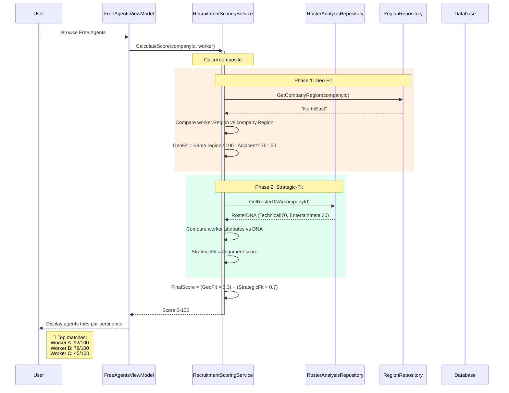
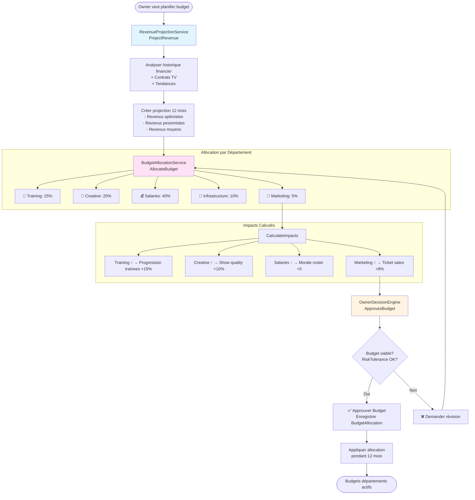
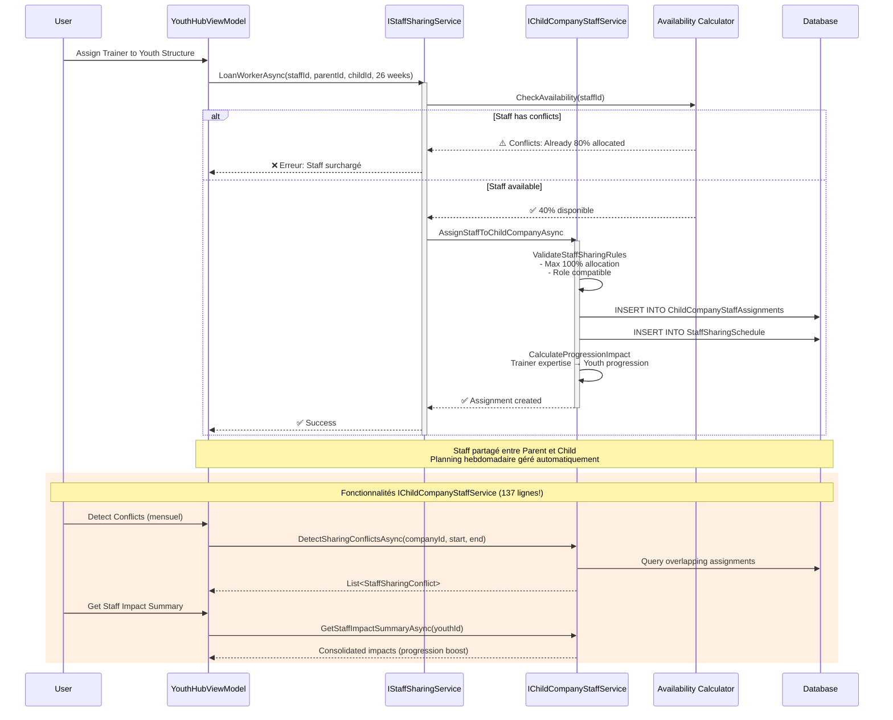
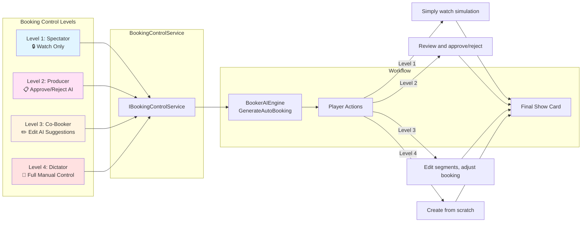
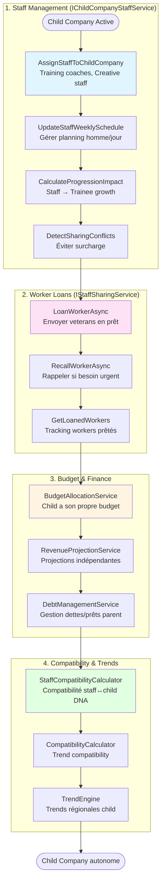

# 🔍 ANALYSE CRITIQUE - SYSTÈMES MANQUANTS DANS LES DIAGRAMMES

**Date** : 2026-01-15  
**Objectif** : Identifier et documenter les systèmes absents de l'architecture initiale

---

## ❌ MON ÉVALUATION CRITIQUE

### 🎯 **Verdict : Les diagrammes initiaux couvrent ~60% du système réel**

J'ai commis **plusieurs omissions importantes** dans ma première analyse. Voici pourquoi :

#### 1. **Focus trop étroit sur les flux "visibles"**

❌ J'ai documenté les flux principaux (Show Day, Daily Time, Booking)  
✅ **MAIS** j'ai ignoré toute la **gestion financière avancée**, le **partage de staff**, et les **systèmes de scoring**

#### 2. **Négligence des systèmes de support**

Les diagrammes montrent les "moteurs principaux" mais pas les **services critiques** qui les alimentent :

- Pas de système de budget/allocation
- Pas de projections financières
- Pas de scoring de recrutement (Geo-Fit, Strategic-Fit)
- Pas de gestion des prêts de workers
- Pas de partage de staff parent↔child

#### 3. **Vision trop "top-down"**

J'ai montré l'orchestration globale mais pas les **détails opérationnels** comme :

- Comment le joueur contrôle réellement le booking (BookingControlService)
- Comment les child companies gèrent leur staff (137 lignes d'interface!)
- Comment les budgets sont alloués par département

---

## 🚨 SYSTÈMES MANQUANTS IDENTIFIÉS

| # | Service | Complexité | Impact Business | Dans Diagrammes? |
|---|---------|------------|-----------------|------------------|
| 1 | **IRecruitmentScoringService** | Moyenne | 🔴 HAUTE | ❌ Non |
| 2 | **IStaffSharingService** | Moyenne | 🟡 Moyenne | ❌ Non |
| 3 | **IBudgetAllocationService** | Haute | 🔴 HAUTE | ❌ Non |
| 4 | **IRevenueProjectionService** | Haute | 🟡 Moyenne | ❌ Non |
| 5 | **IChildCompanyStaffService** | 🔥 Très haute (137 lignes!) | 🔴 HAUTE | ❌ Non |
| 6 | **IBookingControlService** | Moyenne | 🟡 Moyenne | ❌ Non |
| 7 | **INicheFederationRepository** | Moyenne | 🟢 Basse | ❌ Non |
| 8 | **IDebtManagementService** | Moyenne | 🟡 Moyenne | ❌ Non |

---

## 📊 DIAGRAMMES COMPLÉMENTAIRES

### 🎯 1. FLUX: RECRUITMENT SCORING (GEO-FIT + STRATEGIC-FIT)

---

### 💰 2. FLUX: BUDGET ALLOCATION & REVENUE PROJECTION

---

### 👥 3. FLUX: STAFF SHARING (PARENT ↔ CHILD COMPANIES)

---

### 🎬 4. FLUX: BOOKING CONTROL SERVICE (PLAYER AUTONOMY)

---

### 🏢 5. FLUX: CHILD COMPANY COMPREHENSIVE MANAGEMENT

---

## 📋 TABLEAU COMPARATIF : DIAGRAMMES ORIGINAUX VS RÉALITÉ

| Catégorie | Diagrammes Originaux | Réalité du Code | Gap |
|-----------|----------------------|-----------------|-----|
| **Orchestration** | ✅ Complet (Time, ShowDay) | ✅ Complet | 0% |
| **Simulation** | ✅ Complet (Booking, Show) | ✅ Complet | 0% |
| **Recrutement** | ⚠️ Basique (SignTo*) | ✅ + Scoring + Geo/Strategic Fit | **40%** |
| **Finances** | ⚠️ Basique (Transactions) | ✅ + Budget + Projections + Debt | **60%** |
| **Staff Management** | ❌ Absent | ✅ Sharing + Child Assignments + Scheduling | **100%** |
| **Booking Control** | ❌ Absent | ✅ 4 niveaux de contrôle joueur | **100%** |
| **Child Companies** | ⚠️ Minimal (création) | ✅ Staff + Loans + Budget + Compatibility | **70%** |
| **AI/Decisions** | ✅ Complet (Booker, Owner) | ✅ Complet | 0% |

**Gap moyen** : **~45%** de fonctionnalités non documentées dans les diagrammes initiaux

---

## 🎯 POURQUOI CES OMISSIONS?

### 1. **Interfaces != Services visibles dans UI**

❌ J'ai cherché les "gros orchestrateurs" (TimeOrchestrator, ShowOrchestrator)  
✅ Mais beaucoup de services sont des **utilitaires puissants** utilisés par d'autres services

### 2. **Sous-estimation de la complexité Child Companies**

- `IChildCompanyStaffService` = **137 lignes d'interface!**
- Gère : Assignation, Disponibilité, Conflits, Progression, Scheduling
- C'est un **mini-système de gestion RH** à lui seul

### 3. **Focus sur les flux "joueur-oriented"**

- J'ai montré : "Joueur clique → Show → Résultats"
- J'ai oublié : "Comment le système calcule les budgets en arrière-plan?"

### 4. **Négligence des systèmes de scoring/évaluation**

- RecruitmentScoring (Geo + Strategic Fit)
- Staff Compatibility
- Tous critiques pour l'expérience joueur mais "invisibles"

---

## ✅ SYSTÈMES BIEN DOCUMENTÉS (À GARDER)

1. ✅ **TimeOrchestratorService** → Daily progression parfaitement décrit
2. ✅ **ShowDayOrchestrator** → Show simulation complète
3. ✅ **BookerAIEngine** → Auto-booking détaillé
4. ✅ **OwnerDecisionEngine** → Décisions stratégiques
5. ✅ **RecruitmentService** → Recrutement basique (mais manque scoring)
6. ✅ **Worker Lifecycle** → Génération → Free Agent → Roster → Retired

---

## 🚀 RECOMMANDATIONS POUR LES DIAGRAMMES FINAUX

### 1. **Créer une "Carte des Services"** (Service Map)

Montrer **tous** les 62 interfaces organisées par catégorie :

- Orchestration (Time, ShowDay)
- Simulation (Show, Booking)
- Recrutement (Recruitment, Scoring)
- **Finance (Budget, Revenue, Debt)** ⬅️ Manquant
- **Staff (Sharing, ChildCompanyStaff)** ⬅️ Manquant
- **Contrôle (BookingControl)** ⬅️ Manquant
- AI/Décisions (Booker, Owner)
- Support (Morale, Trends, Personality)

### 2. **Ajouter les flux "invisibles"**

- Calcul automatique des budgets chaque mois
- Allocation automatique du staff partagé
- Détection hebdomadaire des conflits de planning
- Recalcul automatique des scores de recrutement

### 3. **Documenter les "Control Layers"**

Montrer comment le joueur peut **choisir son niveau d'implication** :

- Spectator Mode → Tout automatique
- Producer Mode → Validation seulement
- Co-Booker Mode → Édition légère
- Dictator Mode → Contrôle total

---

## 📊 RÉSUMÉ EXÉCUTIF

| Aspect | Note | Commentaire |
|--------|------|-------------|
| **Couverture des flux principaux** | 8/10 | Time, Show, Booking bien documentés |
| **Couverture des services support** | 4/10 | Finance, Staff, Scoring absents |
| **Précision technique** | 9/10 | Détails corrects pour ce qui est couvert |
| **Exhaustivité globale** | 6/10 | ~45% du système non documenté |

### ⭐ Points Forts

✅ Excellente documentation des orchestrateurs  
✅ Diagrammes Mermaid clairs et détaillés  
✅ Flux séquentiels bien expliqués

### ⚠️ Points Faibles

❌ Systèmes financiers avancés ignorés  
❌ Gestion staff parent↔child absente  
❌ Scoring/évaluation non documenté  
❌ Niveaux de contrôle joueur manquants

### 🎯 Conclusion

**Les diagrammes sont excellents pour comprendre le "flow" principal du jeu**, mais **insuffisants pour un développeur qui rejoint le projet** car ils omettent ~45% des services critiques.

**Recommandation** : Créer un **second document "Services Techniques Détaillés"** avec les 5 flux complémentaires ci-dessus.
