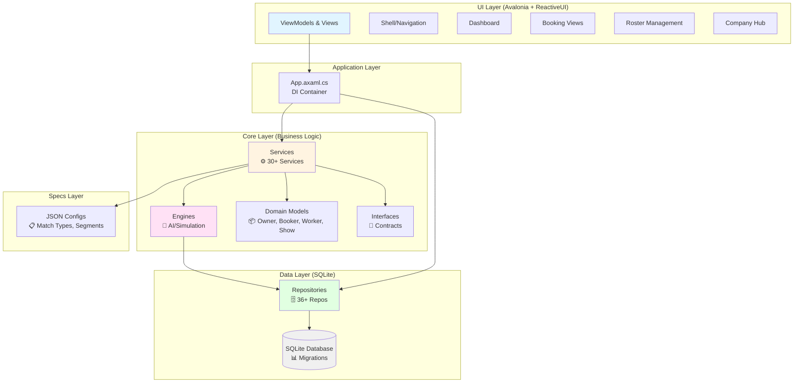
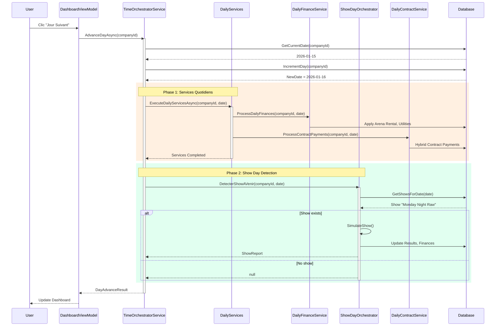
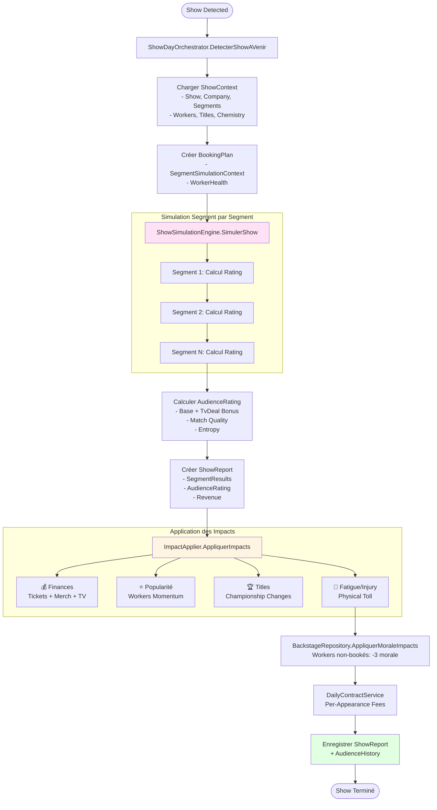
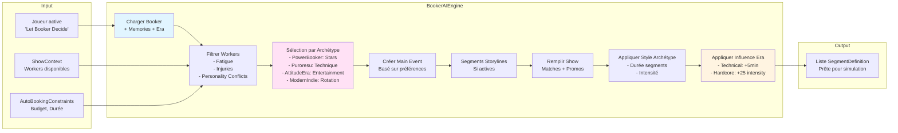
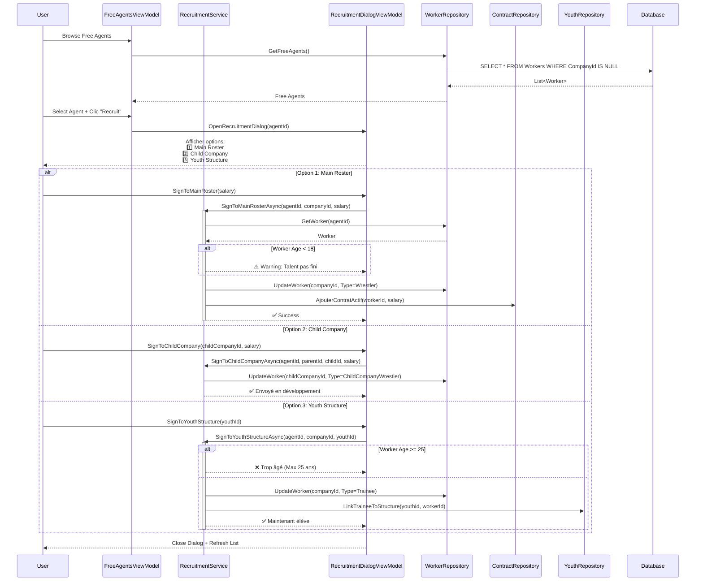
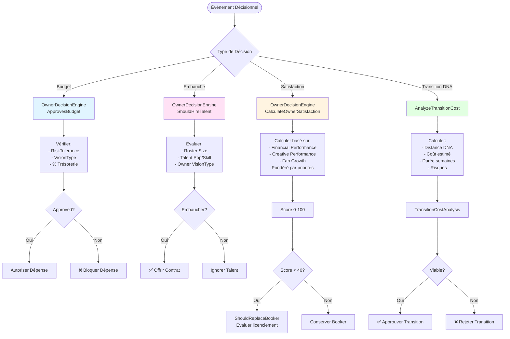
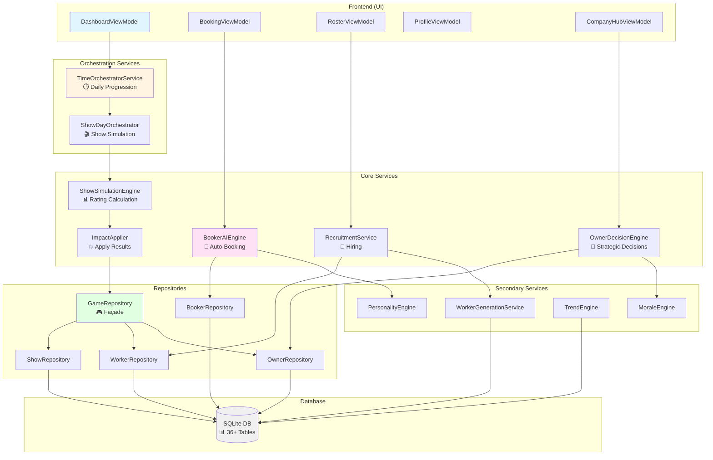
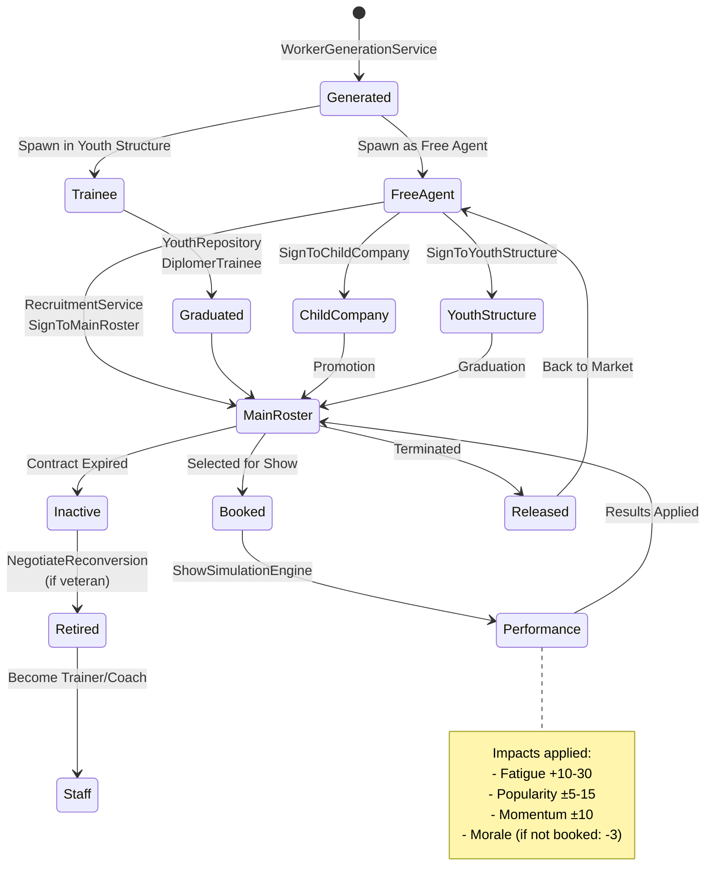

# 🎯 RING GENERAL - DIAGRAMMES D'ARCHITECTURE ET FLUX

**Date** : 2026-01-15  
**Version** : Architecture complète du projet

---

## 📐 1. ARCHITECTURE GLOBALE DU SYSTÈME

---

## ⏱️ 2. FLUX: SYSTÈME QUOTIDIEN (DAILY TIME SYSTEM)

---

## 🎬 3. FLUX: SHOW DAY (SIMULATION COMPLÈTE)

---

## 🤖 4. FLUX: AUTO-BOOKING (BOOKER AI)

---

## 👥 5. FLUX: RECRUTEMENT (MARCHÉ DES AGENTS LIBRES)

---

## 🏢 6. FLUX: GESTION ENTREPRISE (OWNER DECISION ENGINE)

---

## 🔄 7. DIAGRAMME D'INTERACTION DES COMPOSANTS

---

## 📊 8. FLUX DE DONNÉES: WORKER LIFECYCLE

---

## 🎯 9. RÉSUMÉ DES FLUX PRINCIPAUX

| Flux | Orchestrateur | Fréquence | Composants Clés |
|------|---------------|-----------|-----------------|
| **Daily Time System** | `TimeOrchestratorService` | Quotidien | DailyServices, ShowDayOrchestrator |
| **Show Day** | `ShowDayOrchestrator` | Par show | ShowSimulationEngine, ImpactApplier |
| **Auto-Booking** | `BookerAIEngine` | On-demand | BookerRepository, Memories, Era |
| **Recruitment** | `RecruitmentService` | Manuel | WorkerRepository, ContractRepository |
| **Owner Decisions** | `OwnerDecisionEngine` | Événementiel | OwnerRepository, Budget validation |
| **Worker Generation** | `WorkerGenerationService` | Hebdomadaire | YouthRepository, Caps tracking |
| **Morale/Rumors** | `MoraleEngine` | Weekly Loop | BackstageRepository |
| **Trends** | `TrendEngine` | Weekly | TrendRepository, Era influence |

---

## 📋 10. LÉGENDE DES SYMBOLES

| Symbole | Signification |
|---------|---------------|
| 🎮 | GameRepository (Façade) |
| ⏱️ | Time/Orchestration Services |
| 🎬 | Show/Simulation Services |
| 🤖 | AI/Engine Services |
| 👥 | Worker/Recruitment Services |
| 🏢 | Company/Owner Services |
| 💰 | Finance Services |
| 🗄️ | Repositories |
| 📊 | Database/Models |
| 🔌 | Interfaces |
| ⚙️ | Services |

---

## 🔍 NOTES D'ARCHITECTURE

### Points Forts

✅ **Séparation claire des responsabilités** (UI → Services → Repos → DB)  
✅ **Pattern Façade** avec GameRepository orchestrant 9 repositories spécialisés  
✅ **Injection de dépendances** complète dans App.axaml.cs  
✅ **Services hautement cohésifs** (BookerAI = 1404 lignes de logique pure)  
✅ **Flux orchestrés** (TimeOrchestrator → ShowOrchestrator → Simulation → Impact)

### Points d'Attention

⚠️ **UI Phase 4 manquante** : Owner/Booker management UI non créée  
⚠️ **Tests limités** : Scénarios d'intégration Phase 4 manquants  
⚠️ **Phase 5 en attente** : Crisis et Communication définis mais non implémentés
