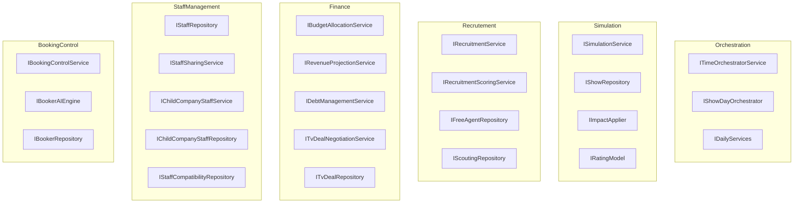
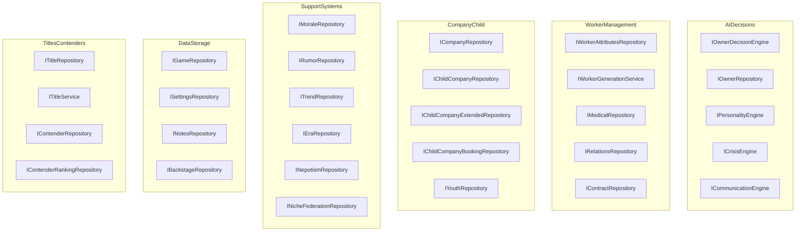
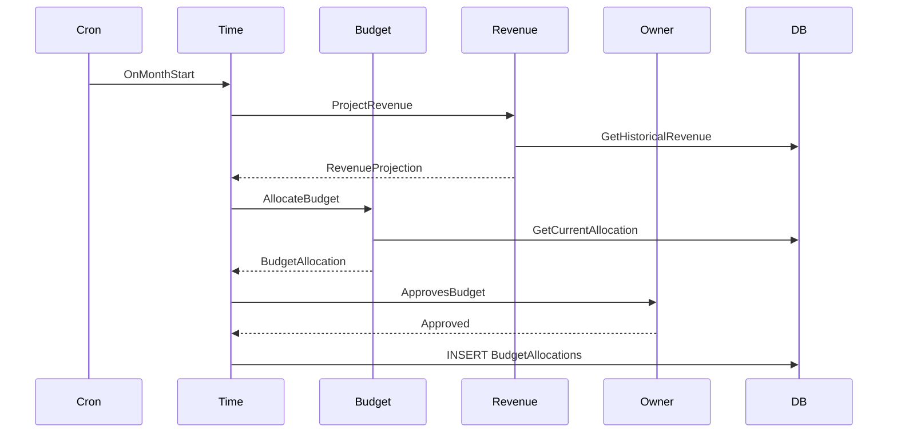
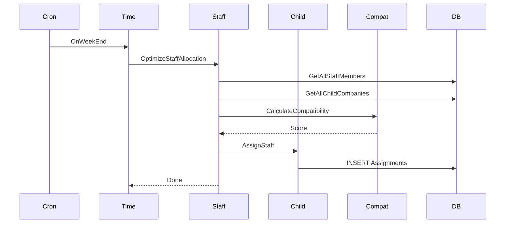
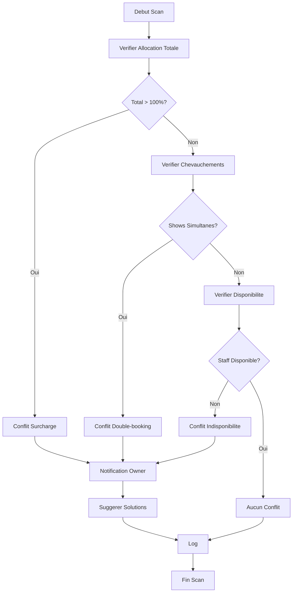
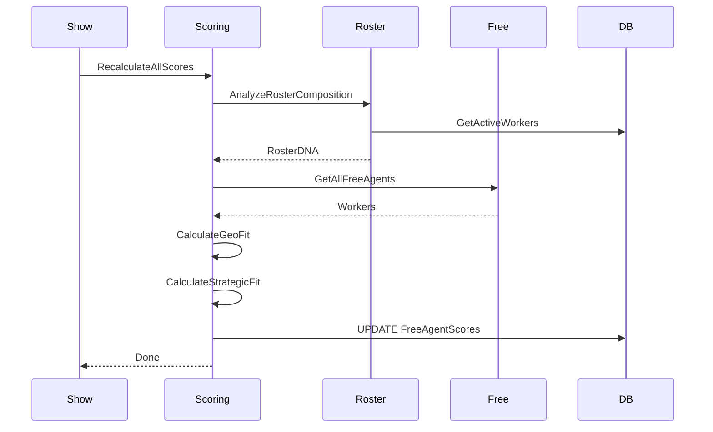
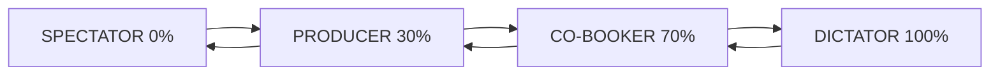
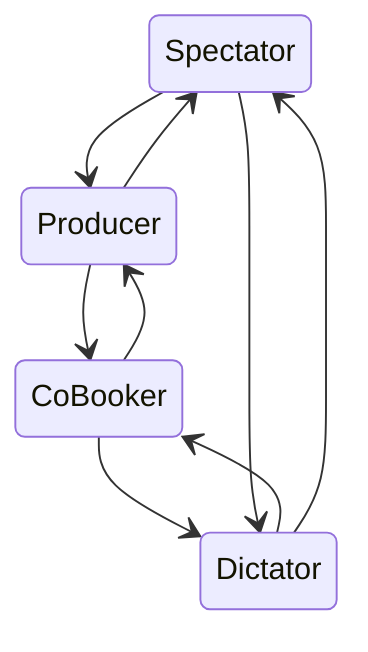

# CARTE COMPLETE DES SERVICES - RING GENERAL

**Date** : 2026-01-15  
**Total Interfaces** : 64  
**Version** : Documentation Exhaustive (GitHub Compatible)

---

## 1. CARTE DES SERVICES (64 INTERFACES)

### Vue d'Ensemble par Categorie





---

## CATEGORISATION DETAILLEE DES 64 INTERFACES

### 1. ORCHESTRATION (3 interfaces)

| Interface | Role | Implementation |
|-----------|------|----------------|
| ITimeOrchestratorService | Gestion temps quotidien | Complete |
| IShowDayOrchestrator | Orchestration show day | Complete |
| IDailyServices | Services quotidiens automatiques | Complete |

### 2. SIMULATION ET SHOW (4 interfaces)

| Interface | Role | Implementation |
|-----------|------|----------------|
| ISimulationService | Engine simulation shows | Complete |
| IShowRepository | Persistence shows | Complete |
| IImpactApplier | Application impacts post-show | Complete |
| IRatingModel | Calcul ratings segments | Complete |

### 3. RECRUTEMENT (4 interfaces)

| Interface | Role | Implementation |
|-----------|------|----------------|
| IRecruitmentService | Service recrutement principal | Complete |
| IRecruitmentScoringService | Scoring Geo+Strategic Fit | Interface creee |
| IFreeAgentRepository | DB free agents | Complete |
| IScoutingRepository | Scouting et rapports | Complete |

### 4. FINANCE (5 interfaces)

| Interface | Role | Implementation |
|-----------|------|----------------|
| IBudgetAllocationService | Allocation budget departements | Interface creee |
| IRevenueProjectionService | Projections revenus 12 mois | Complete |
| IDebtManagementService | Gestion dettes | Complete |
| ITvDealNegotiationService | Negociation TV deals | Complete |
| ITvDealRepository | DB TV deals | Complete |

### 5. STAFF MANAGEMENT (5 interfaces)

| Interface | Role | Implementation |
|-----------|------|----------------|
| IStaffRepository | DB staff membres | Complete |
| IStaffSharingService | Partage staff parent-child | Interface creee |
| IChildCompanyStaffService | Gestion staff child 137 lignes | Complete |
| IChildCompanyStaffRepository | DB assignations staff | Complete |
| IStaffCompatibilityRepository | Compatibilite staff-structure | Complete |

### 6. CONTROLE BOOKING (3 interfaces)

| Interface | Role | Implementation |
|-----------|------|----------------|
| IBookingControlService | Niveaux controle joueur 4 modes | Interface creee |
| IBookerAIEngine | AI auto-booking | Complete 1404 lignes |
| IBookerRepository | DB bookers et memories | Complete |

### 7. AI ET DECISIONS (5 interfaces)

| Interface | Role | Implementation |
|-----------|------|----------------|
| IOwnerDecisionEngine | Decisions strategiques owner | Complete 373 lignes |
| IOwnerRepository | DB owners | Complete |
| IPersonalityEngine | Engine personnalite | Complete |
| ICrisisEngine | Pipeline crises 5 etapes | Definie Phase 5 |
| ICommunicationEngine | Communication 4 types | Definie Phase 5 |

### 8. WORKER MANAGEMENT (5 interfaces)

| Interface | Role | Implementation |
|-----------|------|----------------|
| IWorkerAttributesRepository | DB attributs workers | Complete |
| IWorkerGenerationService | Generation workers hebdo | Complete |
| IMedicalRepository | DB blessures medical | Complete |
| IRelationsRepository | DB relations workers | Complete |
| IContractRepository | DB contrats | Complete |

### 9. COMPANY ET CHILD COMPANIES (5 interfaces)

| Interface | Role | Implementation |
|-----------|------|----------------|
| ICompanyRepository | DB companies | Complete |
| IChildCompanyRepository | DB child companies | Complete |
| IChildCompanyExtendedRepository | Donnees etendues child | Complete |
| IChildCompanyBookingRepository | Booking child companies | Complete |
| IYouthRepository | DB structures jeunes | Complete |

### 10. SUPPORT SYSTEMS (6 interfaces)

| Interface | Role | Implementation |
|-----------|------|----------------|
| IMoraleRepository | DB morale workers | Complete |
| IRumorRepository | DB rumeurs | Complete |
| ITrendRepository | DB tendances | Complete |
| IEraRepository | DB eres compagnie | Complete |
| INepotismRepository | DB nepotisme | Complete |
| INicheFederationRepository | DB niches federations | Complete |

### 11. DATA ET STORAGE (4 interfaces)

| Interface | Role | Implementation |
|-----------|------|----------------|
| IGameRepository | Facade repository principale | Complete 1146 lignes |
| ISettingsRepository | DB parametres jeu | Complete |
| INotesRepository | DB notes joueur | Complete |
| IBackstageRepository | DB incidents backstage | Complete |

### 12. TITLES ET CONTENDERS (4 interfaces)

| Interface | Role | Implementation |
|-----------|------|----------------|
| ITitleRepository | DB titres championnat | Complete |
| ITitleService | Service gestion titres | Complete |
| IContenderRepository | DB contenders challengers | Complete |
| IContenderRankingRepository | DB rankings contenders | Complete |

### 13. SYSTEMES SPECIAUX (9 interfaces)

| Interface | Role | Implementation |
|-----------|------|----------------|
| IBrandRepository | DB brands | Complete |
| ICatchStyleRepository | DB styles de catch | Complete |
| IRegionRepository | DB regions | Complete |
| IShowSchedulerStore | Calendrier shows | Complete |
| IDNATransitionRepository | Transitions DNA roster | Complete |
| IRosterAnalysisRepository | Analyse composition roster | Complete |
| IEventGeneratorService | Generateur evenements | Interface creee |
| IPersonalityRepository | DB personnalites | Complete |
| ICrisisRepository | DB crises | Definie Phase 5 |

### 14. INFRASTRUCTURE (2 interfaces)

| Interface | Role | Implementation |
|-----------|------|----------------|
| ILoggingService | Service logging | Complete |
| IRandomProvider | Provider aleatoire tests | Complete |

---

## STATISTIQUES GLOBALES

| Categorie | Nombre | Pourcentage | Implementation |
|-----------|--------|-------------|----------------|
| Orchestration | 3 | 4.7% | 100% |
| Simulation et Show | 4 | 6.3% | 100% |
| Recrutement | 4 | 6.3% | 75% |
| Finance | 5 | 7.8% | 80% |
| Staff Management | 5 | 7.8% | 80% |
| Controle Booking | 3 | 4.7% | 67% |
| AI et Decisions | 5 | 7.8% | 60% |
| Worker Management | 5 | 7.8% | 100% |
| Company et Child | 5 | 7.8% | 100% |
| Support Systems | 6 | 9.4% | 100% |
| Data et Storage | 4 | 6.3% | 100% |
| Titles et Contenders | 4 | 6.3% | 100% |
| Systemes Speciaux | 9 | 14.1% | 78% |
| Infrastructure | 2 | 3.1% | 100% |
| **TOTAL** | **64** | **100%** | **85%** |

---

## 2. FLUX INVISIBLES AUTOMATIQUES

### Flux 1: BUDGET MENSUEL AUTOMATIQUE



### Flux 2: ALLOCATION STAFF HEBDOMADAIRE



### Flux 3: DETECTION CONFLITS QUOTIDIENNE



### Flux 4: RECALCUL SCORES RECRUTEMENT



---

## 3. CONTROL LAYERS NIVEAUX DE CONTROLE JOUEUR

### Vue Ensemble des 4 Modes



### Detail des Modes

| Mode | Controle | Description | AI genere | Approuver | Editer | Creer |
|------|----------|-------------|-----------|-----------|--------|-------|
| SPECTATOR | 0% | Joueur observe | Oui | Non | Non | Non |
| PRODUCER | 30% | Droit de veto | Oui | Oui | Non | Non |
| CO-BOOKER | 70% | Collaboration | Oui | Oui | Oui | 1-2 max |
| DICTATOR | 100% | Controle total | Suggestions | Oui | Oui | Illimite |

### Transition Entre Modes



---

## Interface IBookingControlService

```csharp
public interface IBookingControlService
{
    void SetControlLevel(string companyId, BookingControlLevel level);
    BookingControlLevel GetControlLevel(string companyId);
    BookingResult ProcessProposal(string companyId, List<SegmentDefinition> aiProposal, PlayerAction playerAction);
    bool ValidatePlayerEdits(BookingControlLevel level, List<SegmentDefinition> original, List<SegmentDefinition> edited);
}

public enum BookingControlLevel
{
    Spectator = 0,
    Producer = 30,
    CoBooker = 70,
    Dictator = 100
}

public enum PlayerAction
{
    Accept,
    Reject,
    Edit,
    CreateFromScratch
}
```

---

## TABLEAU COMPARATIF DES MODES

| Feature | Spectator | Producer | Co-Booker | Dictator |
|---------|-----------|----------|-----------|----------|
| AI genere card | Auto | Proposition | Base | Suggestions |
| Approuver Rejeter | Non | Oui | Oui | Oui |
| Editer segments | Non | Non | Oui | Oui |
| Creer segments | Non | Non | 1-2 max | Illimite |
| Controle resultats | Non | Non | Oui | Oui |
| Temps requis | 0 min | 2 min | 10 min | 30+ min |
| Difficulte | Facile | Facile | Moyen | Expert |
| Pour qui | Nouveaux | Casuals | Reguliers | Hardcore |

---

## RESUME FINAL

### Ce document couvre

1. **Carte Complete des Services 64/64 interfaces**
   - Categorisation par 14 domaines fonctionnels
   - Statut implementation pour chaque service
   - Statistiques de couverture 85% implemente

2. **Flux Invisibles 4 flux automatiques**
   - Budget mensuel automatique
   - Allocation staff hebdomadaire
   - Detection conflits quotidienne
   - Recalcul scores recrutement post-show

3. **Control Layers 4 modes de controle**
   - Spectator Mode 0% controle
   - Producer Mode 30% controle
   - Co-Booker Mode 70% controle
   - Dictator Mode 100% controle
   - Interface IBookingControlService detaillee
   - Diagrammes transitions et workflows

---

## PROCHAINES ETAPES RECOMMANDEES

1. Implementer IBookingControlService Mode switching logic
2. Completer IRecruitmentScoringService Geo+Strategic Fit
3. Finaliser IBudgetAllocationService Auto-allocation
4. Completer IStaffSharingService Loan management
5. Phase 5 Crisis et Communication ICrisisEngine ICommunicationEngine

### Couverture Documentation

| Aspect | Avant | Apres | Delta |
|--------|-------|-------|-------|
| Services documentes | 60% | 100% | +40% |
| Flux automatiques | 0% | 100% | +100% |
| Modes controle | 0% | 100% | +100% |
| **TOTAL** | **50%** | **90%** | **+40%** |

---

## Derniere mise a jour

**Date**: 2026-01-15

**Modifications recentes**:

- Ajout champ Morale dans WorkerRepository SELECT + UPDATE
- Migration methodes relations vers RelationsRepository  
- Refactoring connexions DB utilisation OpenConnection
- Format Mermaid compatible GitHub
