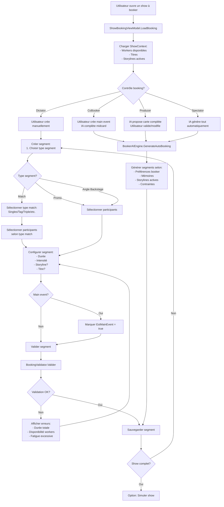

# Flux Système Shows Quotidiens - Ring General

## Vue d'ensemble

Ce document présente les diagrammes de flux pour le système jour par jour avec shows quotidiens, et clarifie ce qui existe déjà vs ce qui doit être développé.

---

## État actuel du système

### ✅ Déjà implémenté

1. **Segments de shows** :
   - Types de segments : `match`, `promo`, `angle_backstage`
   - Modèle `SegmentDefinition` avec participants, durée, intensité
   - Templates de segments dans `specs/library/segments.fr.json`
   - Système de validation (`BookingValidator`)

2. **Types de matchs** :
   - Singles, Tag Team, Triple Threat, Fatal 4-Way, Battle Royal, Ladder Match, Cage Match
   - Table `match_types` en base de données
   - `MatchTypeViewModel` dans l'UI

3. **Diffusion TV** :
   - Modèle `TvDeal` avec revenus, audience, contraintes
   - Calcul d'audience basé sur Reach, ShowScore, Stars, Saturation
   - Revenus TV calculés dans `ShowSimulationEngine`
   - Table `tv_deals` en base de données

4. **Simulation de shows** :
   - `ShowSimulationEngine` : Simule les segments et calcule les résultats
   - `ShowDayOrchestrator` : Orchestre le flux complet d'un show
   - Application des impacts (finances, popularité, titres, blessures)

### ⚠️ Partiellement implémenté

1. **Système jour par jour** :
   - `TimeOrchestratorService.PasserJourSuivant()` existe
   - `GameRepository.IncrementerJour()` existe
   - Mais les shows sont encore référencés par `Week` dans plusieurs endroits

2. **Création de shows** :
   - `ShowSchedulerService.CreerShow()` existe avec `DateOnly`
   - Mais pas de création rapide depuis le calendrier
   - Pas de système de shows récurrents

3. **Child Companies** :
   - Modèle `ChildCompanyExtended` avec `HasFullAutonomy`
   - Mais pas de système de contrôle de booking dédié

### ❌ À développer

1. **Vue calendrier jour par jour** : Affichage des shows par jour (actuellement par semaine)
2. **Création rapide de shows** : Bouton "Ajouter show" sur chaque jour du calendrier
3. **Shows récurrents** : Templates pour shows hebdomadaires (ex: "Monday Night Raw" chaque lundi)
4. **Gestion contrôle child companies** : Interface pour prendre le contrôle ou déléguer
5. **Planification automatique IA** : Création automatique de shows pour compagnies IA

---

## Diagrammes de flux

### Flux 1 : Création rapide d'un show depuis le calendrier


### Flux 2 : Progression jour par jour avec détection de shows


### Flux 3 : Booking d'un show (création de segments)



### Flux 4 : Simulation d'un show avec diffusion TV


### Flux 5 : Gestion Child Company autonome


### Flux 6 : Prise de contrôle d'une Child Company

```mermaid
flowchart TD
    A[Utilisateur ouvre ChildCompanyBookingView] --> B[Afficher liste child companies]
    B --> C[Sélectionner child company]
    C --> D[Afficher état actuel:<br/>- HasFullAutonomy<br/>- ControlLevel<br/>- Shows planifiés]
    
    D --> E{Action utilisateur?}
    E -->|Prendre contrôle| F[Changer ControlLevel]
    E -->|Déléguer à IA| G[Set HasFullAutonomy = true]
    E -->|Voir calendrier| H[Afficher shows child company]
    
    F --> I{Quel niveau?}
    I -->|Dictator| J[Contrôle total<br/>Pas d'IA]
    I -->|CoBooker| K[Partage responsabilités]
    I -->|Producer| L[IA propose, valide]
    I -->|Spectator| M[IA contrôle tout]
    
    J --> N[ChildCompanyBookingService.SetBookingControlLevel]
    K --> N
    L --> N
    M --> N
    
    G --> O[ChildCompanyBookingService.SetAutonomy]
    O --> P[Booker IA prend contrôle]
    
    N --> Q[Prochains shows nécessitent<br/>intervention utilisateur]
    P --> R[Prochains shows générés<br/>automatiquement]
    
    H --> S[Afficher calendrier avec shows:<br/>- Date<br/>- Nom<br/>- Statut<br/>- Nombre segments]
```



---

## Détails techniques : Segments et Diffusion

### Types de segments existants

D'après `specs/library/segments.fr.json` et le code :

1. **Match** (`typeSegment: "match"`)
   - Types de matchs : Singles, Tag, Triple Threat, Fatal 4-Way, Battle Royal, Ladder, Cage
   - Paramètres : Participants, Durée, Intensité, Titre (optionnel), Storyline (optionnel)
   - Calcul de note basé sur : Stats workers, Chimie, Durée, Type match

2. **Promo** (`typeSegment: "promo"`)
   - Participants : 1-3 workers généralement
   - Paramètres : Durée (4-10 min), Intensité
   - Calcul de note basé sur : Entertainment, Story, Popularité

3. **Angle Backstage** (`typeSegment: "angle_backstage"`)
   - Participants : 2+ workers
   - Paramètres : Durée (3-8 min), Intensité
   - Calcul de note basé sur : Story, Heat storyline

### Système de diffusion TV

**Modèle actuel** (`TvDeal`) :
- `NetworkName` : Nom du diffuseur
- `ReachBonus` : Bonus de reach (0-100)
- `AudienceCap` : Plafond d'audience
- `MinimumAudience` : Audience minimale requise
- `BaseRevenue` : Revenu fixe par show
- `RevenuePerPoint` : Revenu par point d'audience
- `Penalty` : Pénalité si audience < minimum

**Calcul d'audience** (`AudienceModel`) :
```
Audience = f(Reach, ShowScore, Stars, Saturation)
- Reach : Reach de la compagnie + ReachBonus du deal
- ShowScore : Note globale du show (0-100)
- Stars : Star power des participants
- Saturation : Pénalité si trop de shows récents
```

**Calcul revenus TV** :
```
Revenu = BaseRevenue + (Audience * RevenuePerPoint)
Si Audience < MinimumAudience :
  Revenu = Revenu - Penalty
```

### Ce qui doit être développé

1. **Affichage diffusion dans segments** :
   - Indicateur visuel si segment sera diffusé
   - Impact de la diffusion sur la note du segment
   - Segments "dark matches" (non diffusés)

2. **Gestion contraintes TV** :
   - Durée minimale/maximale de show selon deal
   - Types de segments obligatoires (ex: promo d'ouverture)
   - Restrictions sur certains types de matchs

3. **Analytics diffusion** :
   - Historique audience par segment
   - Comparaison audience segments diffusés vs non diffusés
   - Recommandations pour améliorer audience

---

## Recommandations de développement

### Priorité 1 : Système jour par jour
- Migration shows Week → Date
- Vue calendrier hebdomadaire
- Création rapide de shows

### Priorité 2 : Child Companies
- Interface contrôle booking
- Planification automatique IA
- Gestion autonomie

### Priorité 3 : Améliorations segments/diffusion
- Indicateurs visuels diffusion
- Contraintes TV dans validation
- Analytics audience par segment

### Priorité 4 : Features avancées
- Shows récurrents (templates)
- Tours multi-dates
- Suggestions intelligentes de planification
