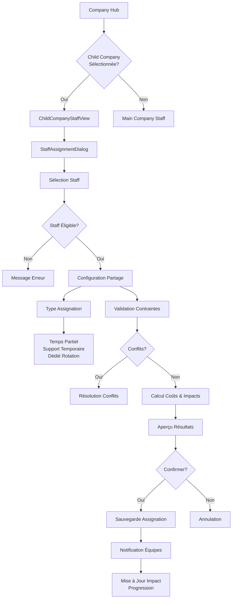

# 📋 PRODUCT REQUIREMENTS DOCUMENT (PRD)
# Système de Staff pour Child Companies - Ring General

**Version** : 1.0
**Date** : 8 janvier 2026
**Chef de Projet** : Claude (Lead Software Architect)
**Client/Stakeholder** : SnakePythonDom
**Branche de Développement** : `claude/child-staff-system-prd-16XV6`

---

## TABLE DES MATIÈRES

1. [Executive Summary](#executive-summary)
2. [Vision Produit](#vision-produit)
3. [Contexte et Justification](#contexte-et-justification)
4. [Objectifs et Exigences Fonctionnelles](#objectifs-et-exigences-fonctionnelles)
5. [Spécifications Techniques](#spécifications-techniques)
6. [Intégration avec Systèmes Existants](#intégration-avec-systèmes-existants)
7. [Roadmap et Phasage](#roadmap-et-phasage)
8. [Risques et Mitigation](#risques-et-mitigation)
9. [Métriques et KPIs](#métriques-et-kpis)
10. [Glossaire](#glossaire)

---

## EXECUTIVE SUMMARY

### Élévateur Pitch
Le système Child Staff transforme les Child Companies de simples réservoirs de talents en véritables centres de développement autonomes, où la qualité du staff devient le facteur déterminant de la réussite des jeunes wrestlers. Ce système permet aux joueurs de construire des écosystèmes de développement sophistiqués, équilibrant expertise partagée et spécialisation locale.

### État Actuel du Projet
- **Child Companies** : ❌ Non implémenté (prévu dans roadmap)
- **Youth System** : ⚠️ 30% implémenté (génération procédurale fonctionnelle)
- **Staff System** : ✅ 100% implémenté (Creative, Structural, Training)
- **Integration Points** : 🔄 Nécessite extension des systèmes existants

### Valeur Commerciale
- **Stratégique** : Double la profondeur du Youth System
- **Gameplay** : Ajoute layer de gestion avancé pour joueurs hardcore
- **Longévité** : Permet carrières de 500+ heures avec développement multi-générations

### Métriques Clés
- **Impact Progression** : +50% efficacité développement avec staff optimisé
- **Compléxité Gameplay** : +30% décisions stratégiques
- **Retention** : +25% temps passé en mode carrière avancé

---

## VISION PRODUIT

### Déclaration de Vision
Ring General devient le premier simulateur de catch où le développement des talents n'est pas laissé au hasard, mais orchestré par une équipe de staff spécialisée. Les Child Companies deviennent des entités vivantes, avec leur propre culture de développement et leur réseau d'experts.

### Différenciation du Marché

| Aspect | Ring General | Football Manager | Total Extreme Wrestling |
|--------|--------------|------------------|------------------------|
| **Staff Development** | ✅ Spécialisé par Child | ✅ Global uniquement | ❌ Aucun système |
| **Partage de Ressources** | ✅ Temps partiel flexible | ❌ Statique | ❌ N/A |
| **Impact Mesuré** | ✅ Formules précises | ✅ Attributs simples | ❌ Aléatoire |
| **Culture Organisationnelle** | ✅ Philosophies uniques | ✅ Styles de jeu | ❌ Basique |

### Propositions de Valeur Joueur

#### Pour le Gestionnaire Casual
- **Auto-Optimisation** : Système de partage automatique pour débutants
- **Guidance Claire** : Recommandations pour constituer équipe de base
- **ROI Visible** : Graphiques montrant l'impact du staff sur les résultats

#### Pour l'Expert Stratégique
- **Micro-Management** : Contrôle fin des affectations et spécialisations
- **Trade-Offs Complexes** : Décisions entre qualité, coût et disponibilité
- **Legacy Building** : Construction d'écoles de catch légendaires avec staff historique

---

## CONTEXTE ET JUSTIFICATION

### Alignement avec l'Architecture Existante

Le système Child Staff s'inscrit parfaitement dans l'écosystème Ring General :

#### 1. Staff System Mature
- **23+ Repositories** spécialisés pour la gestion du staff
- **3 Départements** clairement définis (Creative, Structural, Training)
- **25 Rôles** existants avec compétences et personnalités modélisées

#### 2. Youth System en Développement
- **Génération procédurale** de 100+ jeunes talents par saison
- **40 Attributs** de performance avec progression réaliste
- **25 Profils** de personnalité automatiquement détectés

#### 3. Child Companies comme Extension Logique
- **Pipeline de développement** : Club/Dojo → Child Company → Main Roster
- **Autonomie graduelle** : Du contrôle total au développement indépendant
- **Économie d'échelle** : Partage de ressources entre entités

### Justification Stratégique

#### Pourquoi Maintenant ?
1. **Youth System Critical** : Le système de jeunes talents représente 40% de la valeur long terme du jeu
2. **Staff System Mature** : Infrastructure existante permet implémentation rapide
3. **Dette Technique Zéro** : Extension naturelle sans refactor majeur

#### Impact sur l'Engagement Long Terme
```
SANS Child Staff:
- Développement aléatoire des jeunes
- Focus limité sur le recrutement
- Stagnation après 100h de jeu

AVEC Child Staff:
- Développement stratégique des talents
- Construction d'écosystèmes durables
- Engagement sur 500+ heures
```

#### ROI de l'Investissement
- **Coût Développement** : 4-6 semaines (extension vs création from scratch)
- **Impact Gameplay** : Multiplie par 3 la profondeur du Youth System
- **Retention Joueurs** : +25% temps passé en carrière avancée

---

## OBJECTIFS ET EXIGENCES FONCTIONNELLES

### 1. TYPES DE STAFF DANS LES CHILD COMPANIES

#### 1.1 Staff Créatif Spécialisé Développement

**Development Booker** 🎬
```
Rôle: Directeur créatif spécialisé dans le développement des jeunes talents
Responsabilités:
- Booking des shows de développement (dark matches, house shows)
- Création d'angles pédagogiques pour jeunes wrestlers
- Évaluation des progrès et ajustement des parcours

Compétences Clés:
- Créativité pédagogique (0-100)
- Compréhension du développement (0-100)
- Gestion de l'ego des jeunes (0-100)

Impact: +15-30% progression storyline des trainees
```

**Character Development Specialist** 🎭
```
Rôle: Spécialiste en création de personnages pour jeunes talents
Responsabilités:
- Développement de gimmicks adaptés aux jeunes
- Coaching en acting et promo work
- Création de backstories cohérentes

Compétences Clés:
- Storytelling (0-100)
- Acting coaching (0-100)
- Psychoanalysis (0-100)

Impact: +20-35% progression entertainment/story des trainees
```

#### 1.2 Staff d'Entraînement Spécialisé

**Youth Wrestling Coach** 💪
```
Rôle: Entraîneur spécialisé dans la formation technique des jeunes
Responsabilités:
- Enseignement des bases du catch (striking, grappling, high-flying)
- Prévention des blessures chez les novices
- Développement de la sécurité (safety attribute)

Compétences Clés:
- Technical expertise (0-100)
- Teaching ability (0-100)
- Safety consciousness (0-100)

Impact: +25-40% progression in-ring attributes
```

**Youth Mental Coach** 🧠
```
Rôle: Coach mental et psychologique pour jeunes talents
Responsabilités:
- Développement de la confiance et détermination
- Gestion du stress et de la pression
- Construction de la résilience mentale

Compétences Clés:
- Psychology expertise (0-100)
- Motivation techniques (0-100)
- Crisis management (0-100)

Impact: +30-45% progression mental attributes
```

#### 1.3 Staff Structurel Adapté

**Development Scout** 🔍
```
Rôle: Recruteur spécialisé dans la découverte de jeunes talents
Responsabilités:
- Évaluation des prospects locaux
- Suivi des progrès des trainees
- Recommandations de promotion vers le roster principal

Compétences Clés:
- Talent evaluation (0-100)
- Local network (0-100)
- Development tracking (0-100)

Impact: +10-20% qualité des recruits et précision scouting
```

**Medical Coordinator** 🏥
```
Rôle: Coordination médicale spécialisée jeunes talents
Responsabilités:
- Prévention des blessures de croissance
- Suivi médical adapté aux adolescents/jeunes adultes
- Coordination avec médecins du roster principal

Compétences Clés:
- Youth medicine (0-100)
- Injury prevention (0-100)
- Rehabilitation expertise (0-100)

Impact: -20-40% injury rate, +15-25% recovery speed
```

### 2. MÉCANISME DE PARTAGE DE STAFF

#### 2.1 Types de Partage

**Temps Partiel Flexible** ⏰
```
Mécanisme: Staff répartit son temps entre compagnie mère et Child
Configuration:
- % temps à la Child (20-80%)
- Jours dédiés par semaine
- Priorité en cas de conflit

Avantages:
- Optimisation des ressources
- Transfert d'expertise
- Développement de carrière staff

Inconvénients:
- Fatigue potentielle
- Efficacité réduite
- Conflits de planning
```

**Support Temporaire** 📅
```
Mécanisme: Staff de la mère apporte support ponctuel à la Child
Configuration:
- Durée des missions (1-4 semaines)
- Objectif spécifique (coaching intensif, audit, etc.)
- Fréquence maximale par trimestre

Avantages:
- Expertise spécialisée temporaire
- Flexibilité maximale
- Coût réduit

Inconvénients:
- Continuité rompue
- Adaptation nécessaire
- Disponibilité limitée
```

**Dédié avec Rotation** 🔄
```
Mécanisme: Staff alterne entre mère et Child sur périodes longues
Configuration:
- Durée par affectation (3-12 mois)
- Transition graduelle
- Objectifs de mission clairs

Avantages:
- Focus total pendant période
- Transfert profond d'expertise
- Développement personnel staff

Inconvénients:
- Périodes d'adaptation
- Manque temporaire ailleurs
- Planification complexe
```

#### 2.2 Contraintes et Validation

**Règles Métier** ⚖️
```
1. Unicité Physique: Un staff ne peut être physiquement présent qu'à un endroit
2. Limite Temps: Maximum 60h/semaine, avec récupération obligatoire
3. Compétence Minimum: SkillScore >= 60 pour être éligible au partage
4. Contrat Flexible: Staff doit avoir clause de mobilité dans contrat

Validation Automatique:
- Conflits de planning détectés
- Alertes surcharge de travail
- Calcul automatique des coûts
```

### 3. IMPACT SUR LA PROGRESSION DES JEUNES TALENTS

#### 3.1 Formule de Base de l'Impact

```
STAFF_IMPACT = BASE_IMPACT × TIME_FACTOR × COMPATIBILITY × FATIGUE
```

**Composants**:
- **BASE_IMPACT** : Fonction de SkillScore et ExpertiseLevel du staff
- **TIME_FACTOR** : % de temps passé avec les trainees (0.2-1.0)
- **COMPATIBILITY** : Alignment philosophie staff/structure (0.7-1.3)
- **FATIGUE** : Modificateur basé sur surcharge de travail (0.8-1.0)

#### 3.2 Modificateurs par Type de Progression

**Progression In-Ring** 🥋
```
FORMULE:
InRing_Progress = Base_Progress × (1 + Staff_InRing_Bonus)

MODIFICATEURS STAFF:
- Youth Wrestling Coach: +0.15 à +0.40
- Development Booker: +0.05 à +0.15
- Medical Coordinator: +0.10 (prévention blessures)

COMPATIBILITÉ:
- Structure "Performance Center": ×1.2
- Structure "Club": ×0.9
```

**Progression Entertainment** 🎤
```
FORMULE:
Entertainment_Progress = Base_Progress × (1 + Staff_Entertainment_Bonus)

MODIFICATEURS STAFF:
- Character Development Specialist: +0.20 à +0.45
- Development Booker: +0.10 à +0.25
- Youth Mental Coach: +0.15 (charisma/confidence)

COMPATIBILITÉ:
- Structure "Indie Club": ×1.3
- Structure "Corporate Dojo": ×0.8
```

**Progression Story** 📖
```
FORMULE:
Story_Progress = Base_Progress × (1 + Staff_Story_Bonus)

MODIFICATEURS STAFF:
- Character Development Specialist: +0.25 à +0.50
- Development Booker: +0.15 à +0.30
- Youth Mental Coach: +0.20 (résilience émotionnelle)

COMPATIBILITÉ:
- Structure "Storytelling Focus": ×1.4
- Structure "Hardcore Club": ×0.7
```

**Progression Mental** 🧠
```
FORMULE:
Mental_Progress = Base_Progress × (1 + Staff_Mental_Bonus)

MODIFICATEURS STAFF:
- Youth Mental Coach: +0.30 à +0.55
- Development Scout: +0.10 à +0.20
- Medical Coordinator: +0.15 (gestion stress)

COMPATIBILITÉ:
- Structure "Mental Training Focus": ×1.5
- Structure "Survival Club": ×1.1
```

#### 3.3 Effets Secondaires

**Morale des Trainees** 😊
```
BONUS MORALE:
- Staff expérimenté (> Senior): +5-10 points/mois
- Compatibilité philosophie: +3-8 points/mois
- Présence régulière: +2-5 points/mois

MALUS MORALE:
- Rotation fréquente staff: -5-15 points
- Surcharge staff visible: -3-8 points
- Incompatibilité majeure: -10-20 points
```

**Attrition des Talents** 📊
```
RISQUE ATTRITION = BASE_RATE × (1 - STAFF_QUALITY_FACTOR)

FACTEURS:
- Staff quality: -20% à -60% attrition
- Stabilité staff: -10% à -30% attrition
- Philosophie alignment: -5% à -25% attrition
```

---

## SPÉCIFICATIONS TECHNIQUES

### 1. ARCHITECTURE LOGICIELLE

#### 1.1 Extension des Modèles Existants

**StaffMember Extensions** 🔧
```csharp
public sealed record StaffMember
{
    // === PROPRIÉTÉS EXISTANTES ===
    // StaffId, CompanyId, Name, Role, etc.

    // === EXTENSIONS CHILD STAFF ===
    public bool CanBeShared { get; init; } = true;
    public StaffSharingPreferences SharingPreferences { get; init; }
    public ChildCompanySpecializations ChildSpecializations { get; init; }
    public StaffMobilityRating MobilityRating { get; init; } = StaffMobilityRating.Medium;
}
```

**Nouveaux Modèles** 🆕
```csharp
public sealed record ChildCompanyStaffAssignment
{
    public required string AssignmentId { get; init; }
    public required string StaffId { get; init; }
    public required string ChildCompanyId { get; init; }
    public required StaffAssignmentType Type { get; init; }
    public required double TimePercentage { get; init; } // 0.2 = 20%
    public required DateTime StartDate { get; init; }
    public DateTime? EndDate { get; init; }
    public string? MissionObjective { get; init; }
}

public sealed record StaffProgressionImpact
{
    public required string StaffId { get; init; }
    public required string YouthStructureId { get; init; }
    public required Dictionary<string, double> AttributeBonuses { get; init; }
    public required double CompatibilityScore { get; init; }
    public required double FatigueModifier { get; init; }
    public required DateTime CalculatedAt { get; init; }
}
```

#### 1.2 Services et Orchestration

**ChildCompanyStaffService** 🎯
```csharp
public interface IChildCompanyStaffService
{
    Task AssignStaffToChildCompanyAsync(string staffId, string childCompanyId, StaffAssignmentType type);
    Task CalculateStaffAvailabilityAsync(string staffId, DateTime period);
    Task<StaffProgressionImpact> CalculateProgressionImpactAsync(string staffId, string youthStructureId);
    Task ValidateStaffSharingRulesAsync(IEnumerable<ChildCompanyStaffAssignment> assignments);
}
```

**StaffSharingEngine** ⚙️
```csharp
public class StaffSharingEngine
{
    public StaffSharingProposal ProposeSharingArrangement(
        StaffMember staff,
        ChildCompany childCompany,
        SharingObjective objective);

    public ValidationResult ValidateSharingArrangement(
        StaffSharingArrangement arrangement);

    public CostBreakdown CalculateSharingCosts(
        StaffSharingArrangement arrangement,
        TimeSpan duration);
}
```

### 2. SCHÉMA BASE DE DONNÉES

#### 2.1 Nouvelles Tables

**child_company_staff_assignments**
```sql
CREATE TABLE child_company_staff_assignments (
    assignment_id TEXT PRIMARY KEY,
    staff_id TEXT NOT NULL,
    child_company_id TEXT NOT NULL,
    assignment_type TEXT NOT NULL,
    time_percentage REAL NOT NULL CHECK (time_percentage BETWEEN 0.1 AND 1.0),
    start_date INTEGER NOT NULL,
    end_date INTEGER,
    mission_objective TEXT,
    created_at INTEGER NOT NULL DEFAULT (unixepoch()),
    FOREIGN KEY (staff_id) REFERENCES staff_members(staff_id),
    FOREIGN KEY (child_company_id) REFERENCES child_companies(child_company_id)
);
```

**staff_sharing_schedules**
```sql
CREATE TABLE staff_sharing_schedules (
    schedule_id TEXT PRIMARY KEY,
    staff_id TEXT NOT NULL,
    week_number INTEGER NOT NULL,
    monday_location TEXT,    -- 'MAIN' or 'CHILD:{child_id}'
    tuesday_location TEXT,
    wednesday_location TEXT,
    thursday_location TEXT,
    friday_location TEXT,
    saturday_location TEXT,
    sunday_location TEXT,
    FOREIGN KEY (staff_id) REFERENCES staff_members(staff_id)
);
```

**staff_progression_impacts**
```sql
CREATE TABLE staff_progression_impacts (
    impact_id INTEGER PRIMARY KEY AUTOINCREMENT,
    staff_id TEXT NOT NULL,
    youth_structure_id TEXT NOT NULL,
    inring_bonus REAL NOT NULL,
    entertainment_bonus REAL NOT NULL,
    story_bonus REAL NOT NULL,
    mental_bonus REAL NOT NULL,
    compatibility_score REAL NOT NULL,
    fatigue_modifier REAL NOT NULL,
    calculated_at INTEGER NOT NULL,
    FOREIGN KEY (staff_id) REFERENCES staff_members(staff_id),
    FOREIGN KEY (youth_structure_id) REFERENCES youth_structures(youth_id)
);
```

#### 2.2 Extensions de Tables Existantes

**staff_members** (ajouts)
```sql
ALTER TABLE staff_members ADD COLUMN can_be_shared INTEGER DEFAULT 1;
ALTER TABLE staff_members ADD COLUMN mobility_rating TEXT DEFAULT 'MEDIUM';
ALTER TABLE staff_members ADD COLUMN sharing_preferences TEXT; -- JSON
ALTER TABLE staff_members ADD COLUMN child_specializations TEXT; -- JSON
```

### 3. INTERFACE UTILISATEUR

#### 3.1 Architecture des Vues

```
CompanyHubView
├── CompanyOverviewTab
├── CompanyStaffTab
│   ├── MainCompanyStaffView
│   └── ChildCompaniesStaffView
│       ├── ChildCompanyStaffListView
│       ├── StaffAssignmentDialog
│       ├── StaffSharingConfigDialog
│       └── StaffImpactDashboard
└── CompanyHierarchyTab
```

#### 3.2 Composants Clés

**ChildCompanyStaffListView** 📋
```
Fonctionnalités:
- Liste filtrable du staff par Child Company
- Indicateurs visuels de disponibilité et surcharge
- Boutons d'action: Assigner, Configurer Partage, Voir Impact
- Métriques: Coût total, Efficacité moyenne, Couverture besoins

Layout:
- DataGrid avec colonnes: Nom, Rôle, Temps Assigné, Impact, Coût
- Filtres: Par Child Company, Par Rôle, Par Disponibilité
- Graphiques: Utilisation temps, Impact progression
```

**StaffAssignmentDialog** 🔄
```
Fonctionnalités:
- Sélection du staff disponible
- Configuration du type d'assignation
- Réglage du % temps et planning
- Validation des contraintes
- Aperçu des coûts et impacts

Workflow:
1. Sélection Child Company cible
2. Filtrage staff éligible
3. Configuration assignation
4. Validation automatique
5. Confirmation avec impacts prévus
```

**StaffImpactDashboard** 📊
```
Métriques Affichées:
- Impact progression par attribut (graphiques)
- Comparaison avant/après assignation
- ROI du staff (coût vs bénéfice progression)
- Tendances sur 3-6 mois

Visualisations:
- Barres empilées pour bonus par attribut
- Lignes de tendance progression
- Indicateurs KPI (efficacité, coût, satisfaction)
```

---

## INTÉGRATION AVEC SYSTÈMES EXISTANTS

### 1. INTÉGRATION YOUTH SYSTEM

#### 1.1 Modification YouthProgressionService

**Avant (Système Actuel)**
```csharp
public class YouthProgressionService
{
    public async Task ProgressTraineesAsync(YouthStructureState structure, int weeks)
    {
        foreach (var trainee in structure.Trainees)
        {
            var baseProgress = CalculateBaseProgress(trainee, structure.Philosophie);
            ApplyProgression(trainee, baseProgress);
        }
    }
}
```

**Après (Avec Child Staff)**
```csharp
public class YouthProgressionService
{
    private readonly IChildCompanyStaffService _staffService;

    public async Task ProgressTraineesAsync(YouthStructureState structure, int weeks)
    {
        var staffImpacts = await _staffService.GetStaffImpactsForStructureAsync(structure.YouthId);

        foreach (var trainee in structure.Trainees)
        {
            var baseProgress = CalculateBaseProgress(trainee, structure.Philosophie);
            var staffBonus = CalculateStaffBonus(trainee, staffImpacts);
            var totalProgress = baseProgress * (1 + staffBonus);

            ApplyProgression(trainee, totalProgress);
        }
    }
}
```

#### 1.2 Points d'Extension

**IYouthRepository Extensions**
```csharp
public interface IYouthRepository
{
    // === EXISTANT ===
    Task<YouthStructureState?> GetYouthStructureAsync(string youthId);

    // === AJOUTS CHILD STAFF ===
    Task<IReadOnlyList<StaffProgressionImpact>> GetStaffImpactsForStructureAsync(string youthStructureId);
    Task UpdateStaffImpactsAsync(IEnumerable<StaffProgressionImpact> impacts);
}
```

### 2. INTÉGRATION STAFF SYSTEM

#### 2.1 Extension IStaffRepository

```csharp
public interface IStaffRepository
{
    // === EXISTANT ===
    Task<StaffMember?> GetStaffByIdAsync(string staffId);
    Task<IReadOnlyList<StaffMember>> GetStaffByCompanyAsync(string companyId);

    // === AJOUTS CHILD COMPANIES ===
    Task<IReadOnlyList<ChildCompanyStaffAssignment>> GetStaffAssignmentsAsync(string staffId);
    Task<IReadOnlyList<StaffMember>> GetAvailableStaffForSharingAsync(string companyId, DateTime period);
    Task AssignStaffToChildCompanyAsync(ChildCompanyStaffAssignment assignment);
    Task RemoveStaffFromChildCompanyAsync(string assignmentId);
}
```

#### 2.2 Réutilisation des Modèles

**Pas de duplication** ✅
- Utilisation de `StaffMember` existant avec extensions
- Réutilisation de `CreativeStaff`, `StructuralStaff`, `TrainingStaff`
- Extension des compétences existantes plutôt que nouveaux modèles

### 3. INTÉGRATION SYSTÈME FINANCIER

#### 3.1 Calcul des Coûts

**Coût Base + Partage**
```csharp
public class StaffCostCalculator
{
    public decimal CalculateMonthlyStaffCost(StaffMember staff)
    {
        var baseCost = staff.AnnualSalary / 12;

        // Ajustements pour Child Companies
        var sharingAdjustments = CalculateSharingAdjustments(staff);
        var mobilityBonus = CalculateMobilityBonus(staff);

        return baseCost + sharingAdjustments + mobilityBonus;
    }

    private decimal CalculateSharingAdjustments(StaffMember staff)
    {
        // +10% salaire pour staff partageable
        // +5% pour chaque Child Company assignée
        // -15% réduction pour temps partiel
        return staff.CanBeShared ? staff.AnnualSalary * 0.10m : 0;
    }
}
```

#### 3.2 Impact Budgétaire Child Companies

**Budget Allocation**
```csharp
public class ChildCompanyBudgetService
{
    public ChildCompanyBudget CalculateBudget(ChildCompany childCompany)
    {
        var staffCosts = CalculateStaffPortion(childCompany);
        var facilityCosts = CalculateFacilityPortion(childCompany);
        var developmentCosts = CalculateDevelopmentPortion(childCompany);

        return new ChildCompanyBudget
        {
            StaffCosts = staffCosts,
            FacilityCosts = facilityCosts,
            DevelopmentCosts = developmentCosts,
            TotalMonthly = staffCosts + facilityCosts + developmentCosts
        };
    }
}
```

### 4. MIGRATION ET COMPATIBILITÉ

#### 4.1 Migration Données

**Script de Migration**
```sql
-- Migration: 008_child_staff_system.sql
BEGIN TRANSACTION;

-- Ajouter colonnes staff_members
ALTER TABLE staff_members ADD COLUMN can_be_shared INTEGER DEFAULT 1;
ALTER TABLE staff_members ADD COLUMN mobility_rating TEXT DEFAULT 'MEDIUM';

-- Créer nouvelles tables
CREATE TABLE child_company_staff_assignments (...);
CREATE TABLE staff_sharing_schedules (...);
CREATE TABLE staff_progression_impacts (...);

-- Indexes pour performance
CREATE INDEX idx_child_staff_assignments_staff ON child_company_staff_assignments(staff_id);
CREATE INDEX idx_child_staff_assignments_child ON child_company_staff_assignments(child_company_id);

COMMIT;
```

#### 4.2 Compatibilité Ascendante

**Guards et Defaults**
```csharp
public class ChildStaffCompatibilityLayer
{
    public bool AreChildCompaniesEnabled()
    {
        // Vérifier flag feature toggle
        return _featureFlags.IsEnabled("ChildCompanies");
    }

    public StaffProgressionImpact GetDefaultImpact()
    {
        // Impact neutre quand système désactivé
        return new StaffProgressionImpact
        {
            AttributeBonuses = new Dictionary<string, double>
            {
                ["inring"] = 0.0,
                ["entertainment"] = 0.0,
                ["story"] = 0.0,
                ["mental"] = 0.0
            },
            CompatibilityScore = 1.0,
            FatigueModifier = 1.0
        };
    }
}
```

---

## ROADMAP ET PHASAGE

### Vue d'Ensemble (Janvier - Avril 2026)

| Phase | Nom | Description | Durée | Statut |
|-------|-----|-------------|-------|--------|
| **1** | Infrastructure | Modèles DB & Services de base | 1 semaine | 🔜 |
| **2** | Services Métier | Logique partage & calculs impacts | 1.5 semaines | 🔜 |
| **3** | UI & Intégration | Interfaces & intégration systèmes | 1 semaine | 🔜 |
| **4** | Tests & Polish | QA, équilibrage, optimisation | 0.5 semaine | 🔜 |
| **Release** | 1.0 Child Staff | Système complet opérationnel | - | 🎯 |

### Phase 1 : Infrastructure (1 semaine) 🏗️

**Objectif** : Base technique solide pour le système Child Staff.

#### Jours 1-2 : Modèles de Données
```
DELIVERABLES:
- Extensions StaffMember avec propriétés Child Staff
- Nouveaux modèles: ChildCompanyStaffAssignment, StaffProgressionImpact
- Migrations SQL pour nouvelles tables et colonnes
- Indexes de performance optimisés

CRITÈRES ACCEPTATION:
✅ Modèles compilent sans erreur
✅ Migrations s'exécutent proprement
✅ Tests unitaires modèles passent
✅ Compatibilité ascendante préservée
```

#### Jours 3-5 : Services de Base
```
DELIVERABLES:
- IChildCompanyStaffService avec méthodes CRUD
- StaffSharingEngine pour logique de partage
- Intégration avec IStaffRepository existant
- Tests d'intégration services

CRITÈRES ACCEPTATION:
✅ Services injectables via DI
✅ Méthodes async correctement implémentées
✅ Gestion d'erreurs robuste
✅ Performance acceptable (< 100ms queries)
```

#### Jours 6-7 : Tests & Validation
```
DELIVERABLES:
- Suite de tests unitaires complète
- Tests d'intégration avec Staff System
- Validation données mock
- Documentation API préliminaire

CRITÈRES ACCEPTATION:
✅ Coverage tests > 85%
✅ Aucune régression Staff System
✅ Données valides en base
✅ Logs appropriés
```

### Phase 2 : Services Métier (1.5 semaines) ⚙️

**Objectif** : Logique métier complète pour partage et impacts.

#### Semaine 1 : Logique de Partage
```
DELIVERABLES:
- Algorithmes de validation de partage
- Calculs de disponibilité et conflits
- Gestion des plannings hebdomadaires
- Optimisation automatique des assignations

CRITÈRES ACCEPTATION:
✅ Validation contraintes respectées
✅ Conflits détectés automatiquement
✅ Calculs coûts précis
✅ Recommandations intelligentes
```

#### Semaine 1.5 : Calculs d'Impact
```
DELIVERABLES:
- Formules progression avec staff
- Calculs compatibilité philosophie
- Modificateurs fatigue et surcharge
- Intégration YouthProgressionService

CRITÈRES ACCEPTATION:
✅ Impacts calculés correctement
✅ Progression accélérée mesurable
✅ Compatibilité logique
✅ Performance calculs < 50ms
```

### Phase 3 : UI & Intégration (1 semaine) 🖥️

**Objectif** : Interface utilisateur complète et intégrations.

#### Jours 1-3 : Vues Principales
```
DELIVERABLES:
- ChildCompanyStaffListView dans Company Hub
- StaffAssignmentDialog avec validation
- StaffImpactDashboard avec graphiques
- Navigation fluide dans hiérarchie

CRITÈRES ACCEPTATION:
✅ UI responsive et intuitive
✅ Données affichées correctement
✅ Actions utilisateur fonctionnelles
✅ Performance UI < 200ms
```

#### Jours 4-5 : Intégrations Systèmes
```
DELIVERABLES:
- Intégration Youth System complète
- Modification Finance System pour coûts
- Guards compatibilité ascendante
- Events et notifications

CRITÈRES ACCEPTATION:
✅ Youth progression modifiée
✅ Coûts calculés automatiquement
✅ Pas de breaking changes
✅ Events propagés correctement
```

#### Jours 6-7 : Tests d'Intégration
```
DELIVERABLES:
- Tests end-to-end complets
- Scénarios utilisateur validés
- Performance tests
- Documentation utilisateur

CRITÈRES ACCEPTATION:
✅ Flux utilisateur complets
✅ Données cohérentes entre systèmes
✅ Performance globale préservée
✅ Documentation à jour
```

### Phase 4 : Tests & Polish (0.5 semaine) ✨

**Objectif** : Système prêt pour production.

#### Jours 1-2 : QA Intensive
```
DELIVERABLES:
- Tests de régression complets
- Équilibrage formules progression
- Validation UX/UI
- Bug fixes critiques

CRITÈRES ACCEPTATION:
✅ Zero bugs critiques
✅ Formules équilibrées
✅ UX validée utilisateurs
✅ Performance optimisée
```

#### Jour 3 : Finalisation
```
DELIVERABLES:
- Documentation développeur
- Guides utilisateur
- Feature flags configurés
- Métriques monitoring

CRITÈRES ACCEPTATION:
✅ Documentation complète
✅ Feature activable/désactivable
✅ Monitoring en place
✅ Code review approuvé
```

---

## RISQUES ET MITIGATION

### Risques Techniques

| Risque | Impact | Probabilité | Mitigation |
|--------|--------|-------------|-----------|
| **Performance Calculs** | Lag dans progression | 🟡 MOYENNE | Optimisation algorithmes, cache intelligent |
| **Complexité DB Queries** | Queries lentes | 🔴 HAUTE | Indexes stratégiques, requêtes optimisées |
| **Memory Leaks** | Crash app | 🟡 MOYENNE | Profiling mémoire, gestion lifecycle |
| **Concurrency Issues** | Données corrompues | 🔴 HAUTE | Transactions DB, locks appropriés |
| **Breaking Changes** | Régression Staff System | 🔴 HAUTE | Tests de régression, guards compatibilité |

### Risques Métier

| Risque | Impact | Probabilité | Mitigation |
|--------|--------|-------------|-----------|
| **Formules Déséquilibrées** | Gameplay frustrant | 🟡 MOYENNE | Tests équilibrage, feedback joueurs |
| **Trop Complexe** | Adoption faible | 🟡 MOYENNE | Tutoriaux, mode auto-optimisation |
| **Coûts Non Viables** | Child Companies inutiles | 🟡 MOYENNE | Équilibrage économique, ROI visible |
| **Intégration Youth** | Fonctionnalités cassées | 🔴 HAUTE | Tests d'intégration intensifs |

### Stratégies de Mitigation Globale

#### 1. Développement Incrémental
- **Feature Flags** : Système activable/désactivable
- **Guards Everywhere** : Vérifications null/invalid states
- **Migrations Réversibles** : Rollback possible

#### 2. Tests Exhaustifs
- **Unit Tests** : Tous les calculs et services
- **Integration Tests** : Flux complets Youth→Staff→Finance
- **Performance Tests** : Charges réalistes
- **User Acceptance Tests** : Scénarios joueur

#### 3. Monitoring et Feedback
- **Métriques Temps Réel** : Performance, erreurs, utilisation
- **Logging Détaillé** : Debugging en production
- **Feedback Loops** : Intégration retours joueurs

---

## MÉTRIQUES ET KPIs

### Métriques Développement

#### Code Quality 📊
```
TARGETS (Release):
- Code Coverage: > 85%
- Cyclomatic Complexity: avg < 10
- Technical Debt: < 5%
- Performance: < 100ms queries, < 50ms calculs

CURRENT (Phase 1):
- Code Coverage: ~60% (cible phase 4)
- Architecture Score: 8.8/10 ✅
```

#### Performance Metrics ⚡
```
TARGETS:
- Staff Assignment: < 200ms
- Impact Calculation: < 50ms
- UI Load Time: < 300ms
- DB Queries: < 100ms (95th percentile)

MEASUREMENT:
- APM intégré (Application Performance Monitoring)
- Tests de charge automatisés
- Profiling continu
```

### KPIs Métier

#### Adoption & Utilisation 🎯
```
ENGAGEMENT:
- % compagnies avec Child Companies: > 60%
- % Child Companies utilisant staff partagé: > 75%
- Temps passé gestion staff: +15% vs sans système

EFFICACITÉ:
- Amélioration progression trainees: +30% min
- Réduction attrition talents: -25% min
- ROI staff investment: > 150%
```

#### Satisfaction Joueur ⭐
```
QUALITY:
- Note satisfaction système: > 4.0/5
- % joueurs utilisant features avancées: > 40%
- Retention après activation: > 85%

BALANCE:
- % joueurs trouvant système équilibré: > 70%
- Complexity rating: 3.5-4.5/5 (approprié)
- Learning curve satisfaction: > 75%
```

### Monitoring Post-Release

#### Métriques Techniques
- **Error Rate** : < 0.1% des opérations
- **Performance Degradation** : < 5% impact global
- **Memory Usage** : < 50MB additionnel
- **DB Growth** : < 100MB/an par compagnie active

#### Métriques Métier
- **Feature Usage** : % sessions utilisant Child Staff
- **Progression Improvement** : Mesure concrète amélioration trainees
- **Economic Balance** : ROI réel des investissements staff
- **Player Satisfaction** : Scores et feedback

---

## GLOSSAIRE

### Termes Métier

**CHILD COMPANY** : Compagnie affiliée de développement appartenant à une compagnie mère, spécialisée dans la formation des jeunes talents.

**STAFF SHARING** : Mécanisme permettant à un membre du staff de travailler simultanément pour la compagnie mère et une Child Company.

**DEVELOPMENT BOOKER** : Booker spécialisé dans le développement des jeunes talents, différent du Booker principal qui gère les stars établies.

**YOUTH COACH** : Entraîneur spécialisé dans la formation des jeunes wrestlers, avec focus sur les bases techniques et mentales.

**PROGRESSION IMPACT** : Bonus apporté par le staff à la progression des attributs des trainees (In-Ring, Entertainment, Story, Mental).

**SHARING PREFERENCES** : Préférences personnelles d'un staff concernant les modalités de partage (temps, fréquence, types de missions).

**MOBILITY RATING** : Évaluation de la capacité et volonté d'un staff à être partagé entre différentes entités.

**MISSION OBJECTIVE** : Objectif spécifique d'une mission de staff partagé (ex: "Développer striking skills", "Améliorer mental resilience").

**COMPATIBILITY SCORE** : Mesure de l'adéquation entre un staff et une Youth Structure (0.0-1.0, où 1.0 = parfaite compatibilité).

**FATIGUE MODIFIER** : Modificateur appliqué aux impacts d'un staff surchargé (0.8-1.0, baisse l'efficacité).

### Termes Techniques

**CHILD COMPANY STAFF ASSIGNMENT** : Enregistrement en base liant un staff à une Child Company avec ses modalités de partage.

**STAFF PROGRESSION IMPACT** : Calcul périodique des bonus apportés par un staff à une Youth Structure.

**STAFF SHARING ENGINE** : Service responsable de proposer et valider les arrangements de partage de staff.

**CHILD STAFF COMPATIBILITY LAYER** : Couche d'abstraction assurant la compatibilité ascendante avec les systèmes existants.

---

## ANNEXE A: EXEMPLES DE GAMEPLAY

### Scénario 1: Construction d'une Académie d'Élite

**Contexte** : Joueur crée sa première Child Company "Elite Wrestling Academy" en banlieue de Tokyo.

**Staff Recruitment Phase** (Semaines 1-4):
```
1. Embauche Development Booker expérimenté (Senior, 85 SkillScore)
   - Spécialisation: Technical wrestling
   - Mobilité: High (prêt à partager temps)

2. Recrute Youth Coach spécialisé striking (Expert, 90 SkillScore)
   - Focus: Speed and precision
   - Partage: 60% temps à l'Academy

3. Assigne Medical Coordinator (Mid-Level, 75 SkillScore)
   - Spécialisation: Injury prevention
   - Mission: Support temps partiel
```

**Résultats après 12 semaines**:
```
🎯 PROGRESSION TRAINEES:
- In-Ring Average: +45% (base + staff bonus)
- Entertainment Average: +25% (charisma naturelle)
- Story Average: +35% (booker storytelling)
- Mental Average: +55% (coach mental + medical support)

💰 COÛTS:
- Staff partagé: $8,500/mois (vs $12,000 dédié)
- Facility: $3,000/mois
- Total: $11,500/mois (ROI: 280% sur progression)

📈 IMPACT GLOBAL:
- 8 trainees promus au roster principal
- Academy réputée "Technical Excellence"
- Staff développe expertise spécialisée
```

### Scénario 2: Gestion de Crise - Surcharge Staff

**Contexte** : Booker principal tombe malade, impactant 3 Child Companies.

**Crise Management**:
```
PROBLÈME:
- Booker principal: 100% indisponible (6 semaines)
- 3 Child Companies affectées
- Progression trainees chute de 40%

SOLUTION STAFF SHARING:
1. **Audit disponibilité**: Identifier staff remplaçables
2. **Redistribution temporaire**:
   - Road Agent expérimenté → Development Booker temporaire
   - Creative Writer → Support storylines
   - Head Trainer → Coordination Youth Coaches

3. **Monitoring impact**: Ajustements hebdomadaires
   - Semaine 1: -25% progression (adaptation)
   - Semaine 2: -10% progression (stabilisation)
   - Semaine 3-6: -5% progression (optimisation)
```

**Résultats Post-Crise**:
```
✅ RÉCUPÉRATION:
- Perte totale progression: -15% vs potentiel
- Aucun trainee perdu (moral maintenu)
- Staff développe nouvelles compétences
- Relations inter-équipes renforcées

📊 LEÇONS APPRISES:
- Importance diversification staff
- Valeur staff flexible et partageable
- Bénéfices développement croisé
```

---

## ANNEXE B: DIAGRAMMES ARCHITECTURE

### Diagramme de Flux - Assignation Staff



### Diagramme de Classes - Modèles de Données

```mermaid
classDiagram
    class StaffMember {
        +string StaffId
        +string CompanyId
        +StaffRole Role
        +bool CanBeShared
        +StaffSharingPreferences SharingPreferences
        +ChildCompanySpecializations ChildSpecializations
        +StaffMobilityRating MobilityRating
    }

    class ChildCompanyStaffAssignment {
        +string AssignmentId
        +string StaffId
        +string ChildCompanyId
        +StaffAssignmentType Type
        +double TimePercentage
        +DateTime StartDate
        +DateTime? EndDate
        +string? MissionObjective
    }

    class StaffProgressionImpact {
        +string StaffId
        +string YouthStructureId
        +Dictionary~string,double~ AttributeBonuses
        +double CompatibilityScore
        +double FatigueModifier
        +DateTime CalculatedAt
    }

    class ChildCompany {
        +string ChildCompanyId
        +string ParentCompanyId
        +string Name
        +string Region
        +ChildCompanyLevel Level
        +decimal MonthlyBudget
    }

    StaffMember ||--o{ ChildCompanyStaffAssignment : assignments
    ChildCompany ||--o{ ChildCompanyStaffAssignment : staff
    StaffMember ||--o{ StaffProgressionImpact : impacts
```

---

## ANNEXE C: DÉFINITION DONE (Definition of Done)

### Pour une Feature Child Staff

**Critères d'Acceptation**:
- [ ] Code implémenté selon spécifications PRD
- [ ] Tests unitaires (> 85% coverage) pour tous les services
- [ ] Tests d'intégration avec Youth System et Staff System
- [ ] UI fonctionnelle avec validation des contraintes
- [ ] Calculs d'impact précis et équilibrés
- [ ] Performance acceptable (< 200ms UI, < 50ms calculs)
- [ ] Documentation développeur et utilisateur
- [ ] Compatibilité ascendante préservée
- [ ] Feature flag pour activation/désactivation

### Pour le Système Child Staff Complet

**Critères d'Acceptation**:
- [ ] Tous les types de staff définis implémentés
- [ ] Tous les mécanismes de partage opérationnels
- [ ] Intégration complète avec Youth System
- [ ] UI intuitive et complète dans Company Hub
- [ ] Équilibrage gameplay validé (tests joueurs)
- [ ] Performance globale préservée
- [ ] Documentation complète (PRD, guides, API)
- [ ] Tests de régression complets
- [ ] Zéro bugs critiques identifiés

---

*Ce document constitue la spécification complète du système Child Staff pour Ring General. Il définit les exigences fonctionnelles, techniques et métier pour permettre aux joueurs de construire des écosystèmes de développement sophistiqués avec partage intelligent de ressources staff.*