# Cartographie MVVM - ViewModels

Cartographie générée à partir de `src/RingGeneral.UI/ViewModels`, avec relations d'héritage, dépendances injectées et commandes ReactiveUI.

## 1. Core ViewModels (Racine)

### Titre : Root ViewModels

```mermaid
classDiagram
class StaffCompatibilityCalculator
class ServiceContainer
class SegmentTypeCatalog
class SaveStorageService
class IStaffRepository
class IStaffCompatibilityRepository
class IEventAggregator
class IEraRepository
class IBrandRepository
class EraTransitionService
class BrandManagementService
class ReactiveObject
class AttributeViewModel
class AudienceHistoryItemViewModel
class BrandConflictViewModel
class BrandListItemViewModel
class BrandManagementViewModel {
  +ReactiveCommand CreateBrandCommand
  +ReactiveCommand CloseBrandCommand
  +ReactiveCommand UpdateBrandCommand
  +ReactiveCommand SwitchToMultiBrandCommand
  +ReactiveCommand RefreshDataCommand
}
class BrandObjectiveOptionViewModel
class CodexArticleViewModel
class CodexViewModel
class CompanyHierarchyViewModel
class CreativeStaffViewModel
class EraListItemViewModel
class EraManagementViewModel {
  +ReactiveCommand InitiateTransitionCommand
  +ReactiveCommand AccelerateTransitionCommand
  +ReactiveCommand CancelTransitionCommand
  +ReactiveCommand RefreshDataCommand
}
class EraTransitionViewModel
class EraTypeOptionViewModel
class GameSessionViewModel {
  +ReactiveCommand AvancerTempsCommand
  +ReactiveCommand OuvrirRechercheGlobaleCommand
  +ReactiveCommand FermerRechercheGlobaleCommand
}
class GlobalSearchResultViewModel
class HelpPanelViewModel
class HelpSectionViewModel
class ImpactPageViewModel
class InboxItemViewModel
class MatchTypeOptionViewModel
class MatchTypeViewModel
class ParticipantViewModel
class ReachMapItemViewModel
class SaveGameEntryViewModel
class SaveManagerViewModel
class SaveSlotViewModel
class SegmentConsigneViewModel
class SegmentResultViewModel
class SegmentTemplateViewModel
class SegmentTypeOptionViewModel
class SegmentViewModel {
  +ReactiveCommand AddParticipantCommand
  +ReactiveCommand RemoveParticipantCommand
}
class ShowCalendarItemViewModel
class ShowHistoryEntryViewModel
class ShowHistoryViewModel
class StaffCompatibilityViewModel
class StaffManagementViewModel {
  +ReactiveCommand HireStaffCommand
  +ReactiveCommand TerminateStaffCommand
  +ReactiveCommand CalculateCompatibilityCommand
  +ReactiveCommand RecalculateAllCompatibilitiesCommand
  +ReactiveCommand RefreshDataCommand
}
class StaffMemberListItemViewModel
class StorylineListItemViewModel
class StorylineOptionViewModel
class StorylineParticipantViewModel
class StorylinePhaseOptionViewModel
class StorylineStatusOptionViewModel
class StructuralStaffViewModel
class TableColumnOrderViewModel
class TableFilterOptionViewModel
class TableViewConfigurationViewModel
class TableViewItemViewModel
class TrainerViewModel
class TvDealViewModel
class ViewModelBase
class YouthStructureViewModel
ViewModelBase <|-- BrandListItemViewModel
ViewModelBase <|-- BrandManagementViewModel
ViewModelBase <|-- CodexViewModel
ViewModelBase <|-- CompanyHierarchyViewModel
ViewModelBase <|-- CreativeStaffViewModel
ViewModelBase <|-- EraListItemViewModel
ViewModelBase <|-- EraManagementViewModel
ViewModelBase <|-- EraTransitionViewModel
ViewModelBase <|-- GameSessionViewModel
ViewModelBase <|-- HelpPanelViewModel
ViewModelBase <|-- ImpactPageViewModel
ReactiveObject <|-- MatchTypeViewModel
ViewModelBase <|-- SaveManagerViewModel
ViewModelBase <|-- SaveSlotViewModel
ReactiveObject <|-- SegmentConsigneViewModel
ReactiveObject <|-- SegmentTemplateViewModel
ViewModelBase <|-- SegmentViewModel
ViewModelBase <|-- StaffCompatibilityViewModel
ViewModelBase <|-- StaffManagementViewModel
ViewModelBase <|-- StaffMemberListItemViewModel
ViewModelBase <|-- StorylineListItemViewModel
ViewModelBase <|-- StructuralStaffViewModel
ViewModelBase <|-- TableViewConfigurationViewModel
ViewModelBase <|-- TableViewItemViewModel
ViewModelBase <|-- TrainerViewModel
ReactiveObject <|-- ViewModelBase
ViewModelBase <|-- YouthStructureViewModel
BrandManagementViewModel ..> BrandManagementService
BrandManagementViewModel ..> IBrandRepository
EraManagementViewModel ..> EraTransitionService
EraManagementViewModel ..> IEraRepository
GameSessionViewModel ..> ServiceContainer
SaveManagerViewModel ..> SaveStorageService
SegmentViewModel ..> IEventAggregator
SegmentViewModel ..> SegmentTypeCatalog
StaffManagementViewModel ..> IStaffCompatibilityRepository
StaffManagementViewModel ..> IStaffRepository
StaffManagementViewModel ..> StaffCompatibilityCalculator
```

**Note**
- ViewModels sans injection de service: AttributeViewModel, AudienceHistoryItemViewModel, BrandConflictViewModel, BrandListItemViewModel, BrandObjectiveOptionViewModel, CodexArticleViewModel, CodexViewModel, CompanyHierarchyViewModel, CreativeStaffViewModel, EraListItemViewModel, EraTransitionViewModel, EraTypeOptionViewModel, GlobalSearchResultViewModel, HelpPanelViewModel, HelpSectionViewModel, ImpactPageViewModel, InboxItemViewModel, MatchTypeOptionViewModel, MatchTypeViewModel, ParticipantViewModel, ReachMapItemViewModel, SaveGameEntryViewModel, SaveSlotViewModel, SegmentConsigneViewModel, SegmentResultViewModel, SegmentTemplateViewModel, SegmentTypeOptionViewModel, ShowCalendarItemViewModel, ShowHistoryEntryViewModel, ShowHistoryViewModel, StaffCompatibilityViewModel, StaffMemberListItemViewModel, StorylineListItemViewModel, StorylineOptionViewModel, StorylineParticipantViewModel, StorylinePhaseOptionViewModel, StorylineStatusOptionViewModel, StructuralStaffViewModel, TableColumnOrderViewModel, TableFilterOptionViewModel, TableViewConfigurationViewModel, TableViewItemViewModel, TrainerViewModel, TvDealViewModel, ViewModelBase, YouthStructureViewModel
- ViewModels sans commandes observables: AttributeViewModel, AudienceHistoryItemViewModel, BrandConflictViewModel, BrandListItemViewModel, BrandObjectiveOptionViewModel, CodexArticleViewModel, CodexViewModel, CompanyHierarchyViewModel, CreativeStaffViewModel, EraListItemViewModel, EraTransitionViewModel, EraTypeOptionViewModel, GlobalSearchResultViewModel, HelpPanelViewModel, HelpSectionViewModel, ImpactPageViewModel, InboxItemViewModel, MatchTypeOptionViewModel, MatchTypeViewModel, ParticipantViewModel, ReachMapItemViewModel, SaveGameEntryViewModel, SaveManagerViewModel, SaveSlotViewModel, SegmentConsigneViewModel, SegmentResultViewModel, SegmentTemplateViewModel, SegmentTypeOptionViewModel, ShowCalendarItemViewModel, ShowHistoryEntryViewModel, ShowHistoryViewModel, StaffCompatibilityViewModel, StaffMemberListItemViewModel, StorylineListItemViewModel, StorylineOptionViewModel, StorylineParticipantViewModel, StorylinePhaseOptionViewModel, StorylineStatusOptionViewModel, StructuralStaffViewModel, TableColumnOrderViewModel, TableFilterOptionViewModel, TableViewConfigurationViewModel, TableViewItemViewModel, TrainerViewModel, TvDealViewModel, ViewModelBase, YouthStructureViewModel

### Titre : Core Domain ViewModels

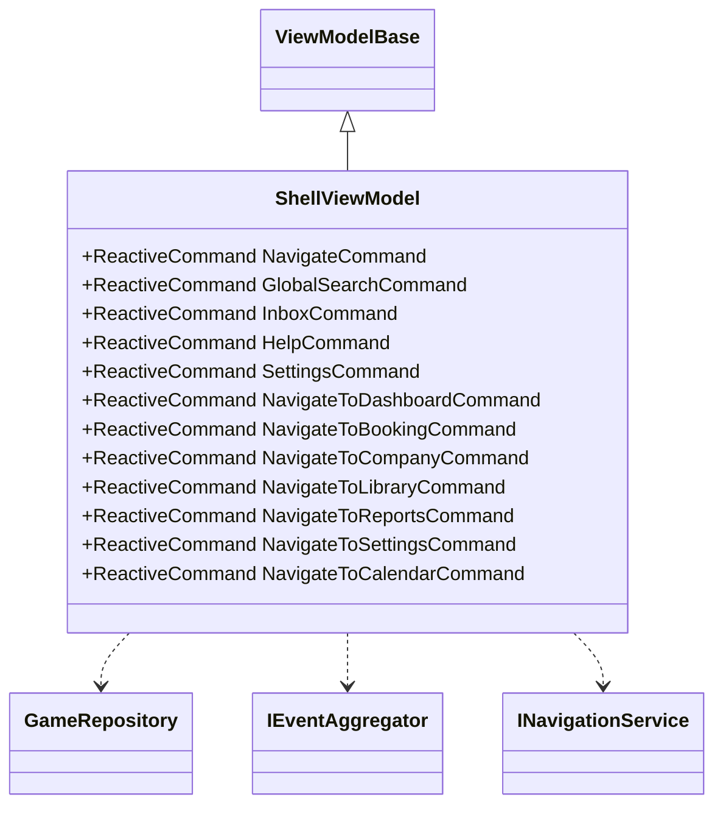

### Titre : Start Domain ViewModels

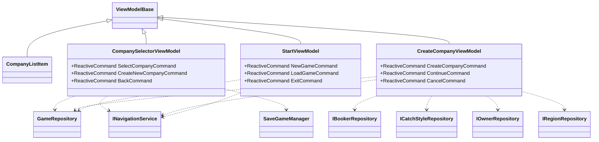

**Note**
- ViewModels sans injection de service: CompanyListItem
- ViewModels sans commandes observables: CompanyListItem

## 2. Booking ViewModels

### Titre : Booking Domain ViewModels

```mermaid
classDiagram
class TemplateService
class SettingsRepository
class SegmentTypeCatalog
class IShowDayOrchestrator
class IEventAggregator
class IBookingControlService
class IBookerAIEngine
class GameRepository
class BookingValidator
class BookingBuilderService
class ViewModelBase
class BookingSettingsViewModel {
  +ReactiveCommand SaveSettingsCommand
  +ReactiveCommand ResetToDefaultsCommand
  +ReactiveCommand AddValidationRuleCommand
  +ReactiveCommand RemoveValidationRuleCommand
  +ReactiveCommand TestValidationCommand
}
class BookingViewModel {
  +ReactiveCommand AddSegmentCommand
  +ReactiveCommand DeleteSegmentCommand
  +ReactiveCommand MoveSegmentUpCommand
  +ReactiveCommand MoveSegmentDownCommand
  +ReactiveCommand SaveSegmentCommand
  +ReactiveCommand CopySegmentCommand
  +ReactiveCommand ApplyTemplateCommand
  +ReactiveCommand ValidateBookingCommand
}
class LibraryViewModel {
  +ReactiveCommand CreateTemplateCommand
  +ReactiveCommand EditTemplateCommand
  +ReactiveCommand DeleteTemplateCommand
  +ReactiveCommand DuplicateTemplateCommand
  +ReactiveCommand ApplyTemplateCommand
  +ReactiveCommand SearchCommand
  +ReactiveCommand RefreshCommand
}
class ShowBookingViewModel {
  +ReactiveCommand AddSegmentCommand
  +ReactiveCommand RemoveSegmentCommand
  +ReactiveCommand MoveSegmentUpCommand
  +ReactiveCommand MoveSegmentDownCommand
  +ReactiveCommand DuplicateSegmentCommand
  +ReactiveCommand SimulateShowCommand
  +ReactiveCommand ValidateBookingCommand
  +ReactiveCommand AutoBookCommand
}
class ShowHistoryEntryViewModel
class ShowHistoryPageViewModel {
  +ReactiveCommand ViewDetailsCommand
  +ReactiveCommand ExportCommand
  +ReactiveCommand FilterCommand
  +ReactiveCommand RefreshCommand
}
class ShowWorkersViewModel {
  +ReactiveCommand AddParticipantCommand
  +ReactiveCommand RemoveParticipantCommand
  +ReactiveCommand ClearParticipantsCommand
}
class ValidationRuleViewModel
class WorkerSelectionViewModel {
  +ReactiveCommand SelectWorkerCommand
  +ReactiveCommand CancelCommand
}
ViewModelBase <|-- BookingSettingsViewModel
ViewModelBase <|-- BookingViewModel
ViewModelBase <|-- LibraryViewModel
ViewModelBase <|-- ShowBookingViewModel
ViewModelBase <|-- ShowHistoryEntryViewModel
ViewModelBase <|-- ShowHistoryPageViewModel
ViewModelBase <|-- ShowWorkersViewModel
ViewModelBase <|-- ValidationRuleViewModel
ViewModelBase <|-- WorkerSelectionViewModel
BookingSettingsViewModel ..> GameRepository
BookingViewModel ..> BookingBuilderService
BookingViewModel ..> BookingValidator
BookingViewModel ..> GameRepository
BookingViewModel ..> IBookingControlService
BookingViewModel ..> IEventAggregator
BookingViewModel ..> IShowDayOrchestrator
BookingViewModel ..> SegmentTypeCatalog
BookingViewModel ..> TemplateService
LibraryViewModel ..> GameRepository
ShowBookingViewModel ..> BookingBuilderService
ShowBookingViewModel ..> BookingValidator
ShowBookingViewModel ..> GameRepository
ShowBookingViewModel ..> IBookerAIEngine
ShowBookingViewModel ..> IBookingControlService
ShowBookingViewModel ..> IEventAggregator
ShowBookingViewModel ..> SegmentTypeCatalog
ShowBookingViewModel ..> SettingsRepository
ShowBookingViewModel ..> TemplateService
ShowHistoryPageViewModel ..> GameRepository
ShowWorkersViewModel ..> GameRepository
```

**Note**
- ViewModels sans injection de service: ShowHistoryEntryViewModel, ValidationRuleViewModel, WorkerSelectionViewModel
- ViewModels sans commandes observables: ShowHistoryEntryViewModel, ValidationRuleViewModel

## 3. Finance ViewModels

### Titre : Finance Domain ViewModels

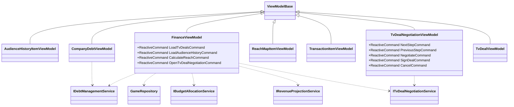

**Note**
- ViewModels sans injection de service: AudienceHistoryItemViewModel, ReachMapItemViewModel, TransactionItemViewModel, TvDealViewModel
- ViewModels sans commandes observables: AudienceHistoryItemViewModel, CompanyDebtViewModel, ReachMapItemViewModel, TransactionItemViewModel, TvDealViewModel

## 4. Autres Domaines (Company, Youth, etc.)

### Titre : Calendar Domain ViewModels

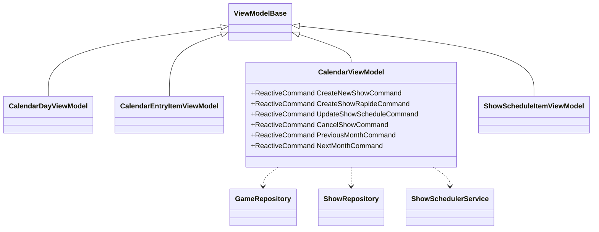

**Note**
- ViewModels sans injection de service: CalendarDayViewModel, CalendarEntryItemViewModel, ShowScheduleItemViewModel
- ViewModels sans commandes observables: CalendarDayViewModel, CalendarEntryItemViewModel, ShowScheduleItemViewModel

### Titre : Company Domain ViewModels

```mermaid
classDiagram
class WorkerRepository
class ShowRepository
class NicheFederationService
class IStaffRepository
class IRegionRepository
class IOwnerDecisionEngine
class INicheFederationRepository
class INavigationService
class IGameRepository
class IChildCompanyExtendedRepository
class GameRepository
class ChildCompanyService
class ChildCompanyBookingService
class ViewModelBase
class ChildCompaniesViewModel {
  +ReactiveCommand RefreshCommand
  +ReactiveCommand CreateChildCompanyCommand
  +ReactiveCommand ManageChildCompanyCommand
}
class ChildCompanyBookingItemViewModel
class ChildCompanyBookingViewModel {
  +ReactiveCommand SetControlLevelCommand
  +ReactiveCommand ToggleAutoScheduleCommand
  +ReactiveCommand ViewShowsCommand
  +ReactiveCommand RefreshCommand
}
class ChildCompanyDetailViewModel {
  +ReactiveCommand BackCommand
}
class NicheManagementViewModel {
  +ReactiveCommand EstablishNicheCommand
  +ReactiveCommand AbandonNicheCommand
  +ReactiveCommand EvaluateNicheCommand
}
ViewModelBase <|-- ChildCompaniesViewModel
ViewModelBase <|-- ChildCompanyBookingItemViewModel
ViewModelBase <|-- ChildCompanyBookingViewModel
ViewModelBase <|-- ChildCompanyDetailViewModel
ViewModelBase <|-- NicheManagementViewModel
ChildCompaniesViewModel ..> ChildCompanyService
ChildCompaniesViewModel ..> IChildCompanyExtendedRepository
ChildCompaniesViewModel ..> INavigationService
ChildCompaniesViewModel ..> IRegionRepository
ChildCompanyBookingViewModel ..> ChildCompanyBookingService
ChildCompanyBookingViewModel ..> GameRepository
ChildCompanyBookingViewModel ..> ShowRepository
ChildCompanyDetailViewModel ..> IChildCompanyExtendedRepository
ChildCompanyDetailViewModel ..> IGameRepository
ChildCompanyDetailViewModel ..> INavigationService
ChildCompanyDetailViewModel ..> IStaffRepository
ChildCompanyDetailViewModel ..> WorkerRepository
NicheManagementViewModel ..> INicheFederationRepository
NicheManagementViewModel ..> IOwnerDecisionEngine
NicheManagementViewModel ..> NicheFederationService
```

**Note**
- ViewModels sans injection de service: ChildCompanyBookingItemViewModel
- ViewModels sans commandes observables: ChildCompanyBookingItemViewModel

### Titre : CompanyHub Domain ViewModels

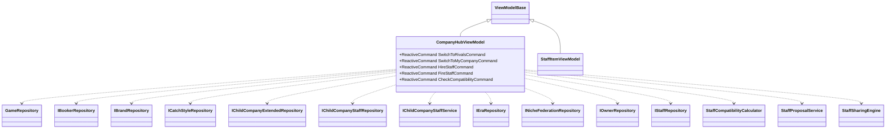

**Note**
- ViewModels sans injection de service: StaffItemViewModel
- ViewModels sans commandes observables: StaffItemViewModel

### Titre : Contracts Domain ViewModels

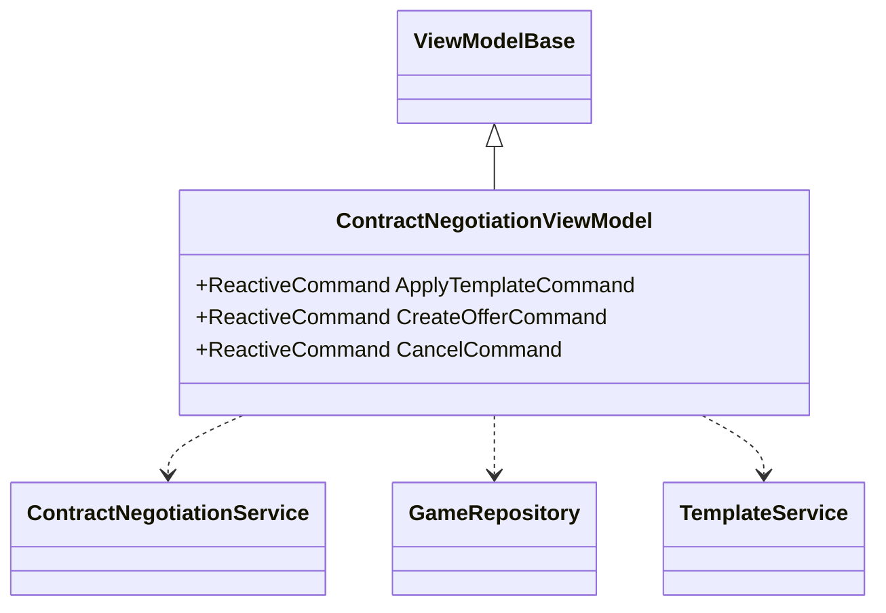

### Titre : Crisis Domain ViewModels

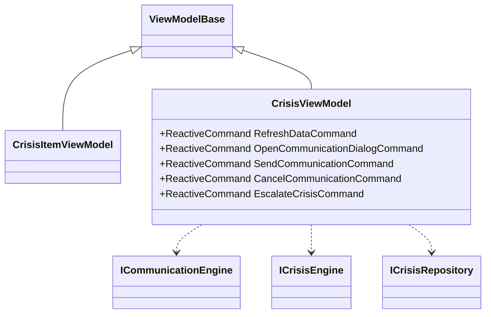

**Note**
- ViewModels sans injection de service: CrisisItemViewModel
- ViewModels sans commandes observables: CrisisItemViewModel

### Titre : Dashboard Domain ViewModels

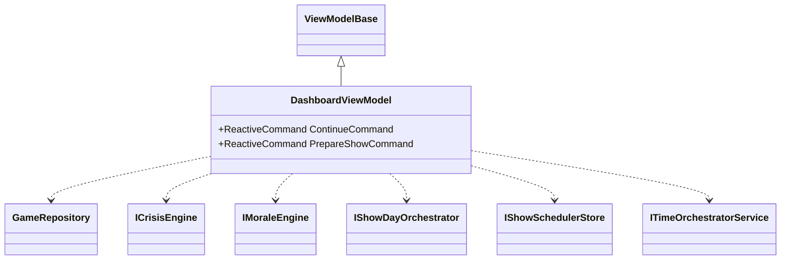

### Titre : Inbox Domain ViewModels

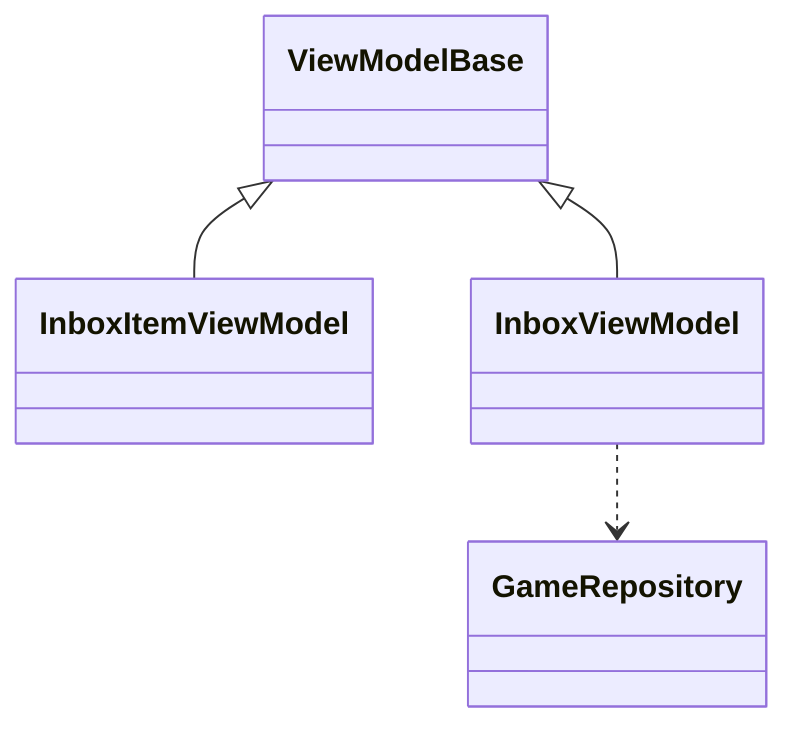

**Note**
- ViewModels sans injection de service: InboxItemViewModel
- ViewModels sans commandes observables: InboxItemViewModel, InboxViewModel

### Titre : Medical Domain ViewModels

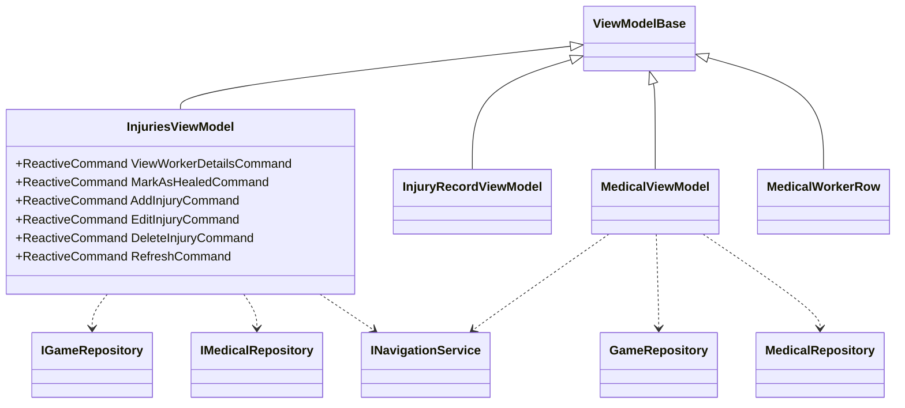

**Note**
- ViewModels sans injection de service: InjuryRecordViewModel, MedicalWorkerRow
- ViewModels sans commandes observables: InjuryRecordViewModel, MedicalViewModel, MedicalWorkerRow

### Titre : OwnerBooker Domain ViewModels

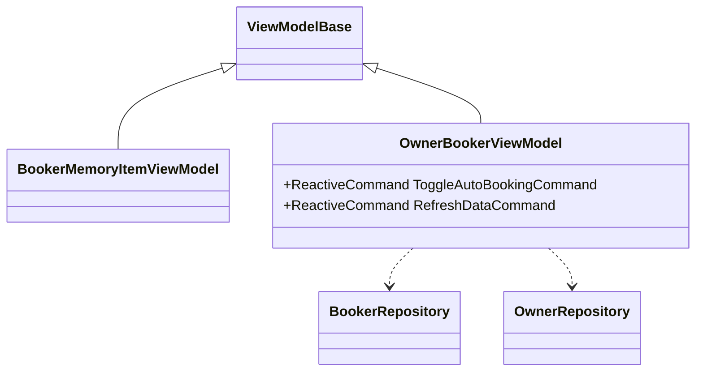

**Note**
- ViewModels sans injection de service: BookerMemoryItemViewModel
- ViewModels sans commandes observables: BookerMemoryItemViewModel

### Titre : Roster Domain ViewModels

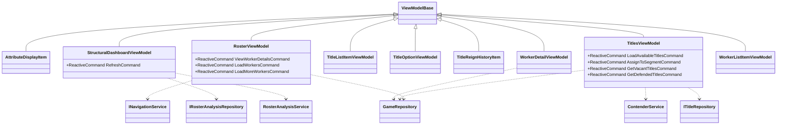

**Note**
- ViewModels sans injection de service: AttributeDisplayItem, TitleListItemViewModel, TitleOptionViewModel, TitleReignHistoryItem, WorkerListItemViewModel
- ViewModels sans commandes observables: AttributeDisplayItem, TitleListItemViewModel, TitleOptionViewModel, TitleReignHistoryItem, WorkerDetailViewModel, WorkerListItemViewModel

### Titre : Search Domain ViewModels

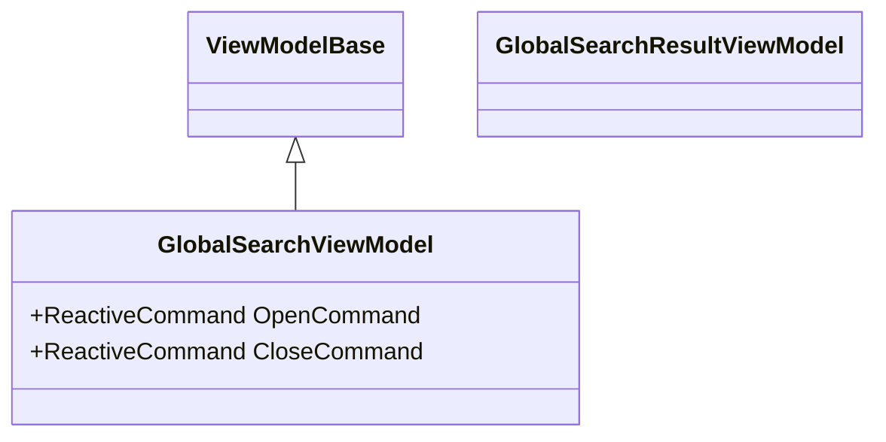

**Note**
- ViewModels sans injection de service: GlobalSearchResultViewModel, GlobalSearchViewModel
- ViewModels sans commandes observables: GlobalSearchResultViewModel

### Titre : Settings Domain ViewModels

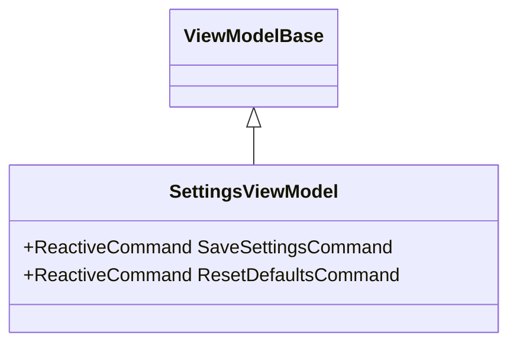

**Note**
- ViewModels sans injection de service: SettingsViewModel

### Titre : Shared Domain ViewModels

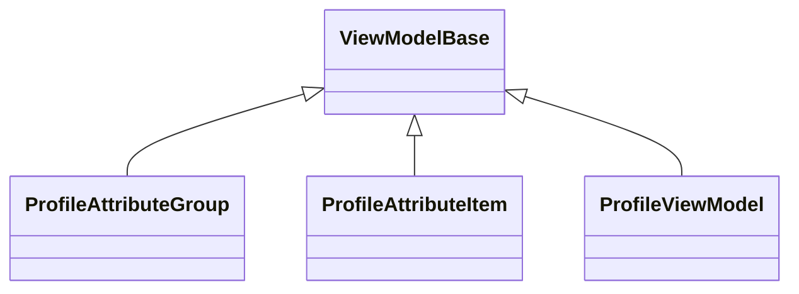

**Note**
- ViewModels sans injection de service: ProfileAttributeGroup, ProfileAttributeItem, ProfileViewModel
- ViewModels sans commandes observables: ProfileAttributeGroup, ProfileAttributeItem, ProfileViewModel

### Titre : Shared Navigation Domain ViewModels

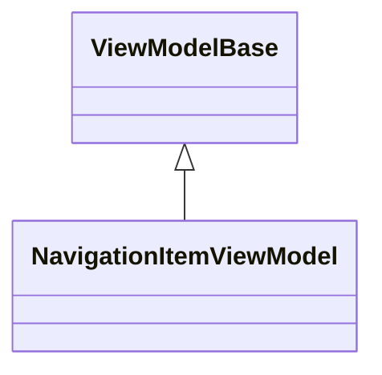

**Note**
- ViewModels sans injection de service: NavigationItemViewModel
- ViewModels sans commandes observables: NavigationItemViewModel

### Titre : Storylines Domain ViewModels

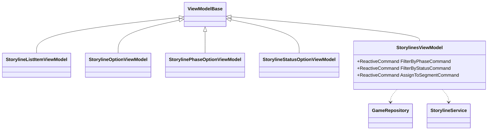

**Note**
- ViewModels sans injection de service: StorylineListItemViewModel, StorylineOptionViewModel, StorylinePhaseOptionViewModel, StorylineStatusOptionViewModel
- ViewModels sans commandes observables: StorylineListItemViewModel, StorylineOptionViewModel, StorylinePhaseOptionViewModel, StorylineStatusOptionViewModel

### Titre : Tables Domain ViewModels

```mermaid
classDiagram
class ViewModelBase
class TableViewViewModel
ViewModelBase <|-- TableViewViewModel
```

**Note**
- ViewModels sans injection de service: TableViewViewModel
- ViewModels sans commandes observables: TableViewViewModel

### Titre : Trends Domain ViewModels

```mermaid
classDiagram
class ITrendRepository
class IRosterAnalysisRepository
class CompatibilityCalculator
class ViewModelBase
class TrendsViewModel {
  +ReactiveCommand RefreshCommand
}
ViewModelBase <|-- TrendsViewModel
TrendsViewModel ..> CompatibilityCalculator
TrendsViewModel ..> IRosterAnalysisRepository
TrendsViewModel ..> ITrendRepository
```

### Titre : Workers Profile Domain ViewModels

```mermaid
classDiagram
class PersonalityDetectorService
class IWorkerAttributesRepository
class IRelationsRepository
class INotesRepository
class AgentReportGeneratorService
class ViewModelBase
class AttributesTabViewModel {
  +ReactiveCommand ToggleEditModeCommand
  +ReactiveCommand SaveAttributesCommand
  +ReactiveCommand CancelEditCommand
}
class ContractsTabViewModel {
  +ReactiveCommand AddContractCommand
  +ReactiveCommand EditContractCommand
  +ReactiveCommand ExpireContractCommand
  +ReactiveCommand TerminateContractCommand
}
class GimmickTabViewModel {
  +ReactiveCommand AddSpecializationCommand
  +ReactiveCommand RemoveSpecializationCommand
}
class HistoryTabViewModel {
  +ReactiveCommand ViewMatchDetailsCommand
  +ReactiveCommand ViewReignDetailsCommand
}
class NotesTabViewModel {
  +ReactiveCommand AddNoteCommand
  +ReactiveCommand EditNoteCommand
  +ReactiveCommand DeleteNoteCommand
  +ReactiveCommand FilterByCategoryCommand
}
class PersonalityTabViewModel {
  +ReactiveCommand RecalculateProfileCommand
  +ReactiveCommand LaunchScoutingCommand
  +ReactiveCommand RevealBasicScoutingCommand
  +ReactiveCommand RevealFullScoutingCommand
}
class ProfileViewModel {
  +ReactiveCommand RefreshCommand
  +ReactiveCommand CloseProfileCommand
}
class RelationsTabViewModel {
  +ReactiveCommand AddRelationCommand
  +ReactiveCommand EditRelationCommand
  +ReactiveCommand DeleteRelationCommand
  +ReactiveCommand AddToFactionCommand
  +ReactiveCommand RemoveFromFactionCommand
}
ViewModelBase <|-- AttributesTabViewModel
ViewModelBase <|-- ContractsTabViewModel
ViewModelBase <|-- GimmickTabViewModel
ViewModelBase <|-- HistoryTabViewModel
ViewModelBase <|-- NotesTabViewModel
ViewModelBase <|-- PersonalityTabViewModel
ViewModelBase <|-- ProfileViewModel
ViewModelBase <|-- RelationsTabViewModel
AttributesTabViewModel ..> IWorkerAttributesRepository
ContractsTabViewModel ..> INotesRepository
GimmickTabViewModel ..> INotesRepository
HistoryTabViewModel ..> INotesRepository
NotesTabViewModel ..> INotesRepository
PersonalityTabViewModel ..> AgentReportGeneratorService
PersonalityTabViewModel ..> IWorkerAttributesRepository
PersonalityTabViewModel ..> PersonalityDetectorService
ProfileViewModel ..> AgentReportGeneratorService
ProfileViewModel ..> INotesRepository
ProfileViewModel ..> IRelationsRepository
ProfileViewModel ..> IWorkerAttributesRepository
ProfileViewModel ..> PersonalityDetectorService
RelationsTabViewModel ..> IRelationsRepository
```

### Titre : Youth Domain ViewModels

```mermaid
classDiagram
class YouthRepository
class GameRepository
class ViewModelBase
class LoanManagementViewModel
class LoanedWorkerItemViewModel {
  +ReactiveCommand RecallCommand
}
class StructureManagementViewModel
class TraineeItemViewModel
class YouthGenerationOptionViewModel
class YouthHubViewModel
class YouthProgramViewModel
class YouthStaffAssignmentViewModel
class YouthStaffItemViewModel
class YouthStaffManagementViewModel
class YouthStructureItemViewModel {
  +ReactiveCommand UpgradeEquipmentCommand
  +ReactiveCommand IncreaseBudgetCommand
}
class YouthStructureViewModel
class YouthTraineeItemViewModel
class YouthTraineeManagementViewModel
class YouthViewModel {
  +ReactiveCommand GraduateTraineeCommand
  +ReactiveCommand CreateStructureCommand
  +ReactiveCommand AssignCoachCommand
  +ReactiveCommand UpdateBudgetCommand
  +ReactiveCommand GenerateTraineesCommand
}
ViewModelBase <|-- LoanManagementViewModel
ViewModelBase <|-- LoanedWorkerItemViewModel
ViewModelBase <|-- StructureManagementViewModel
ViewModelBase <|-- TraineeItemViewModel
ViewModelBase <|-- YouthGenerationOptionViewModel
ViewModelBase <|-- YouthHubViewModel
ViewModelBase <|-- YouthProgramViewModel
ViewModelBase <|-- YouthStaffAssignmentViewModel
ViewModelBase <|-- YouthStaffItemViewModel
ViewModelBase <|-- YouthStaffManagementViewModel
ViewModelBase <|-- YouthStructureItemViewModel
ViewModelBase <|-- YouthStructureViewModel
ViewModelBase <|-- YouthTraineeItemViewModel
ViewModelBase <|-- YouthTraineeManagementViewModel
ViewModelBase <|-- YouthViewModel
LoanManagementViewModel ..> GameRepository
LoanManagementViewModel ..> YouthRepository
StructureManagementViewModel ..> GameRepository
StructureManagementViewModel ..> YouthRepository
YouthHubViewModel ..> GameRepository
YouthHubViewModel ..> YouthRepository
YouthStaffManagementViewModel ..> GameRepository
YouthStaffManagementViewModel ..> YouthRepository
YouthStructureItemViewModel ..> GameRepository
YouthStructureItemViewModel ..> YouthRepository
YouthTraineeManagementViewModel ..> GameRepository
YouthTraineeManagementViewModel ..> YouthRepository
YouthViewModel ..> GameRepository
YouthViewModel ..> YouthRepository
```

**Note**
- ViewModels sans injection de service: LoanedWorkerItemViewModel, TraineeItemViewModel, YouthGenerationOptionViewModel, YouthProgramViewModel, YouthStaffAssignmentViewModel, YouthStaffItemViewModel, YouthStructureViewModel, YouthTraineeItemViewModel
- ViewModels sans commandes observables: LoanManagementViewModel, StructureManagementViewModel, TraineeItemViewModel, YouthGenerationOptionViewModel, YouthHubViewModel, YouthProgramViewModel, YouthStaffAssignmentViewModel, YouthStaffItemViewModel, YouthStaffManagementViewModel, YouthStructureViewModel, YouthTraineeItemViewModel, YouthTraineeManagementViewModel
