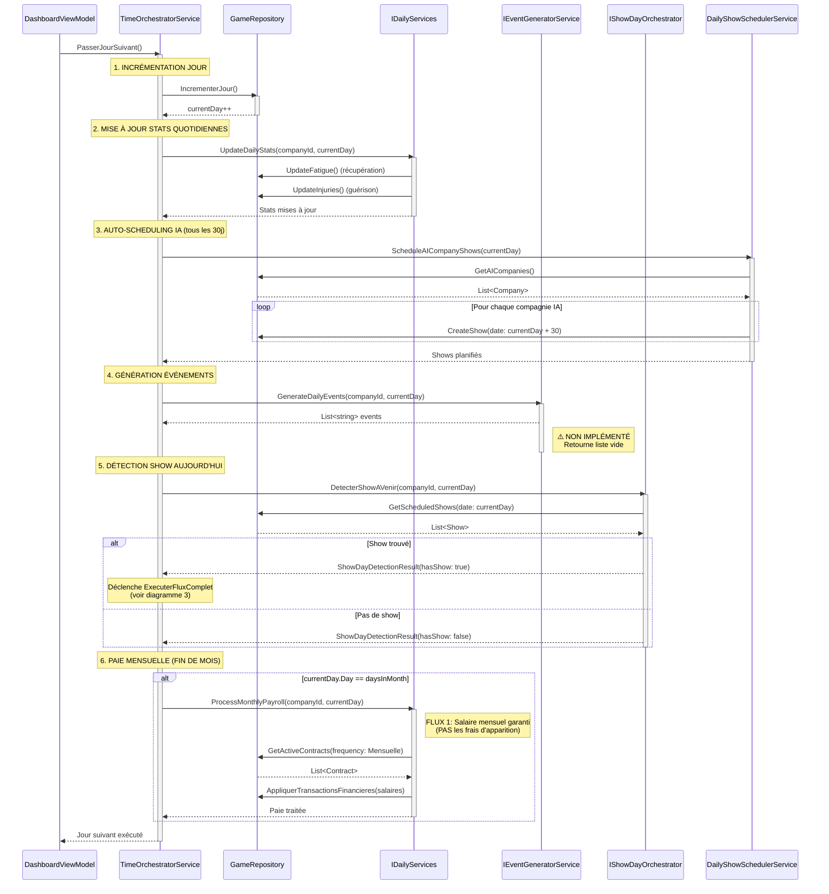

# 🗺️ Architecture Maps - État Actuel de la Codebase

> Documentation générée le 2026-01-12
> Analyse des dossiers: `src/RingGeneral.Core` et `src/RingGeneral.UI`

---

## 1. FLUX D'ARCHITECTURE (Dépendances MVVM)

**Type:** `classDiagram`
**Objectif:** Visualiser les dépendances des ViewModels principaux vers les Services Core

```mermaid
classDiagram
    %% VIEWMODELS
    class ShellViewModel {
        <<ViewModel>>
    }

    class ShowBookingViewModel {
        <<ViewModel>>
    }

    class FinanceViewModel {
        <<ViewModel>>
    }

    class CompanyHubViewModel {
        <<ViewModel>>
    }

    %% SERVICES & REPOSITORIES
    class INavigationService {
        <<Service>>
    }

    class IEventAggregator {
        <<Service>>
    }

    class GameRepository {
        <<Repository>>
    }

    class BookingValidator {
        <<Service>>
    }

    class BookingBuilderService {
        <<Service>>
    }

    class SegmentTypeCatalog {
        <<Service>>
    }

    class TemplateService {
        <<Service>>
    }

    class IBookerAIEngine {
        <<Service>>
    }

    class IBookingControlService {
        <<Service>>
    }

    class SettingsRepository {
        <<Repository>>
    }

    class IDebtManagementService {
        <<Service>>
    }

    class IRevenueProjectionService {
        <<Service>>
    }

    class IBudgetAllocationService {
        <<Service>>
    }

    class ITvDealNegotiationService {
        <<Service>>
    }

    class IOwnerRepository {
        <<Repository>>
    }

    class IBookerRepository {
        <<Repository>>
    }

    class IChildCompanyExtendedRepository {
        <<Repository>>
    }

    class IChildCompanyStaffService {
        <<Service>>
    }

    class StaffCompatibilityCalculator {
        <<Service>>
    }

    class StaffProposalService {
        <<Service>>
    }

    class StaffSharingEngine {
        <<Service>>
    }

    %% DEPENDENCIES
    ShellViewModel --> INavigationService : navigates
    ShellViewModel --> IEventAggregator : publishes/subscribes
    ShellViewModel --> GameRepository : loads game state

    ShowBookingViewModel --> GameRepository : persists bookings
    ShowBookingViewModel --> SegmentTypeCatalog : gets segment types
    ShowBookingViewModel --> BookingValidator : validates
    ShowBookingViewModel --> BookingBuilderService : builds segments
    ShowBookingViewModel --> TemplateService : manages templates
    ShowBookingViewModel --> IBookerAIEngine : auto-booking
    ShowBookingViewModel --> IBookingControlService : control levels
    ShowBookingViewModel --> SettingsRepository : settings
    ShowBookingViewModel --> IEventAggregator : events

    FinanceViewModel --> GameRepository : financial data
    FinanceViewModel --> IDebtManagementService : debt tracking
    FinanceViewModel --> IRevenueProjectionService : forecasting
    FinanceViewModel --> IBudgetAllocationService : budget mgmt
    FinanceViewModel --> ITvDealNegotiationService : TV deals

    CompanyHubViewModel --> GameRepository : company data
    CompanyHubViewModel --> IOwnerRepository : owner data
    CompanyHubViewModel --> IBookerRepository : booker data
    CompanyHubViewModel --> IChildCompanyExtendedRepository : child companies
    CompanyHubViewModel --> IChildCompanyStaffService : staff management
    CompanyHubViewModel --> StaffCompatibilityCalculator : compatibility
    CompanyHubViewModel --> StaffProposalService : proposals
    CompanyHubViewModel --> StaffSharingEngine : staff sharing
```



### 🔍 Analyse des Dépendances

**✅ Points Forts:**
- Séparation claire entre UI (ViewModels) et logique métier (Services/Repositories)
- Injection de dépendances cohérente via constructeurs
- Services spécialisés pour chaque domaine métier
- Pattern Repository bien appliqué pour l'accès aux données

**⚠️ Points d'Attention:**
- **ShowBookingViewModel** a 9 dépendances → complexité élevée, candidat au refactoring
- **CompanyHubViewModel** a 8 dépendances directes → pourrait bénéficier d'un service façade
- Certaines dépendances sont optionnelles (nullable) → vérifier la logique de fallback

**🔴 Aucune dépendance circulaire détectée** ✓

---

## 2. FLUX DU "DAILY TICK" (Logique Temporelle)

**Type:** `sequenceDiagram`
**Objectif:** Tracer l'exécution d'une journée de simulation



### 🔍 Analyse du Flux Temporel

**✅ Points Forts:**
- Séquence logique claire: incrémentation → stats → scheduling → events → shows → paie
- Séparation des responsabilités (stats, scheduling, events, shows, paie)
- Gestion distincte des flux de paiement (FLUX 1 mensuel vs FLUX 2 par apparition)

**⚠️ Points d'Attention:**
- **IEventGeneratorService non implémenté** → Les événements aléatoires ne sont pas générés
- L'auto-scheduling des shows IA est fixé à 30 jours → manque de flexibilité
- Pas de gestion des transactions en base de données → risque d'incohérence en cas d'erreur

**🔴 Risque d'Incohérence:**
- Si `ProcessMonthlyPayroll` échoue après `IncrementerJour`, le jour avance mais la paie non → nécessite transaction ou compensation

---

## 3. FLUX DU "SHOW DAY" (Simulation)

**Type:** `flowchart TD`
**Objectif:** Visualiser les étapes de simulation d'un show, de la validation à l'application des impacts

```mermaid
flowchart TD
    Start([User clique<br/>'Simuler Show']) --> Load[Charger ShowContext]

    Load --> LoadDetails{Chargement réussi?}
    LoadDetails -->|Non| Error1[Afficher erreur]
    LoadDetails -->|Oui| Context[ShowContext créé]

    Context --> Validate[BookingValidator.<br/>ValiderBooking]

    Validate --> Check{Validation}
    Check -->|Erreurs bloquantes| Error2[Afficher erreurs<br/>+ Bloquer simulation]
    Check -->|Warnings seulement| Warn[Afficher warnings<br/>+ Continuer]
    Check -->|Aucun problème| Warn

    Warn --> Simulate[ShowSimulationEngine.<br/>Simuler]

    Simulate --> LoopSegments[Pour chaque segment]

    LoopSegments --> CalcRating[Calculer Rating<br/>skills + crowd + pacing<br/>+ chemistry + morale]
    CalcRating --> RandomEvents[Appliquer événements<br/>botches, incidents]
    RandomEvents --> Fatigue[Accumuler fatigue]
    Fatigue --> Injuries[Déterminer blessures<br/>basé sur risque]
    Injuries --> Momentum[Tracker momentum<br/>winners/losers]
    Momentum --> PopUpdate[Maj popularité,<br/>storyline heat,<br/>title prestige]

    PopUpdate --> NextSegment{Segment suivant?}
    NextSegment -->|Oui| LoopSegments
    NextSegment -->|Non| ShowLevel[Calculs Show-Level]

    ShowLevel --> GlobalRating[Rating global<br/>moyenne segments]
    GlobalRating --> Audience[Calcul audience<br/>reach + score + stars<br/>- saturation]
    Audience --> Finances[Calcul finances<br/>tickets + merch + TV]
    Finances --> NicheBonuses[Appliquer bonus niche<br/>stable tickets, merch x,<br/>TV reduction]

    NicheBonuses --> Delta[Créer GameStateDelta<br/>injuries, popularity,<br/>finances, morale]

    Delta --> Finalize[ShowDayOrchestrator.<br/>FinaliserShow]

    Finalize --> Titles[TitleService.<br/>Appliquer changements titres]
    Titles --> ApplyImpacts[ImpactApplier.<br/>AppliquerImpacts]

    ApplyImpacts --> Implemented{Implémenté?}
    Implemented -->|Non| Manual[⚠️ Application manuelle<br/>des impacts via<br/>GameStateDelta]
    Implemented -->|Oui| Apply[Applique finances,<br/>blessures, popularité,<br/>morale]

    Manual --> AppearanceFees
    Apply --> AppearanceFees[IDailyServices.<br/>ProcessAppearanceFees]

    AppearanceFees --> PayWorkers[FLUX 2: Payer workers<br/>ayant participé au show]
    PayWorkers --> Morale[MoraleEngine.<br/>UpdateUnusedWorkers<br/>-3 morale]

    Morale --> MarkSimulated[Marquer show<br/>status: SIMULATED]

    MarkSimulated --> Inbox[Générer notifications<br/>InboxItem]
    Inbox --> End([Simulation terminée])

    Error1 --> End
    Error2 --> End

    style Start fill:#4CAF50
    style End fill:#2196F3
    style Error1 fill:#F44336
    style Error2 fill:#F44336
    style Implemented fill:#FF9800
    style Manual fill:#FF5722
    style ApplyImpacts fill:#FF9800
```



### 🔍 Analyse du Flux Show Day

**✅ Points Forts:**
- Validation rigoureuse avant simulation (erreurs bloquantes vs warnings)
- Simulation détaillée segment par segment avec multiples facteurs
- Séparation claire entre simulation (lecture) et application (écriture)
- Gestion des deux flux de paiement distincts (FLUX 2 pour apparitions)

**⚠️ Points d'Attention:**
- **IImpactApplier non implémenté** → Les impacts sont appliqués manuellement via GameStateDelta
- Risque de doubles paiements si FLUX 1 et FLUX 2 ne sont pas coordonnés correctement
- Le calcul de finances est complexe (reach, stars, saturation, niche) → potentiel de bugs

**🔴 Incohérences Détectées:**
1. **Interface vs Implémentation:** `IImpactApplier` défini mais non implémenté → code fragile
2. **Responsabilité partagée:** Les impacts sont appliqués à la fois dans `ShowDayOrchestrator.FinaliserShow()` et via `IImpactApplier` → duplication potentielle
3. **Workflow incomplet:** Si `ProcessAppearanceFees` échoue, le show est marqué SIMULATED mais la paie non → incohérence

**💡 Recommandations:**
- Implémenter `IImpactApplier` pour centraliser l'application des impacts
- Utiliser une transaction de base de données pour garantir l'atomicité du flux complet
- Ajouter des compensations en cas d'échec partiel (rollback ou retry)

---

## 4. FLUX DE NAVIGATION (Expérience Utilisateur)

**Type:** `stateDiagram-v2`
**Objectif:** Visualiser les écrans majeurs et les transitions de navigation

```mermaid
stateDiagram-v2
    [*] --> AppStart: Lancement application

    AppStart --> CheckSave: App.axaml.cs<br/>OnFrameworkInitializationCompleted

    CheckSave --> HasSave{Save game exists?}

    HasSave -->|Non| StartScreen: NavigateTo<br/>StartViewModel
    HasSave -->|Oui| Dashboard: NavigateTo<br/>DashboardViewModel

    state "Mode Start (Pas de partie en cours)" as StartMode {
        StartScreen --> CompanySelector: Nouvelle partie
        StartScreen --> LoadGame: Charger partie

        CompanySelector --> CreateCompany: Créer nouvelle<br/>compagnie
        CompanySelector --> Dashboard: Compagnie sélectionnée

        CreateCompany --> Dashboard: Compagnie créée
        LoadGame --> Dashboard: Save chargée
    }

    state "Mode Game (Partie active - ShellViewModel)" as GameMode {
        Dashboard --> BookingMenu: BOOKING (menu)
        Dashboard --> RosterMenu: ROSTER (menu)
        Dashboard --> Medical: MÉDICAL
        Dashboard --> CompanyHub: COMPANY HUB
        Dashboard --> AnalysisMenu: ANALYSE (menu)
        Dashboard --> Storylines: STORYLINES
        Dashboard --> YouthHub: YOUTH
        Dashboard --> Finance: FINANCE
        Dashboard --> OwnerBooker: OWNER & BOOKER
        Dashboard --> Crisis: CRISES
        Dashboard --> Calendar: CALENDRIER

        state "Booking (4 écrans)" as BookingMenu {
            [*] --> ActiveShows
            ActiveShows --> Library: Bibliothèque templates
            ActiveShows --> ShowHistory: Historique shows
            ActiveShows --> BookingSettings: Paramètres booking
            Library --> ActiveShows
            ShowHistory --> ActiveShows
            BookingSettings --> ActiveShows

            ActiveShows --> WorkerSelection: Sélection worker<br/>pour segment
            WorkerSelection --> ActiveShows: Worker assigné

            ActiveShows --> SimulateShow: Simuler show
            SimulateShow --> ShowResults: Résultats
            ShowResults --> ActiveShows: Retour
        }

        state "Roster (3 écrans)" as RosterMenu {
            [*] --> WorkersList
            WorkersList --> WorkerDetail: Clic sur worker
            WorkerDetail --> WorkersList: Retour

            WorkersList --> Titles: Gestion titres
            Titles --> WorkersList: Retour

            WorkersList --> StructuralDashboard: Analyse structurelle
            StructuralDashboard --> WorkersList: Retour
        }

        state "Analyse (4 écrans)" as AnalysisMenu {
            [*] --> Trends
            Trends --> NicheManagement: Gestion niche
            Trends --> ChildCompanies: Filiales
            Trends --> ChildCompanyBooking: Booking filiales
            NicheManagement --> Trends
            ChildCompanies --> ChildCompanyDetail: Détail filiale
            ChildCompanyDetail --> ChildCompanies
            ChildCompanyBooking --> Trends
        }

        Finance --> TvDealNegotiation: Négocier TV Deal
        TvDealNegotiation --> Finance: Deal signé/refusé

        CompanyHub --> ContractNegotiation: Négocier contrat
        ContractNegotiation --> CompanyHub: Contrat signé/refusé

        Dashboard --> Inbox: Notifications (overlay)
        Inbox --> Dashboard: Fermer

        Dashboard --> Settings: Paramètres (overlay)
        Settings --> Dashboard: Fermer
    }

    Dashboard --> [*]: Quitter application

    note right of CheckSave
        NavigationService gère
        toutes les transitions.
        ShellViewModel écoute
        CurrentViewModelObservable.
    end note

    note right of GameMode
        Layout 3 panneaux:
        - Gauche: NavigationTree
        - Centre: ContentControl
        - Droite: ContextPanel
        (dynamique selon écran)
    end note
```

### 🔍 Analyse de la Navigation

**✅ Points Forts:**
- Architecture de navigation centralisée via `INavigationService`
- Type-safety: navigation typée avec `NavigateTo<TViewModel>()`
- Séparation claire Mode Start vs Mode Game
- Hiérarchie logique des écrans (menus → sous-écrans → détails)
- Navigation réactive avec ReactiveUI (`BehaviorSubject`)

**⚠️ Points d'Attention:**
- **Navigation profonde:** Booking et Roster ont 3-4 niveaux de profondeur → risque de désorientation utilisateur
- **Pas de breadcrumb visible:** Difficile de savoir où on se trouve dans l'arborescence
- **Back navigation limitée:** Seul `GoBack()` disponible, pas de navigation par historique
- **Context Panel dynamique:** Le panneau de droite change selon l'écran → peut dérouter l'utilisateur

**🔴 Incohérences Détectées:**
1. **Dual-mode UI:** `IsInGameMode` bascule entre deux layouts complètement différents → transition brusque
2. **Navigation Tree vs Direct Navigation:** Certains écrans accessibles via Tree, d'autres via commandes directes → incohérence UX
3. **Overlays vs Pages:** Inbox et Settings sont des overlays, mais pas CompanyHub → incohérence de présentation

**💡 Recommandations:**
- Ajouter un breadcrumb pour montrer la position dans la hiérarchie
- Unifier l'accès aux écrans (soit tout via Tree, soit tout via commandes)
- Considérer une transition progressive entre Mode Start et Mode Game (animation, tutoriel)
- Documenter le Context Panel dans l'UI pour éviter la confusion utilisateur

---

## 📊 Statistiques Globales

**Codebase Core:**
- **59 interfaces** de repositories et services
- **53 implémentations** de services
- **87 ViewModels** dans la couche UI
- **37 Views** Avalonia (XAML)

**Complexité des ViewModels principaux:**
- `ShellViewModel`: 3 dépendances (simple)
- `ShowBookingViewModel`: 9 dépendances ⚠️ (complexe)
- `FinanceViewModel`: 5 dépendances (modéré)
- `CompanyHubViewModel`: 8 dépendances ⚠️ (complexe)

**Services non implémentés:**
- ❌ `IEventGeneratorService` (génération événements quotidiens)
- ❌ `IImpactApplier` (application impacts show)

---

## 🎯 Recommandations Architecturales

### Haute Priorité
1. **Implémenter IEventGeneratorService** pour enrichir la simulation temporelle
2. **Implémenter IImpactApplier** pour centraliser l'application des impacts
3. **Refactoriser ShowBookingViewModel** (9 dépendances → créer services façade)
4. **Ajouter transactions DB** pour garantir l'atomicité des flux critiques

### Priorité Moyenne
5. **Créer service façade** pour CompanyHubViewModel (8 dépendances)
6. **Uniformiser la navigation** (breadcrumb, historique, transitions)
7. **Documenter les deux flux de paiement** (FLUX 1 vs FLUX 2) pour éviter confusion

### Basse Priorité
8. **Ajouter compensation/retry** en cas d'échec partiel de simulation
9. **Améliorer testabilité** avec interfaces pour tous les services
10. **Créer dashboard de monitoring** pour suivre les performances de simulation

---

## 🔧 Outils Utilisés

- **Mermaid Live Editor** pour visualiser: https://mermaid.live
- **Analyse statique** via exploration récursive de `src/RingGeneral.Core` et `src/RingGeneral.UI`
- **Pattern Detection** pour identifier les relations de dépendances

---

**Date de génération:** 2026-01-12
**Architecte:** Claude (Sonnet 4.5)
**Commanditaire:** SnakePythonDom
