# Plan d'Implémentation PRD Ring General

## Vue d'ensemble

Ce plan structure l'implémentation des exigences du PRD en respectant strictement l'architecture MVVM et les conventions du projet (.cursorrules). L'objectif est de transformer Ring General d'un outil de gestion basique en un univers de catch émergent avec système d'IA créative avancé.

## État Actuel du Codebase

### Systèmes Complets ✅

- **TimeOrchestratorService** : Remplace WeeklyLoopService, gère le Daily Tick
- **ShowDayOrchestrator** : Flux Show Day 100% fonctionnel
- **Système d'Attributs** : 40 attributs, 4 dimensions, complet
- **Système de Personnalité** : 25+ profils, détection auto, complet
- **Systèmes Backstage** : Moral, Rumeurs, Népotisme, Crises fonctionnels

### Systèmes Partiels ⚠️

- **BookerAIEngine** : Existe mais règles de décision basiques, besoin d'extension
- **Contrats** : Modèles et repositories existent, templates inactifs, système hybride à finaliser
- **Finances** : FinanceEngine basique, besoin d'outils avancés (graphiques, projections)
- **Broadcasting** : Modèles existent (TvDeal, BroadcastModels), UI manquante
- **Subsidiaries** : Service et ViewModel existent, bouton non activé dans UI
- **Youth System** : Génération procédurale fonctionnelle (30%), reste à construire

### Systèmes Manquants ❌

- **Contract Templates** : Système inactif
- **TV Deal Negotiation UI** : Bouton "Browse Networks" non fonctionnel
- **Finance Dashboard Avancé** : Graphiques, projections, gestion dette
- **Booking Titres Vacants** : Blocage technique à identifier et résoudre

---

## Phase 1 : Système d'IA Créative "Let the Booker Decide"

### 1.1 Extension du BookerAIEngine

**Fichiers à modifier** :

- `src/RingGeneral.Core/Services/BookerAIEngine.cs`
- `src/RingGeneral.Core/Models/Booker/Booker.cs`
- `src/RingGeneral.Core/Interfaces/IBookerAIEngine.cs`

**Actions** :

1. **Ajouter les archétypes créatifs** (Power Booker, Puroresu, Attitude Era, Modern/Indie)

   - Ajouter enum `BookerCreativeArchetype` dans `Booker.cs`
   - Ajouter propriété `CreativeArchetype` au modèle `Booker`
   - Créer méthode `DetermineArchetype()` basée sur `PreferredProductType` et historique

2. **Implémenter les préférences de produit par archétype**

   - Power Booker : Favorise stars établies, règnes longs, rotation limitée
   - Puroresu : Priorité attributs techniques, matchs longs, qualité in-ring
   - Attitude Era : Segments micro, retournements, Star Power brut
   - Modern/Indie : Rotation élevée, montées rapides, changements fréquents

3. **Étendre GenerateAutoBooking() pour stratégies long terme**

   - Consulter `BookerMemory` pour cohérence narrative
   - Prendre en compte l'era actuelle de la compagnie (via `IEraRepository`)
   - Intégrer les préférences du creative staff (si disponible)

4. **Créer système de mémoire évolutive**

   - Les bookers conservent leur ADN créatif mais évoluent avec l'expérience
   - Mémoires influencent les décisions futures (déjà partiellement implémenté)

**Livrables** :

- `BookerCreativeArchetype` enum ajouté
- Méthodes `SelectWorkersByArchetype()`, `DetermineMatchStructure()`, `EvaluateLongTermStrategy()`
- Tests unitaires pour chaque archétype

---

### 1.2 Niveaux de Contrôle du Joueur

**Fichiers à créer/modifier** :

- `src/RingGeneral.Core/Models/Booker/BookingControlLevel.cs` (nouveau enum)
- `src/RingGeneral.Core/Services/BookingControlService.cs` (nouveau service)
- `src/RingGeneral.UI/ViewModels/Booking/BookingControlViewModel.cs` (nouveau ViewModel)
- `src/RingGeneral.UI/Views/Booking/BookingControlView.axaml` (nouvelle View)

**Actions** :

1. **Créer enum BookingControlLevel**
   ```csharp
   public enum BookingControlLevel
   {
       Spectator,    // IA 100%
       Producer,     // IA + veto joueur
       CoBooker,    // Partage responsabilités
       Dictator     // Contrôle total
   }
   ```

2. **Implémenter BookingControlService**

   - Méthode `GenerateShowWithControlLevel()` qui délègue selon le niveau
   - Pour Spectator : Appel direct à `BookerAIEngine.GenerateAutoBooking()`
   - Pour Producer : Génération IA + validation joueur avant application
   - Pour CoBooker : Partage des segments (joueur gère titres majeurs, IA midcard)
   - Pour Dictator : Pas d'appel IA, joueur contrôle tout

3. **Créer UI de sélection du niveau**

   - Dropdown dans `ShowBookingViewModel` pour choisir le niveau
   - Bouton "🤖 Laisser le Booker préparer" visible uniquement si niveau != Dictator
   - Indicateur visuel du niveau actif

**Livrables** :

- Service `BookingControlService` avec logique de délégation
- UI intégrée dans `ShowBookingView.axaml`
- Sauvegarde du niveau dans `GameState` ou `CompanySettings`

---

## Phase 2 : Modules Stratégiques Critiques (MVP)

### 2.1 Système de Broadcasting

**Fichiers à créer/modifier** :

- `src/RingGeneral.Core/Services/TvDealNegotiationService.cs` (nouveau)
- `src/RingGeneral.Core/Interfaces/ITvDealNegotiationService.cs` (nouveau)
- `src/RingGeneral.UI/ViewModels/Finance/TvDealNegotiationViewModel.cs` (nouveau)
- `src/RingGeneral.UI/Views/Finance/TvDealNegotiationView.axaml` (nouveau)
- `src/RingGeneral.UI/Views/Finance/FinanceView.axaml` (modifier pour activer bouton)

**Actions** :

1. **Activer le bouton "Browse Networks"**

   - Localiser le bouton dans `FinanceView.axaml` ou `CompanyHubView.axaml`
   - Connecter la commande à `OpenTvDealNegotiationCommand` dans `FinanceViewModel`

2. **Créer TvDealNegotiationService**

   - Méthode `GetAvailableNetworks(string companyId)` : Liste des networks disponibles
   - Méthode `CalculateInitialOffer()` : Formule basée sur Prestige, Reach, Show Quality
   - Méthode `NegotiateDeal()` : Gère contre-offres avec probabilités
   - Méthode `SignDeal()` : Enregistre le contrat dans la DB

3. **Créer UI de négociation**

   - **Étape 1** : Liste des networks avec filtres (Prestige, Reach, Exigences)
   - **Étape 2** : Termes du deal (durée, exclusivité, nombre de shows/an)
   - **Étape 3** : Négociation avec sliders (+10%, +20%, +30%)
   - **Étape 4** : Confirmation et signature

4. **Intégrer avec FinanceEngine**

   - Les revenus TV sont déjà calculés dans `ShowSimulationEngine`
   - Vérifier que `TvDeal` est bien chargé dans `ShowContext`

**Livrables** :

- Service de négociation fonctionnel
- UI complète avec workflow 4 étapes
- Bouton "Browse Networks" activé et fonctionnel
- Tests de calcul d'offres et probabilités

---

### 2.2 Finances Avancées

**Fichiers à créer/modifier** :

- `src/RingGeneral.Core/Services/RevenueProjectionService.cs` (nouveau)
- `src/RingGeneral.Core/Services/BudgetAllocationService.cs` (nouveau)
- `src/RingGeneral.UI/ViewModels/Finance/BudgetAllocationViewModel.cs` (nouveau)
- `src/RingGeneral.UI/Views/Finance/BudgetAllocationView.axaml` (nouveau)
- `src/RingGeneral.UI/Views/Finance/FinanceView.axaml` (enrichir avec graphiques)

**Actions** :

1. **Créer RevenueProjectionService**

   - Méthode `ProjectRevenue()` : Calcule revenus sur 12 mois
   - Prend en compte : TV Deals, Tickets (saisonnalité), Merch, Sponsors
   - Retourne `RevenueProjection` avec tendances mensuelles

2. **Créer BudgetAllocationService**

   - Méthode `AllocateBudget()` : Répartit budget par département
   - Départements : Talent (salaires), Production, Youth Dev, Marketing, Medical
   - Impact de l'allocation sur les systèmes (ex: +10% Youth Dev → +15% progression)

3. **Enrichir FinanceView avec graphiques**

   - Utiliser `OxyPlot.Avalonia` ou `LiveCharts2` pour graphiques
   - Graphique de trésorerie projetée (12 mois)
   - Graphique de tendance revenus/dépenses
   - Alertes visuelles si trésorerie < 100k dans 3 mois

4. **Ajouter gestion de la dette**

   - Modèle `CompanyDebt` dans `FinanceModels.cs`
   - Calcul des intérêts mensuels
   - Affichage dans dashboard financier

**Livrables** :

- Services de projection et allocation
- UI avec graphiques interactifs
- Système d'alertes financières
- Tests de projections et allocations

---

### 2.3 Gestion des Filiales

**Fichiers à modifier** :

- `src/RingGeneral.UI/Views/CompanyHub/CompanyHubView.axaml` (activer bouton)
- `src/RingGeneral.UI/ViewModels/CompanyHub/CompanyHubViewModel.cs` (connecter commande)
- `src/RingGeneral.UI/Views/Company/ChildCompaniesView.axaml` (améliorer UI)

**Actions** :

1. **Activer le bouton "Create Subsidiary"**

   - Localiser dans `CompanyHubView.axaml`
   - Vérifier que `CreateChildCompanyCommand` est bien connecté
   - Tester le workflow de création

2. **Améliorer ChildCompaniesView**

   - Ajouter affichage des objectifs (Development, Niche, Entertainment, Independence)
   - Afficher le booker assigné et le staff créatif
   - Ajouter bouton "Gérer Filiale" pour accéder aux détails

3. **Intégrer avec Youth System**

   - Les filiales peuvent servir de structures de développement
   - Lier `ChildCompany` avec `YouthStructure` si objectif = Development

**Livrables** :

- Bouton "Create Subsidiary" fonctionnel
- UI améliorée pour gestion des filiales
- Intégration avec Youth System

---

### 2.4 Finalisation du Booking (Titres Vacants)

**Fichiers à modifier** :

- `src/RingGeneral.Core/Validation/BookingValidator.cs` (vérifier validation)
- `src/RingGeneral.UI/ViewModels/Booking/ShowBookingViewModel.cs` (permettre booking vacant)
- `src/RingGeneral.Core/Services/TitleService.cs` (méthode pour booking vacant)

**Actions** :

1. **Identifier le blocage**

   - Vérifier `BookingValidator` : Y a-t-il une validation qui bloque les titres vacants ?
   - Vérifier `ShowBookingViewModel` : Le dropdown de titres filtre-t-il les vacants ?

2. **Permettre le booking de titres vacants**

   - Modifier `BookingValidator` pour accepter `TitleId` même si `CurrentChampionId` est null
   - Ajouter logique dans `TitleService.AssignTitle()` pour gérer les titres vacants
   - Lors de la simulation, si titre vacant et match terminé, assigner le vainqueur

3. **UI pour booking vacant**

   - Dans `ShowBookingView`, permettre sélection de titre vacant dans dropdown
   - Afficher indicateur visuel "VACANT" à côté du titre
   - Après simulation, afficher message "Nouveau champion couronné"

**Livrables** :

- Validation modifiée pour accepter titres vacants
- Service `TitleService` gère couronnement automatique
- UI mise à jour avec indicateurs visuels

---

## Phase 3 : Finalisation des Systèmes Partiels

### 3.1 Système de Contrats - Activation Templates et Hybride

**Fichiers à modifier** :

- `src/RingGeneral.Core/Services/TemplateService.cs` (activer chargement)
- `src/RingGeneral.Core/Services/ContractNegotiationService.cs` (intégrer templates)
- `src/RingGeneral.Data/Repositories/ContractRepository.cs` (vérifier support hybride)

**Actions** :

1. **Activer Contract Templates**

   - Modifier `TemplateService.LoadTemplates()` pour charger depuis DB ou JSON
   - Créer table `ContractTemplates` si nécessaire (migration SQL)
   - Templates : "Main Event Star", "Mid-Card Regular", "Undercard", "Trainee"

2. **Finaliser système hybride (MonthlyWage + AppearanceFee)**

   - Vérifier que `HybridContract` est bien utilisé dans `ContractRepository`
   - S'assurer que `DailyFinanceService.ProcessMonthlyPayroll()` gère les contrats hybrides
   - S'assurer que `ShowDayOrchestrator` applique les `AppearanceFee` après simulation

3. **UI pour sélection de template**

   - Dans `ContractNegotiationView`, ajouter dropdown "Utiliser Template"
   - Pré-remplir les champs selon le template sélectionné
   - Permettre modification manuelle après sélection

**Livrables** :

- Templates de contrats chargés et utilisables
- Système hybride complètement fonctionnel
- UI enrichie avec sélection de templates

---

### 3.2 Conséquences Dynamiques du Moral

**Fichiers à modifier** :

- `src/RingGeneral.Core/Services/MoraleEngine.cs` (ajouter pénalité non-utilisation)
- `src/RingGeneral.Data/Repositories/ImpactApplier.cs` (appliquer pénalité post-show)

**Actions** :

1. **Implémenter pénalité de moral pour workers non utilisés**

   - Dans `ImpactApplier.AppliquerImpacts()`, après simulation du show
   - Détecter les workers sous contrat qui n'ont pas participé au show
   - Appliquer pénalité de -3 points de moral pour chaque worker non utilisé

2. **Afficher notification dans Inbox**

   - Créer `InboxItem` de type "Worker Unused" pour chaque worker affecté
   - Message : "{WorkerName} est mécontent de ne pas avoir été utilisé lors du show"

**Livrables** :

- Pénalité de moral appliquée automatiquement
- Notifications Inbox pour workers non utilisés

---

### 3.3 Extension Auto-Booking IA

**Fichiers à modifier** :

- `src/RingGeneral.Core/Services/BookerAIEngine.cs` (étendre règles)
- `src/RingGeneral.Core/Services/BookerAIEngineExtensions.cs` (utiliser personnalités)

**Actions** :

1. **Intégrer personnalités des talents dans décisions**

   - Consulter `PersonalityDetectorService` pour chaque worker
   - Éviter de matcher des personnalités incompatibles (ex: Ego + Ego)
   - Favoriser les chimies positives détectées

2. **Stratégies à long terme**

   - Planifier des arcs sur plusieurs shows (via `BookerMemory`)
   - Construire progressivement des rivalités
   - Gérer la montée/descente des talents selon leur momentum

**Livrables** :

- Auto-booking prend en compte personnalités et chimies
- Stratégies long terme implémentées

---

## Phase 4 : Youth System (Finalisation)

### 4.1 Compléter le Youth System

**Fichiers à modifier** :

- `src/RingGeneral.Core/Services/YouthProgressionService.cs` (compléter logique)
- `src/RingGeneral.UI/ViewModels/Youth/YouthViewModel.cs` (finaliser UI)

**Actions** :

1. **Implémenter progression hebdomadaire**

   - Calculer gains d'attributs basés sur philosophie, infrastructure, coaching
   - Appliquer limites (`MaxGainParSemaine`, `CapAttribut`)

2. **Système de graduation**

   - Vérifier seuils (`MinSemaines`, `SeuilMoyen`, etc.)
   - Créer événement "Worker Graduated" pour Inbox
   - Générer premier contrat automatique

3. **UI complète**

   - Afficher progression des trainees
   - Graphiques de progression (InRing, Entertainment, Story)
   - Bouton "Graduer" pour promotion manuelle

**Livrables** :

- Système de progression fonctionnel
- Graduation automatique et manuelle
- UI complète avec graphiques

---

## Architecture et Conventions

### Respect des Règles du Projet

1. **MVVM Strict** :

   - Toute logique métier dans Services (`RingGeneral.Core/Services/`)
   - ViewModels injectent dépendances via constructeur
   - Views contiennent uniquement `InitializeComponent()`

2. **Namespaces = Chemins** :

   - Vérifier après chaque création/modification de fichier
   - Utiliser File Cleaner si nécessaire

3. **Dependency Injection** :

   - Enregistrer tous les nouveaux services dans `App.axaml.cs`
   - ViewModels enregistrés comme Transient (sauf ShellViewModel = Singleton)

4. **Repository Pattern** :

   - Un repository par domaine
   - Méthodes asynchrones pour opérations DB
   - Paramètres SQL uniquement (jamais de concaténation)

### Ordre d'Implémentation Recommandé

1. **Phase 2 (MVP)** : Modules critiques d'abord (Broadcasting, Finances, Filiales, Booking Vacant)
2. **Phase 1 (IA)** : Extension BookerAIEngine et niveaux de contrôle
3. **Phase 3 (Finalisation)** : Contrats, Moral, Auto-Booking
4. **Phase 4 (Youth)** : Compléter Youth System

### Tests et Validation

- Tests unitaires pour chaque nouveau service
- Tests d'intégration pour workflows complets (ex: négociation TV Deal)
- Validation MVVM : Vérifier qu'aucune logique métier n'est dans les Views

---

## Risques et Mitigations

| Risque | Impact | Mitigation |

|--------|--------|------------|

| Complexité IA créative | Élevé | Implémenter par archétype, tester chaque séparément |

| Performance graphiques finances | Moyen | Utiliser bibliothèque optimisée (OxyPlot), lazy loading |

| Blocage booking vacant | Moyen | Identifier cause racine avant modification |

| Intégration systèmes existants | Moyen | Respecter architecture en couches, éviter dépendances circulaires |

---

## Métriques de Succès

- ✅ Tous les boutons MVP activés et fonctionnels
- ✅ Système d'IA créative génère des shows cohérents selon archétype
- ✅ Négociation TV Deal complète avec workflow 4 étapes
- ✅ Dashboard financier avec graphiques et projections
- ✅ Booking de titres vacants fonctionnel
- ✅ Contrats hybrides (mensuel + apparition) opérationnels
- ✅ Pénalité de moral pour workers non utilisés appliquée

---

## Schémas de Flux : Avant et Après Implémentation

### 1. Flux Daily Tick (Passage du Temps)

#### AVANT Implémentation

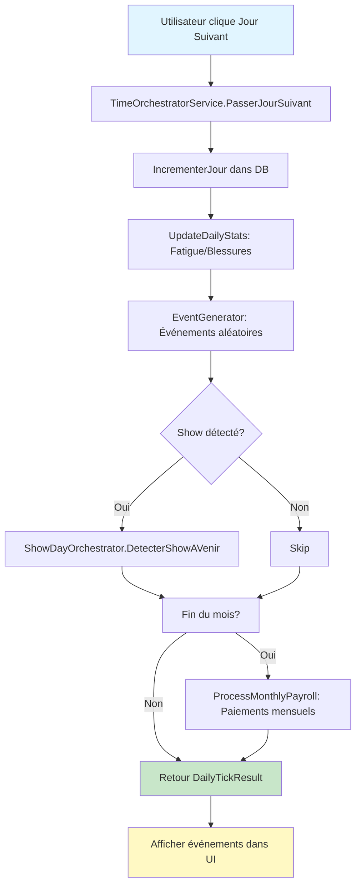

**Limitations actuelles** :

- Pas de gestion des frais d'apparition dans le Daily Tick
- Pas de pénalité de moral pour workers non utilisés
- Pas de gestion des négociations de contrat en cours
- Pas de progression Youth System

#### APRÈS Implémentation

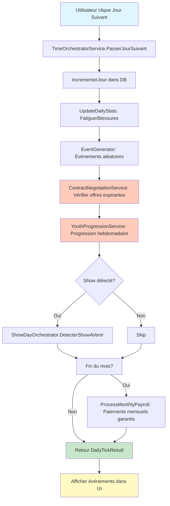

**Améliorations** :

- Vérification des contrats expirants quotidienne
- Progression Youth System intégrée
- Gestion complète des deux flux financiers (mensuel + apparition)

---

### 2. Flux Show Day (Simulation d'Événement)

#### AVANT Implémentation

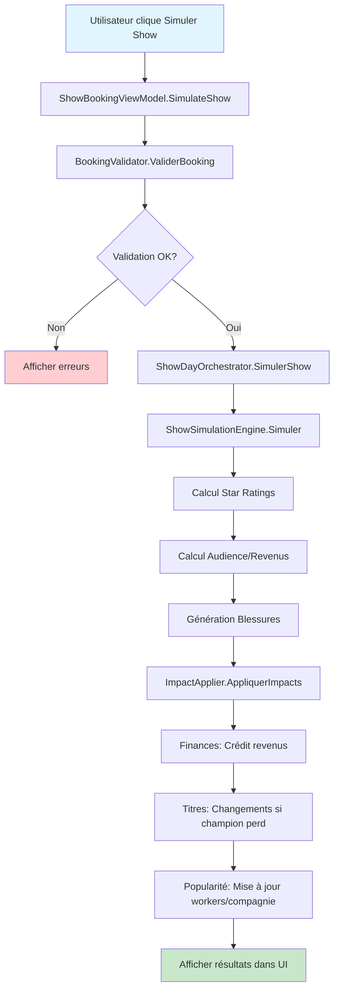

**Limitations actuelles** :

- Pas de gestion du moral post-show (workers non utilisés)
- Pas de frais d'apparition appliqués automatiquement
- Pas de booking de titres vacants
- Pas d'intégration avec système d'IA créative

#### APRÈS Implémentation

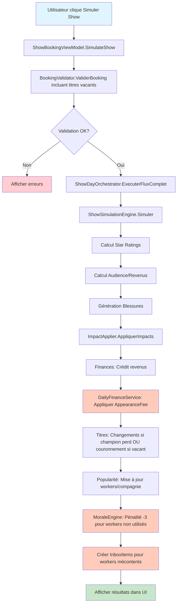

**Améliorations** :

- Gestion automatique des frais d'apparition
- Pénalité de moral pour workers non utilisés
- Support complet des titres vacants avec couronnement automatique
- Notifications Inbox pour événements importants

---

### 3. Flux Booking avec IA Créative

#### AVANT Implémentation

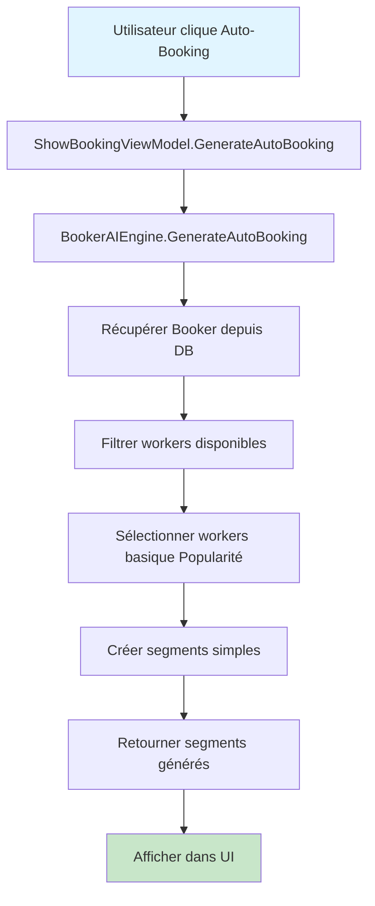

**Limitations actuelles** :

- Pas d'archétypes créatifs (Power Booker, Puroresu, etc.)
- Pas de prise en compte des personnalités
- Pas de stratégies long terme
- Pas de niveaux de contrôle (toujours manuel ou 100% IA)

#### APRÈS Implémentation

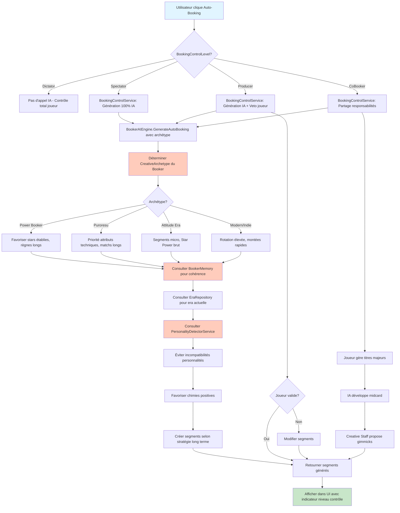

**Améliorations** :

- 4 archétypes créatifs avec logiques distinctes
- Prise en compte des personnalités et chimies
- Stratégies long terme via BookerMemory
- 4 niveaux de contrôle pour s'adapter à tous les profils de joueurs

---

### 4. Flux Négociation TV Deal

#### AVANT Implémentation

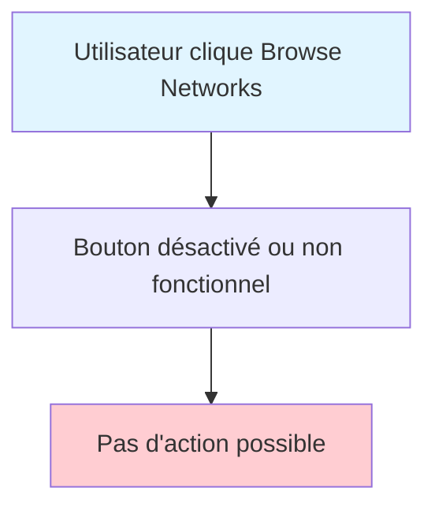

**Limitations actuelles** :

- Bouton non fonctionnel
- Pas de service de négociation
- Pas d'UI de négociation
- Les TV Deals existent en DB mais ne peuvent pas être créés via UI

#### APRÈS Implémentation

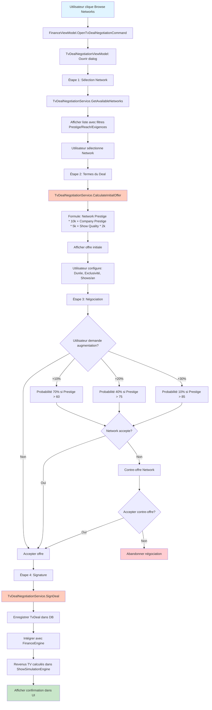

**Améliorations** :

- Workflow complet 4 étapes
- Calcul dynamique des offres
- Système de probabilités réaliste
- Intégration complète avec FinanceEngine

---

### 5. Flux Gestion des Contrats

#### AVANT Implémentation

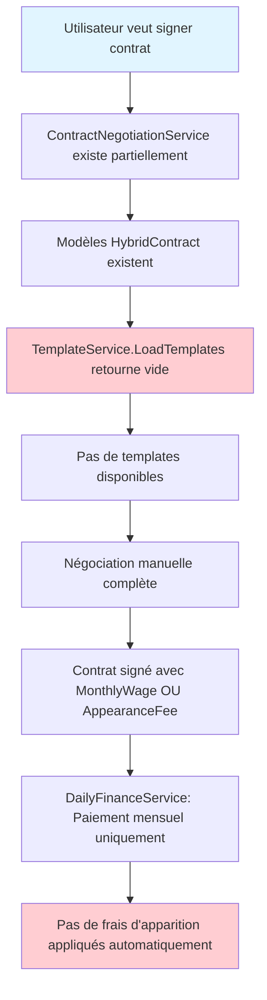

**Limitations actuelles** :

- Templates inactifs (retournent vide)
- Système hybride partiellement implémenté
- Frais d'apparition pas appliqués après shows

#### APRÈS Implémentation

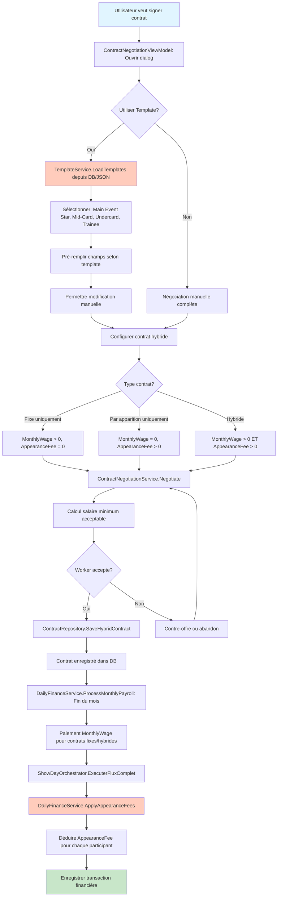

**Améliorations** :

- Templates de contrats activés et utilisables
- Système hybride complètement fonctionnel
- Gestion automatique des deux flux financiers
- UI enrichie avec sélection de templates

---

### 6. Flux Finances Avancées

#### AVANT Implémentation

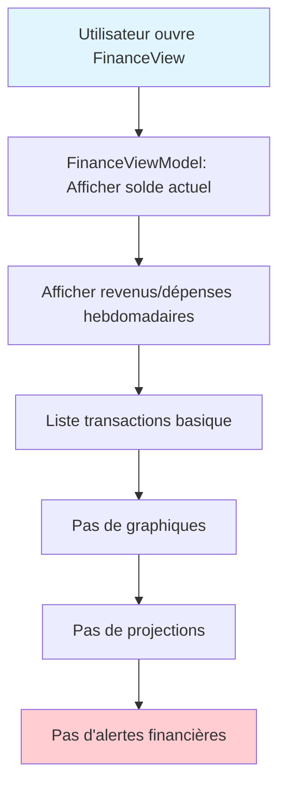

**Limitations actuelles** :

- Dashboard financier basique
- Pas de visualisation graphique
- Pas de projections budgétaires
- Pas d'alertes préventives

#### APRÈS Implémentation

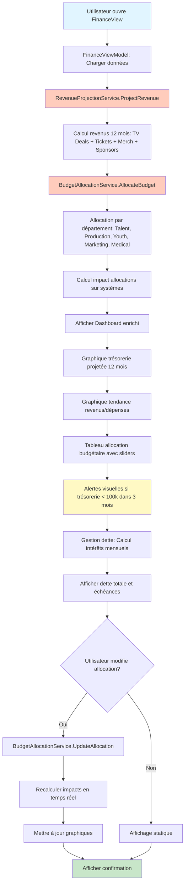

**Améliorations** :

- Dashboard financier professionnel avec graphiques
- Projections budgétaires sur 12 mois
- Système d'alertes préventives
- Gestion complète de la dette
- Allocation budgétaire interactive avec impacts en temps réel

---

## Résumé des Changements de Flux

### Points Clés d'Amélioration

1. **Daily Tick** : Ajout vérification contrats + progression Youth System
2. **Show Day** : Ajout frais d'apparition + pénalité moral + support titres vacants
3. **Booking IA** : Transformation complète avec archétypes + niveaux de contrôle + personnalités
4. **TV Deals** : Passage de "non fonctionnel" à workflow complet 4 étapes
5. **Contrats** : Activation templates + finalisation système hybride
6. **Finances** : Passage de dashboard basique à système professionnel avec graphiques et projections

### Impact sur l'Expérience Utilisateur

- **Avant** : Systèmes partiels, boutons non fonctionnels, pas de délégation IA
- **Après** : Systèmes complets, tous les boutons actifs, contrôle total sur niveau d'implication (Spectator à Dictator)

---

---

## Schémas de Flux : Systèmes Owner, Booker, Eras, Staff

### 7. Owner System - Gestion Économique et Pression Graduelle

#### AVANT Implémentation

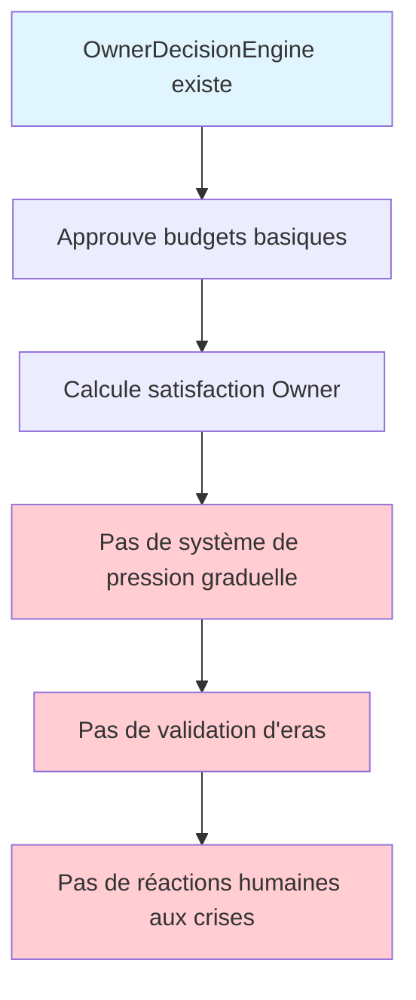

**Limitations actuelles** :

- Pas de système de pression graduelle par paliers
- Pas de validation Owner pour changements d'era
- Pas de réactions personnalisées selon personnalité Owner
- Pas de gestion de traumatismes passés

#### APRÈS Implémentation

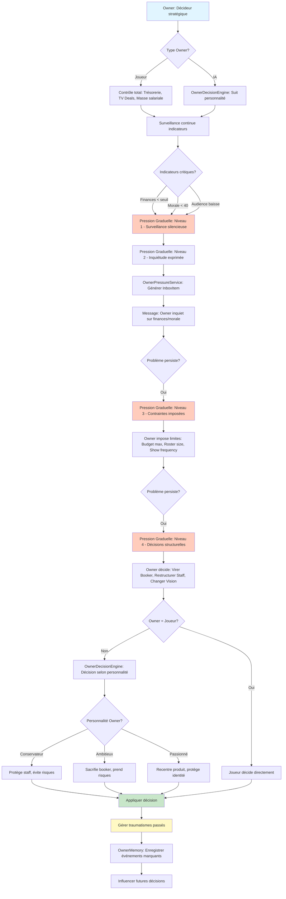

**Améliorations** :

- Système de pression graduelle en 4 paliers
- Validation Owner pour changements d'era
- Réactions personnalisées selon personnalité Owner
- Mémoire des traumatismes influençant les décisions futures
- Distinction claire Joueur (contrôle total) vs IA (personnalité)

---

### 8. Owner System - Validation des Eras

#### AVANT Implémentation

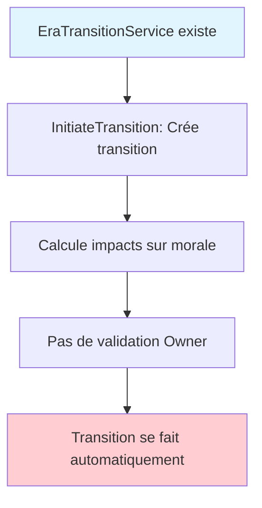

**Limitations actuelles** :

- Pas de validation Owner requise
- Transition automatique sans contrôle
- Pas de friction si Owner refuse

#### APRÈS Implémentation

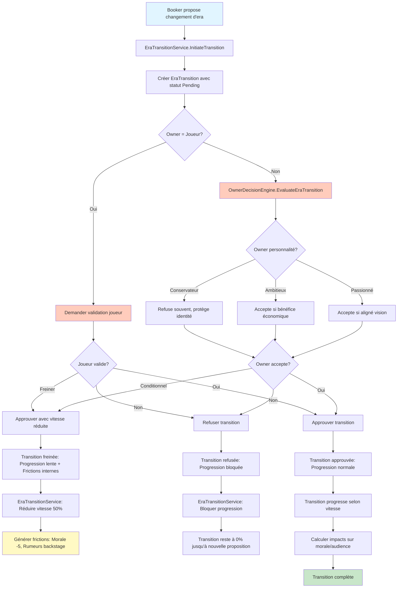

**Améliorations** :

- Validation Owner obligatoire pour changements d'era
- Joueur contrôle total sur transitions
- Owner IA décide selon personnalité
- Frictions internes si transition freinée/refusée
- Protection de l'identité long terme de la compagnie

---

### 9. Booker System & Memory - Mémoire Persistante

#### AVANT Implémentation

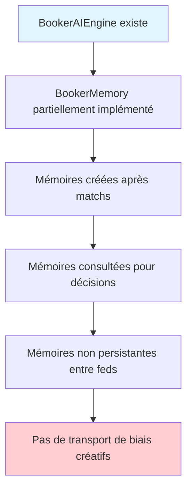

**Limitations actuelles** :

- Mémoires créées mais pas persistantes entre compagnies
- Pas de système de biais créatifs portables
- Pas de traumatismes enregistrés
- Pas de recettes gagnantes reproduites ailleurs

#### APRÈS Implémentation

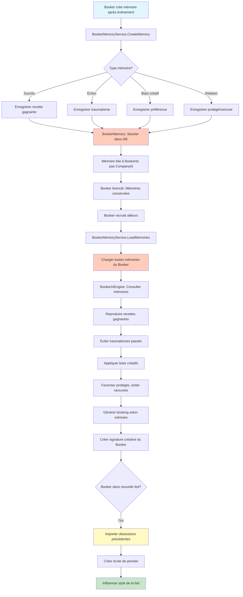

**Améliorations** :

- Mémoires persistantes liées au Booker, pas à la compagnie
- Transport de biais créatifs entre fédérations
- Traumatismes influencent décisions futures
- Recettes gagnantes reproduites ailleurs
- Création d'écoles de pensée dans le monde

---

### 10. Booker System - Préférences de Produit et Auto-Booking

#### AVANT Implémentation

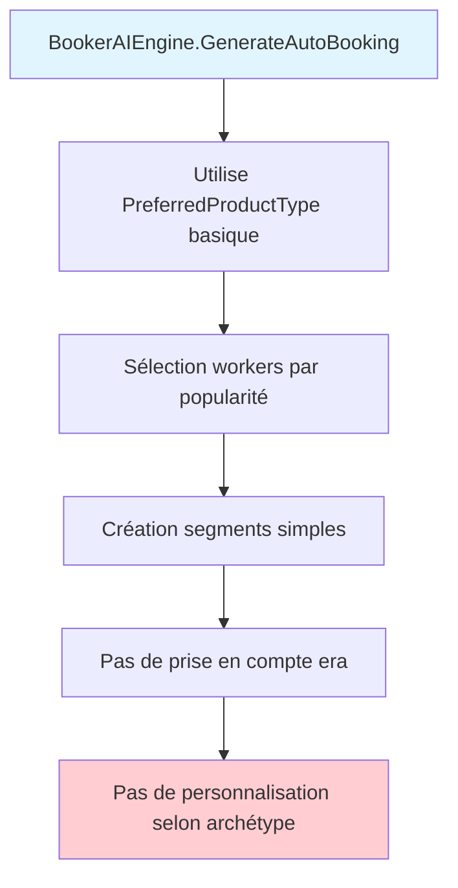

**Limitations actuelles** :

- Préférences produit basiques
- Pas d'archétypes créatifs (Power Booker, Puroresu, etc.)
- Pas de prise en compte de l'era actuelle
- Auto-booking optionnel mais pas de niveaux de contrôle

#### APRÈS Implémentation

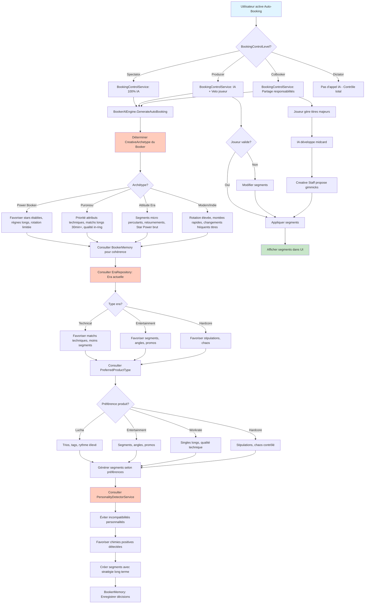

**Améliorations** :

- 4 archétypes créatifs avec logiques distinctes
- Prise en compte de l'era actuelle de la compagnie
- Préférences produit influencent structure des shows
- 4 niveaux de contrôle pour s'adapter au joueur
- Intégration personnalités et chimies
- Stratégies long terme via BookerMemory

---

### 11. Eras - Transitions Lentes et Identités Fortes

#### AVANT Implémentation

```mermaid
flowchart TD
    A[EraTransitionService.InitiateTransition] --> B[Crée EraTransition]
    B --> C[Calcule durée selon vitesse]
    C --> D[Transition progresse automatiquement]
    D --> E[Pas de frictions internes]
    E --> F[Pas de résistance publique]
    
    style A fill:#e1f5ff
    style F fill:#ffcdd2
```

**Limitations actuelles** :

- Transitions sans friction
- Pas de résistance interne
- Pas d'identité forte développée sur 5-10 ans
- Pas de possibilité de rester volontairement dans une era

#### APRÈS Implémentation

```mermaid
flowchart TD
    A[Transition d'era initiée] --> B[EraTransitionService: Créer transition]
    B --> C[Calculer compatibilité entre eras]
    C --> D[Calculer résistance au changement]
    
    D --> E{Vitesse transition?}
    E -->|Rapide| F[Résistance élevée: Morale -10, Frictions internes]
    E -->|Normale| G[Résistance modérée: Morale -5]
    E -->|Lente| H[Résistance faible: Morale -2]
    
    F --> I[Générer événements friction]
    G --> I
    H --> I
    
    I --> J[Workers résistent au changement]
    J --> K[Creative Staff confus]
    K --> L[Public réagit négativement si trop rapide]
    
    L --> M[Transition progresse jour par jour]
    M --> N[ProgressPercentage augmente graduellement]
    
    N --> O{Owner valide progression?}
    O -->|Oui| P[Transition continue]
    O -->|Non| Q[Transition freinée ou bloquée]
    
    P --> R{Progression < 100%?}
    R -->|Oui| M
    R -->|Non| S[Transition complète]
    
    S --> T[Nouvelle era active]
    T --> U[Identité de la fed évolue]
    
    U --> V{5-10 ans dans era?}
    V -->|Oui| W[Identité forte développée]
    W --> X[Fed reconnaissable par son style]
    
    Q --> Y[Owner peut bloquer transition]
    Y --> Z[Fed reste volontairement dans era]
    Z --> AA[Aucun malus artificiel]
    AA --> AB[Seul public/économie réagissent]
    
    style A fill:#e1f5ff
    style T fill:#c8e6c9
    style I fill:#ffccbc
    style W fill:#fff9c4
    style Z fill:#fff9c4
```

**Améliorations** :

- Transitions lentes avec frictions internes
- Résistance au changement calculée
- Identité forte développée sur 5-10 ans
- Possibilité de rester volontairement dans une era
- Pas de malus artificiel, seulement réactions naturelles

---

### 12. Staff Complet - Trois Familles et Compatibilités

#### AVANT Implémentation

```mermaid
flowchart TD
    A[Staff models existent] --> B[Booker, Road Agents, Commentateurs]
    B --> C[Pas de classification par familles]
    C --> D[Pas de système de compatibilités]
    D --> E[Pas de hiérarchie multi-brand]
    
    style A fill:#e1f5ff
    style E fill:#ffcdd2
```

**Limitations actuelles** :

- Pas de classification en 3 familles (Créatif, Structurel, Infrastructures)
- Pas de système de compatibilités humaines
- Pas de gestion hiérarchique multi-brand
- Pas d'impact des incompatibilités sur performance

#### APRÈS Implémentation

```mermaid
flowchart TD
    A[Staff complet organisé] --> B{Trois familles}
    
    B --> C[Créatif: Booker, Road Agents, Commentateurs, Créatifs narratifs]
    B --> D[Structurel: Médical, PR/Marketing, Financier, Scouting]
    B --> E[Infrastructures: Trainers, Dojos, Performance Centers]
    
    C --> F[StaffCompatibilityService: Calculer compatibilités]
    D --> F
    E --> F
    
    F --> G{Compatibilité Staff ↔ Staff?}
    G -->|Haute| H[Performance optimale, vision claire]
    G -->|Moyenne| I[Performance normale]
    G -->|Basse| J[Plafonnement, pas sabotage direct]
    
    F --> K{Compatibilité Staff ↔ Workers?}
    K -->|Haute| L[Workers progressent mieux]
    K -->|Basse| M[Workers plafonnent]
    
    F --> N{Compatibilité Staff ↔ Booker?}
    N -->|Haute| O[Alignement fort: Vision claire, continuité]
    N -->|Basse| P[Désalignement: Angles confus, incohérences]
    
    P --> Q[Frustration du vestiaire]
    Q --> R[Morale -3 pour workers affectés]
    
    H --> S[Hiérarchie déterminée]
    I --> S
    J --> S
    
    S --> T{Structure compagnie?}
    T -->|Mono-brand| U[Owner → Booker → Staff]
    T -->|Multi-brand| V[Owner → Head Booker → GM par brand → Staff brand]
    
    U --> W[Gestion directe]
    V --> X[Gestion décentralisée par brand]
    
    W --> Y[Staff assigné à compagnie]
    X --> Z[Staff assigné à brand spécifique]
    
    Y --> AA[Performance calculée selon compatibilités]
    Z --> AA
    
    AA --> AB{Incompatibilité détectée?}
    AB -->|Oui| AC[Plafonnement performance, générer rumeurs]
    AB -->|Non| AD[Performance normale ou optimale]
    
    AC --> AE[Owner peut décider: Garder ou remplacer]
    AD --> AF[Staff fonctionne bien]
    
    style A fill:#e1f5ff
    style AF fill:#c8e6c9
    style F fill:#ffccbc
    style N fill:#ffccbc
    style AC fill:#fff9c4
```

**Améliorations** :

- Classification en 3 familles claires
- Système de compatibilités Staff ↔ Staff, Staff ↔ Workers, Staff ↔ Booker
- Hiérarchie mono-brand et multi-brand
- Impact des incompatibilités: plafonnement, pas sabotage
- Gestion décentralisée pour multi-brand

---

### 13. Creative Staff - Qualité Narrative Variable

#### AVANT Implémentation

```mermaid
flowchart TD
    A[Creative Staff models existent] --> B[Pas de système qualité narrative]
    B --> C[Pas d'impact sur storylines]
    C --> D[Pas de compatibilité avec Booker]
    
    style A fill:#e1f5ff
    style D fill:#ffcdd2
```

**Limitations actuelles** :

- Pas de calcul de qualité narrative
- Pas d'impact sur qualité des storylines
- Pas de compatibilité avec Booker
- Pas de signature narrative par fed

#### APRÈS Implémentation

```mermaid
flowchart TD
    A[Creative Staff assigné] --> B[CreativeStaffService: Calculer qualité narrative]
    B --> C{Facteurs qualité?}
    
    C -->|Personnalité| D[Personnalité créative: Créativité, Vision, Expérience]
    C -->|Compatibilité Booker| E[Alignement vision avec Booker]
    C -->|Relations| F[Relations avec workers, chimies]
    
    D --> G[Calculer NarrativeQualityScore 0-100]
    E --> G
    F --> G
    
    G --> H{Score qualité?}
    H -->|80-100| I[Qualité exceptionnelle: Arcs mémorables]
    H -->|60-79| J[Qualité bonne: Storylines solides]
    H -->|40-59| K[Qualité moyenne: Répétitions fades]
    H -->|0-39| L[Qualité faible: Chaos créatif]
    
    I --> M[Storylines générées: Complexité élevée, continuité]
    J --> N[Storylines générées: Solides, cohérentes]
    K --> O[Storylines générées: Répétitives, prévisibles]
    L --> P[Storylines générées: Incohérentes, confuses]
    
    M --> Q{Compatibilité avec Booker?}
    N --> Q
    O --> Q
    P --> Q
    
    Q -->|Haute| R[Alignement fort: Vision claire, continuité narrative]
    Q -->|Basse| S[Désalignement: Angles confus, incohérences]
    
    R --> T[Workers satisfaits: Morale +2]
    S --> U[Workers frustrés: Morale -3, Rumeurs backstage]
    
    T --> V[Storylines appliquées avec succès]
    U --> W[Storylines appliquées avec friction]
    
    W --> X[Owner peut intervenir]
    X --> Y{Owner = Joueur?}
    Y -->|Oui| Z[Joueur peut remplacer Creative Staff]
    Y -->|Non| AA[OwnerDecisionEngine: Décider selon personnalité]
    
    AA --> AB{Owner personnalité?}
    AB -->|Protecteur| AC[Protège staff, médiation]
    AB -->|Pragmatique| AD[Remplace staff problématique]
    
    Z --> AE[Signature narrative développée]
    AC --> AE
    AD --> AE
    
    AE --> AF{5+ ans même staff?}
    AF -->|Oui| AG[Signature narrative forte: Fed reconnaissable]
    AF -->|Non| AH[Signature narrative changeante]
    
    style A fill:#e1f5ff
    style AG fill:#c8e6c9
    style G fill:#ffccbc
    style Q fill:#ffccbc
    style AE fill:#fff9c4
```

**Améliorations** :

- Calcul de qualité narrative basé sur personnalité, compatibilité, relations
- Impact direct sur qualité des storylines générées
- Compatibilité avec Booker influence continuité narrative
- Signature narrative développée sur le long terme
- Possibilité pour Owner (joueur ou IA) d'intervenir

---

## Résumé des Changements de Flux - Systèmes Owner/Booker/Eras/Staff

### Points Clés d'Amélioration

1. **Owner System** : Passage de décisions basiques à système de pression graduelle + validation eras + réactions personnalisées
2. **Booker Memory** : Passage de mémoires temporaires à système persistant transportable entre fédérations
3. **Eras** : Passage de transitions automatiques à transitions lentes avec frictions + validation Owner
4. **Staff** : Passage de modèles basiques à système complet avec 3 familles + compatibilités + hiérarchie
5. **Creative Staff** : Passage de modèles statiques à système dynamique avec qualité narrative variable

### Impact sur l'Expérience Utilisateur

- **Avant** : Systèmes Owner/Booker/Eras partiels, pas de mémoire persistante, transitions automatiques
- **Après** : Systèmes complets avec mémoire persistante, pression graduelle, validation Owner, compatibilités humaines, signature narrative

---

## Prochaines Étapes

1. Valider le plan avec l'équipe
2. Créer les branches Git pour chaque phase
3. Commencer par Phase 2 (MVP) pour débloquer rapidement
4. Itérer avec tests et validation continue